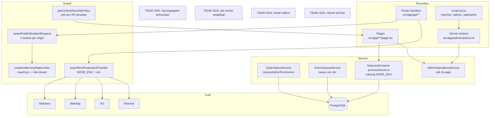
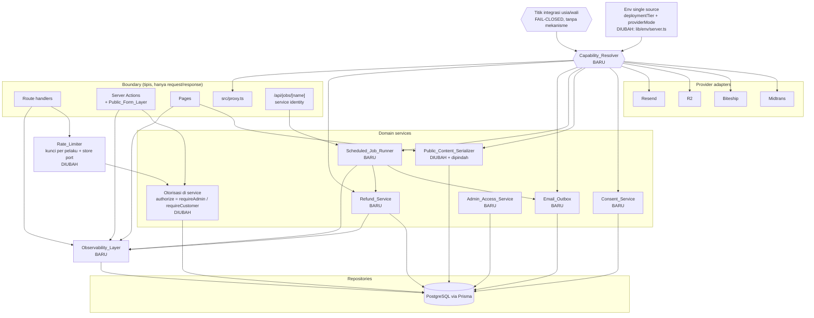
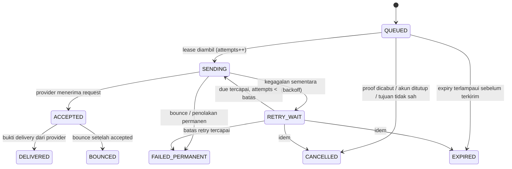
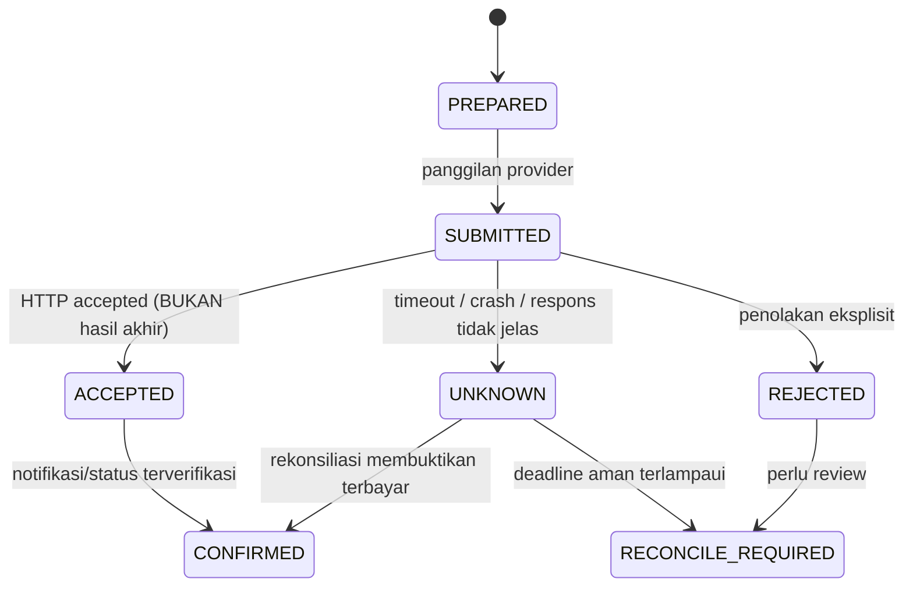

# Design Document — Program Remediasi Audit Niuva

> Dokumen desain. Tidak ada code yang ditulis atau diubah oleh dokumen ini.
> Nama env, nama tabel, dan nama tipe yang muncul di sini adalah **usulan**
> kecuali disebut sudah ada di repository. Penetapan final terjadi pada batch
> implementasi masing-masing, mengikuti `AGENTS.md` dan authority 3 Oktober 2026.

---

## Overview

### 1.1 Apa yang didesain

Requirements 1–32 bukan satu fitur. Keluarannya adalah **program remediasi
bertahap** (Tahap 0–11) atas 60+ temuan audit, dengan sebagian tahap berakhir di
luar kendali code (publikasi policy, bukti staging, aktivasi production). Desain
ini karena itu memiliki dua lapis:

1. **Lapis proses** — bentuk Rencana_Tahap, Register_Dependency, Baseline_Gate,
   Approval_Gate, Register_Keputusan, dan Invariant_No_Regression sebagai
   artefak yang hidup di `.kiro/specs/niuva-audit-remediation/` dan di dokumen
   authority yang relevan. Requirements 1–7, 10, 14, 30, 32 dipenuhi di lapis
   ini; keluarannya dokumen dan gate, bukan runtime.
2. **Lapis runtime** — komponen baru dan yang diubah di `src/`, `prisma/`, dan
   konfigurasi. Requirements 8–9, 11–13, 15–29, 31 dipenuhi di lapis ini.

Dokumen ini mendesain keduanya, tetapi menolak menyelesaikan apa pun yang
requirements tandai sebagai keputusan Owner/legal. Di titik seperti itu desain
hanya menetapkan **titik integrasi fail-closed**.

### 1.2 Empat prinsip pemandu

**P1 — Fail-closed secara default.** Setiap kemampuan yang menyentuh dunia luar
(provider, email, signup, privacy, refund, job, R2) harus *meminta izin* dari
satu resolver dan ditolak bila resource binding, konfigurasi, policy/usia, atau
izin aktivasi per tier belum lengkap. Tidak ada "satu flag public" yang melewati
guard lain (`docs/legal/customer-public-runtime-contract.md`, bagian Hosted).
Keberhasilan `build` bukan izin capability (Req 13.8).

**P2 — Observability sebelum perubahan perilaku.** Rate limit, capability, job,
dan refund tidak dapat diverifikasi tanpa jejak kegagalan yang berkorelasi.
Karena itu Observability_Layer (Req 8) adalah prasyarat Tahap 2 dan seterusnya,
persis seperti Register_Dependency B5→B2/B3 di Req 2.2. Konsekuensi praktis:
sebelum Tahap 1 selesai, perubahan boundary request tidak dijadwalkan.

**P3 — Satu jalur, bukan cabang per lingkungan.** Tiga percabangan hari ini
menghasilkan perilaku production yang tidak pernah diuji: `NODE_ENV` sebagai
izin provider (`src/modules/providers/non-production.ts` dipakai di enam call
site), `NODE_ENV` sebagai pemilih sumber data publik
(`src/features/frontend-preview/server.ts:55-70`), dan otorisasi yang kadang di
page kadang di service. Target: **satu** Capability_Resolver, **satu** serializer
publik, **satu** jalur job, **satu** tempat penegakan otorisasi (service).
Cabang untuk pemeriksaan visual tanpa database tetap ada, tetapi sebagai
capability tersendiri yang tidak menyentuh jalur produksi (Req 15.4).

**P4 — Diff kecil yang dapat direview.** Setiap komponen di bawah dipecah
menjadi task satu-berkas atau satu-kepedulian. Pemecahan modul besar (Req 28)
dijadwalkan *setelah* tahap berisiko supaya diff besar tidak menutupi perubahan
perilaku. Migrasi selalu baru dan non-destruktif; migrasi di
`prisma/migrations/` tidak pernah diedit.

### 1.3 Temuan research yang membentuk desain

Semua pernyataan Next.js di bawah dibaca dari dokumen yang **terpasang** di
`node_modules/next/dist/docs/` (Next 16.3.2), bukan dari ingatan.

| Mekanisme | Dokumen terpasang | Konsekuensi desain |
| --- | --- | --- |
| `proxy.ts` menggantikan `middleware.ts` | `01-app/03-api-reference/03-file-conventions/proxy.md` | File `src/proxy.ts` yang ada sudah mengikuti konvensi v16. Proxy default runtime Node.js; opsi `runtime` dilarang di file proxy. |
| Server Function tidak punya route sendiri | `.../proxy.md`, bagian *Execution order* | Server Action adalah POST ke route tempat ia dipakai, sehingga matcher proxy yang mengecualikan path juga **mengecualikan Server Action di path itu**. Dokumen secara eksplisit menyuruh memverifikasi auth di dalam setiap Server Function. Ini dasar langsung Req 12.5. |
| CSRF Server Action | `01-app/02-guides/server-actions.md` | Framework membandingkan `Origin` dengan `Host`/`X-Forwarded-Host`, membatasi body 1MB, dan mengenkripsi action id. Perlindungan ini **tidak** menggantikan pemeriksaan aplikasi; `serverActions.allowedOrigins` dan `NEXT_SERVER_ACTIONS_ENCRYPTION_KEY` relevan untuk tier hosted. |
| Nonce CSP | `01-app/02-guides/content-security-policy.md` | Nonce **harus** dihasilkan di proxy per request dan **memaksa dynamic rendering**; PPR tidak kompatibel dengan nonce. Alternatif hash adalah `experimental.sri` (ditandai eksperimental, App Router saja). `'unsafe-eval'` hanya dibutuhkan di development. |
| CSP tanpa nonce | `.../content-security-policy.md`, bagian *Without Nonces* | Pola `next.config` + `headers()` yang dipakai `next.config.ts` hari ini adalah pola yang didokumentasikan; ia tidak dapat menghasilkan nonce. |
| Segment config caching | `01-app/02-guides/caching-without-cache-components.md` dan `01-app/03-api-reference/03-file-conventions/02-route-segment-config/index.md` | `dynamic`, `revalidate`, `fetchCache` **masih tersedia** karena `cacheComponents` tidak diaktifkan di `next.config.ts`. Bila nanti `cacheComponents: true`, keempat opsi itu hilang dan model `use cache` berlaku. Strategi render Req 16.1 memakai model lama dan mencatat migrasi sebagai keputusan tersendiri. |
| `revalidatePath` | `01-app/03-api-reference/04-functions/revalidatePath.md` | Beroperasi pada struktur file route, bukan URL browser; di Server Action ia memperbarui UI segera, di Route Handler hanya menandai untuk kunjungan berikutnya. Dynamic segment memerlukan parameter `type`. Ini yang membuat `revalidatePath("/shop")` di `src/app/admin/actions.ts` hanya bermakna bila `/shop` memang punya cache entry (Req 16.2). |
| `sitemap.ts` / `robots.ts` | `01-app/03-api-reference/03-file-conventions/01-metadata/sitemap.md`, `.../robots.md` | Keduanya adalah Route Handler khusus yang **cached by default** kecuali memakai Request-time API atau dynamic config. Karena sitemap Niuva membaca database, perlu keputusan eksplisit revalidate vs dynamic (Req 16.3). |
| `metadataBase` | `01-app/03-api-reference/04-functions/generate-metadata.md` | Terkonfirmasi ada di dokumen terpasang; dipakai Req 16.4. Nilainya harus berasal dari deployment tier, bukan konstanta. |
| `instrumentation.ts` | `01-app/02-guides/instrumentation.md` | `register()` dipanggil sekali per instance dan harus selesai sebelum server melayani request; `NEXT_RUNTIME` membedakan node/edge. Ini tempat yang benar untuk validasi env startup dan inisialisasi logger (Req 9.3). Repo sudah membangun `instrumentation.js` pada build (`.local/auth-production-build-*/server/instrumentation.js`). |
| `images.remotePatterns` | `01-app/01-getting-started/12-images.md` | Terkonfirmasi; dipakai Req 26.6 untuk `*.googleusercontent.com`. |

**Tidak terkonfirmasi oleh dokumen terpasang.** Perilaku
`clerkMiddleware({ contentSecurityPolicy: { strict: true } })` di
`src/proxy.ts` adalah API Clerk, bukan API Next. Dokumen Next terpasang tidak
menjelaskan header apa yang Clerk tulis, apakah ia menyuntik nonce, dan
bagaimana ia berinteraksi dengan header CSP dari `next.config.ts`. Desain CSP
(§3.3) karena itu **menahan** keputusan final sampai perilaku itu diverifikasi
terhadap paket Clerk 7.8.0 yang terpasang pada task implementasinya.

---

## Architecture

### 2.1 Keadaan sekarang



Masalah strukturalnya: izin berasal dari `NODE_ENV`, kunci rate limit berasal
dari origin sehingga satu pelaku memblokir semua, otorisasi tersebar antara page
dan service, sumber data publik bercabang per `NODE_ENV`, dan tidak ada jalur
yang mencatat kegagalan.

### 2.2 Keadaan target



Legenda: **BARU** = komponen yang belum ada. **DIUBAH** = komponen yang ada dan
diubah kontraknya. Provider adapter tetap pada posisi sekarang; yang berubah
adalah dari mana mereka memperoleh izin.

---

## Components and Interfaces

Format setiap komponen: **tujuan · lapisan · kontrak · berkas baru · berkas
diubah · requirement · batas task**.

### 3.1 Observability_Layer — Tahap 1 (Req 8, J9, G3)

**Tujuan.** Membuat setiap kegagalan server dapat ditelusuri dari keluhan
pengguna ke satu catatan log, tanpa dependency baru dan tanpa membocorkan
rahasia.

**Lapisan.** Library lintas lapisan di `src/lib/observability/`, dipanggil dari
boundary (route handler, Server Action, page loader, webhook, job runner).
Bukan service domain: ia tidak mengambil keputusan bisnis.

**Kontrak (usulan).**

```ts
// src/lib/observability/logger.ts
export type FailureKind =
  | "DATABASE_UNAVAILABLE"   // G3: koneksi/timeout DB
  | "PROVIDER_TIMEOUT"       // G3: provider lambat/tidak merespons
  | "PROVIDER_REJECTED"
  | "CODE_DEFECT"            // G3: error tak dikenal di toAppError
  | "VALIDATION_REJECTED"
  | "AUTHORIZATION_REJECTED"
  | "RATE_LIMITED";

export type FailureEvent = Readonly<{
  boundary: string;            // "api:POST /api/uploads/intents", "page:/admin/orders"
  correlationId: string;
  errorCode: ErrorCode;        // dari src/modules/shared/errors.ts
  kind: FailureKind;
  occurredAt: Date;
  // Hanya field allowlist. Tidak ada payload mentah, tidak ada header, tidak ada body.
  safeContext?: Readonly<Record<string, string>>;
}>;

export type FailureLogger = { record: (event: FailureEvent) => void };
export function classifyUnknownError(error: unknown): FailureKind;
export function createConsoleFailureLogger(): FailureLogger;
```

**Bagaimana correlation id dipersistensi (Req 8.2).** `apiError()` di
`src/lib/http/response.ts` sudah membuat correlation id dan mengirimkannya ke
client lewat header `x-correlation-id` serta body. Yang belum ada: sisi server.
Desain:

1. `apiError()` memanggil `FailureLogger.record()` dengan correlation id yang
   sama yang dikirim ke client. Itu satu-satunya tempat pasangan id↔kejadian
   lahir untuk jalur API.
2. Untuk page dan Server Action yang tidak lewat `apiError()`, correlation id
   dibuat di titik boundary dan diteruskan ke view "belum dapat dimuat" sebagai
   teks referensi yang boleh dibacakan pengguna ke petugas.
3. Persistensi durable memakai tabel `FailureEvent` (§4.6) **hanya** untuk
   kegagalan yang petugas perlu temukan kembali (kegagalan page admin, webhook,
   job, refund). Log konsol saja tidak memenuhi "petugas dapat menemukan
   kembali" di Req 8.2 pada hosting yang memutar log.

**Bagaimana rahasia dan PII dikeluarkan (Req 8.3).** `safeContext` adalah
allowlist bertipe `Record<string, string>`; tidak ada jalan memasukkan objek
request, body, header, atau row database. Aturan tambahan: nilai yang masuk
`safeContext` wajib berupa id, enum, nama route, atau angka — bukan email, nama,
alamat, token, atau isi pesan. Token tetap hash di tempat penyimpanannya; logger
tidak pernah menerima token, bahkan hash-nya, kecuali sebagai prefix pendek.

**Bagaimana G3 memakai ini.** Page admin hari ini memakai
`try { ... } catch { return null }`, sehingga tiga penyebab berbeda menjadi satu
tampilan. Desain: loader page admin memanggil `classifyUnknownError()` lalu
mengembalikan tri-state `{ kind: FailureKind }` bukan `null`, dan
`AdminDataUnavailableView` memilih copy per `kind` dari
`system-state-copy.ts` (copy terpusat tetap satu-satunya sumber teks, Req 27.5).
`AdminDataUnavailableView`, loader tri-state `loadAdminRecord`, dan copy
terpusat adalah Invariant_No_Regression (Req 5.1), jadi perubahan ini menambah
state, tidak mengganti kontrak yang sudah diterima.

**Env Sentry tanpa konsumen (Req 8.6, 8.7).** `NEXT_PUBLIC_SENTRY_DSN`,
`SENTRY_AUTH_TOKEN`, `SENTRY_ORG`, `SENTRY_PROJECT` sudah ada di schema env
tetapi tidak ada SDK yang membacanya. Desain **tidak** memasang SDK: itu
dependency baru → Approval_Gate. Yang dilakukan: menandai keempat env sebagai
`UNUSED_PENDING_APPROVAL` di dokumentasi env, dan menjaga `FailureLogger` sebagai
interface supaya adapter SDK dapat ditambahkan nanti tanpa menyentuh call site.

**Berkas baru (usulan).** `src/lib/observability/logger.ts`,
`src/lib/observability/classify.ts`, `src/lib/observability/repository.ts`.
**Berkas diubah.** `src/lib/http/response.ts` (satu task), `src/modules/shared/errors.ts`
(satu task), loader page admin (satu task per kelompok page),
`src/modules/payment/webhook-service.ts` (satu task).

**Batas task.** (1) logger + classifier + test korpus; (2) pasang di
`apiError()`; (3) pasang di `toAppError()`; (4) tri-state `FailureKind` pada
loader admin + copy; (5) webhook; (6) tabel persistensi + migrasi baru.

### 3.2 Env single source dan Capability_Resolver — Tahap 3 (Req 9, 13, 14)

**Tujuan.** Satu tempat yang menjawab "apakah kemampuan X aktif di lingkungan
ini", menggantikan `NODE_ENV` sebagai izin dan menggantikan pemeriksaan env yang
tersebar.

**Lapisan.** `src/lib/env/server.ts` (parsing/validasi, sudah ada) +
`src/modules/capabilities/` (keputusan, baru). Resolver adalah **service**:
ia mengambil keputusan, tidak membaca `process.env` langsung di luar env module
dan tidak menyentuh database.

**Bentuk tier dan mode (usulan, nama final ditetapkan pada implementasi — Req 13.14).**

```ts
export type DeploymentTier = "local-test" | "staging" | "production";
export type ProviderMode = "mock" | "sandbox" | "live";

export type CapabilityName =
  | "signup" | "googleAuth" | "passwordAuth"
  | "emailSender" | "emailDelivery"
  | "privacyRights" | "privacyProof"
  | "objectStorage" | "payment" | "refund" | "shipping"
  | "analytics" | "scheduledJobs";

export type CapabilityDenialReason =
  | "TIER_NOT_ALLOWED"
  | "CONFIG_INCOMPLETE"
  | "RESOURCE_NOT_BOUND"
  | "POLICY_NOT_PUBLISHED"
  | "AGE_GATE_NOT_CLOSED"
  | "ACTIVATION_NOT_GRANTED";

export type CapabilityDecision =
  | Readonly<{ allowed: true; mode: ProviderMode; tier: DeploymentTier }>
  | Readonly<{ allowed: false; reason: CapabilityDenialReason; operatorMessage: string }>;

export type CapabilityResolver = {
  decide: (capability: CapabilityName) => CapabilityDecision;
  requireAllowed: (capability: CapabilityName) => Extract<CapabilityDecision, { allowed: true }>;
};
```

`requireAllowed` melempar `PROVIDER_UNAVAILABLE` (atau kode yang lebih tepat per
capability) dengan `operatorMessage` yang dapat dibaca operator — itu yang
diminta Req 13.6.

**Struktur Capability_Matrix.** Matriks adalah data, bukan rangkaian `if`:

```ts
type CapabilityRule = Readonly<{
  allowedModes: readonly ProviderMode[];      // per tier
  requiredEnv: readonly EnvironmentKey[];     // konfigurasi lengkap
  requiredResources: readonly ResourceBinding[]; // mis. database, bucket privat
  requiredPolicyGates: readonly PolicyGate[]; // PUB-POLICY, PUB-AGE, PUB-GUARDIAN
  requiresActivationGrant: boolean;           // izin aktivasi per tier
}>;

type CapabilityMatrix = Readonly<Record<DeploymentTier, Readonly<Record<CapabilityName, CapabilityRule>>>>;
```

Resolusi adalah konjungsi dari empat syarat Req 13.4 — resource binding,
konfigurasi, policy/usia, izin aktivasi — dan **total**: setiap pasangan
(tier, capability) punya keputusan, dan keputusan default ketika sebuah syarat
tidak terbaca adalah menolak. Mode `live` ditolak sampai ada izin aktivasi
tercatat untuk tier itu (Req 13.5), jadi `providerMode: "live"` di env saja
tidak membuka apa pun.

**Hubungan dengan `getServerCapabilities` yang ada.** `getServerCapabilities()`
di `src/lib/env/server.ts` hari ini mengembalikan boolean per grup env dan sudah
dipanggil dari beberapa tempat. Desain **membungkus**, tidak membuang: resolver
memakai hasil grup env itu sebagai pemenuh syarat "konfigurasi lengkap", lalu
menambahkan tiga syarat lainnya. `getServerCapabilities` tetap ada sebagai
fungsi internal env module dan berhenti menjadi API publik untuk keputusan
runtime. Ini membuat migrasi bisa bertahap tanpa mengubah 6 call site sekaligus.

**Strategi migrasi enam call site `assertNonProductionProvider` (Req 13.7).**
Call site: `src/modules/payment/midtrans.ts`, `src/modules/payment/webhook-service.ts`,
`src/modules/shipping/biteship.ts`, `src/modules/files/r2.ts`,
`src/modules/notifications/resend.ts`, `src/modules/customer-auth/email-mailer.ts`.
Urutan empat langkah, satu task per langkah atau per call site:

1. **Tambahkan resolver tanpa konsumen.** Resolver + matriks + test. Perilaku
   runtime tidak berubah sama sekali.
2. **Buat `assertNonProductionProvider` memanggil resolver di belakang layar**
   dan *mempertahankan* penolakan `NODE_ENV === "production"` sebagai syarat
   tambahan. Pada tahap ini resolver hanya bisa **memperketat**, tidak pernah
   melonggarkan. Ini mitigasi langsung risiko "mengganti guard membuka
   capability" pada bagian Risiko dan Mitigasi.
3. **Pindahkan call site satu per satu** ke `requireAllowed(...)`, satu task per
   modul, dengan test yang membuktikan penolakan tetap terjadi untuk setiap
   `CapabilityDenialReason`.
4. **Hapus `assertNonProductionProvider`** hanya setelah call site terakhir
   pindah; penghapusan berkas mengikuti Approval_Gate (Req 4.3).

**Env yang masuk schema (Req 9.1, 9.2).** `NIUVA_ANALYTICS_ENABLED`,
`CRON_SECRET`, `NIUVA_CUSTOMER_AUTH_MOCK`, `NIUVA_NEXT_DIST_DIR`,
`DEMO_DATABASE_URL` ditambahkan ke `serverEnvironmentSchema`; tiga env internal
testing (`NIUVA_INTERNAL_AUTH_ENABLED`,
`NIUVA_INTERNAL_GOOGLE_EMAIL`, `NIUVA_INTERNAL_PASSWORD_EMAIL`) yang
kini diparse di `src/modules/customer-auth/internal-testing.ts` dirujuk dari
satu schema. Allowlist internal dan dokumen pengujian 30 hari **tidak** berubah
(Req 17.10, Invariant 5.7). Perubahan `.env.example` adalah Approval_Gate
(Req 9.7, 14.2) dan tidak dilakukan tanpa instruksi.

**R2 dan `connect-src` (Req 9.3, 9.4).** `getContentSecurityPolicy` di
`src/lib/security/headers.ts` sekarang memeriksa enam env R2 sendiri dan
**menurunkan** `connect-src` secara senyap bila tidak lengkap. Target:
`connect-src` dihitung dari `decide("objectStorage")`; bila ditolak, keputusan
ditulis ke log sebagai `CONFIG_INCOMPLETE` dan — sesuai Req 9.3 — konfigurasi R2
yang separuh terisi menolak start lewat `instrumentation.ts` (`register()`,
dokumen `01-app/02-guides/instrumentation.md`) atau melaporkan capability tidak
aktif, bukan menurunkan header tanpa jejak.

**Midtrans endpoint dan `allowedDevOrigins` (Req 9.5, 9.6).** Endpoint sandbox
hardcoded di `src/modules/payment/midtrans.ts:11` menjadi konfigurasi yang
dioper `createMidtransSnapGatewayFromEnvironment()`; `MidtransSnapGatewayConfig`
sudah menerima `endpoint`, jadi perubahannya hanya pada sumber nilainya.
`allowedDevOrigins: ["192.168.1.11"]` di `next.config.ts` dibaca dari env.

**Berkas baru.** `src/modules/capabilities/matrix.ts`,
`src/modules/capabilities/resolver.ts`, `src/modules/capabilities/types.ts`,
`src/instrumentation.ts` (bila belum ada di `src/`).
**Berkas diubah.** `src/lib/env/server.ts`, `src/lib/security/headers.ts`,
enam call site provider, `next.config.ts`,
`src/modules/customer-auth/internal-testing.ts`.

### 3.3 CSP dan proxy — Tahap 3 (Req 13.9–13.12)

**Tujuan.** Menghapus `'unsafe-inline'` dari `script-src` pada tier production
dan memberi `/checkout` serta `/account` proteksi setara `/admin`, tanpa
memperluas matcher Clerk secara tidak sengaja.

**Dua opsi yang dokumen terpasang izinkan.**

| Opsi | Mekanisme | Biaya | Rujukan |
| --- | --- | --- | --- |
| A. Nonce per request | Proxy menghasilkan nonce, menulis `Content-Security-Policy` dan `x-nonce`, Next menyuntik nonce ke script framework dan bundel page | **Memaksa dynamic rendering** untuk setiap route yang di-cover; PPR tidak kompatibel; `/services` yang kini statis berhenti statis | `01-app/02-guides/content-security-policy.md`, bagian *Nonces*, *Static vs Dynamic Rendering with CSP* |
| B. Hash via SRI | `experimental.sri.algorithm` menambah `integrity` pada script build-time sehingga `script-src 'self'` cukup | Ditandai **eksperimental** oleh dokumen terpasang; tidak menangani script yang dihasilkan dinamis | dokumen yang sama, bagian *Subresource Integrity (Experimental)* |

**Keputusan desain.** Default rencana adalah **Opsi A terbatas pada route yang
sudah dinamis** (`/checkout`, `/account/*`, `/admin/*`, `/api/*` yang relevan),
dan `script-src 'self'` tanpa `'unsafe-inline'` untuk route itu. Route publik
yang ingin tetap statis/revalidasi tidak masuk cakupan nonce pada task pertama;
keputusan apakah seluruh situs pindah ke nonce (dan kehilangan `/services`
statis) atau memakai Opsi B dicatat pada bagian Keputusan Desain yang
Tertunda, karena ia menukar keamanan dengan performa dan menyentuh permukaan
yang sudah diterima Owner. `'unsafe-eval'` tetap hanya untuk tier non-production, sejalan dokumen.

**Proteksi setara untuk `/checkout` dan `/account` tanpa memperluas Clerk
(Req 13.12).** `src/proxy.ts` hari ini menggabungkan dua hal dalam satu
`config.matcher`: perlindungan rute admin oleh Clerk **dan** (secara tidak
langsung) satu-satunya tempat proxy berjalan. Desain memisahkan keduanya di
dalam satu file proxy — Next hanya mengizinkan satu fungsi proxy per project
(`.../proxy.md`, *Exports*):

```text
proxy(request):
  1. pathname cocok /admin atau /api/admin  -> jalur Clerk (seperti sekarang,
     termasuk fallback 503 HTML/JSON saat credentials kosong)
  2. selain itu                             -> jalur header-only:
     hitung nonce + CSP dari Capability_Resolver, set x-nonce pada request,
     set Content-Security-Policy pada response, TIDAK memanggil clerkMiddleware
config.matcher diperluas ke /checkout, /account/:path*, selain /admin
```

Karena `clerkMiddleware` hanya dipanggil di cabang 1, memperluas matcher **tidak**
memperluas permukaan Clerk. Dua konsekuensi yang dokumen terpasang wajibkan
dicatat:

- Matcher yang baru harus mengecualikan prefetch dan aset statis seperti contoh
  di `content-security-policy.md`, jika tidak CSS/JS bisa terblokir.
- `_next/data/*` tetap memanggil proxy walau dikecualikan negatif
  (`.../proxy.md`, *Negative matching*). Perilaku ini harus diuji, bukan
  diasumsikan.

**Interaksi dengan `contentSecurityPolicy: { strict: true }`.** Belum
terkonfirmasi oleh dokumen Next terpasang (§1.3). Risiko konkret: dua sumber
menulis header CSP untuk `/admin` dan yang terakhir menang, atau Clerk memakai
nonce sendiri yang tidak dikenal Next. Task implementasi wajib memverifikasi
header aktual pada `/admin` sebelum dan sesudah, dan bila konflik terbukti,
menyerahkan penulisan CSP `/admin` sepenuhnya ke satu pihak.

**Origin dan forwarded host (Req 13.9, 13.10).** `isSameOriginRequest` di
`src/lib/security/origin.ts` sudah menolak `Origin` yang hilang (mengembalikan
`false`). Yang perlu ditambahkan: penolakan eksplisit `Origin: null` sebagai
string, dan larangan memakai `X-Forwarded-Host` sebagai pembanding. Catatan
penting dari `server-actions.md`: framework sendiri membandingkan `Origin`
dengan `Host` **atau** `X-Forwarded-Host`, jadi pemeriksaan aplikasi harus tetap
berdiri sendiri dan `serverActions.allowedOrigins` hanya diisi dari daftar
origin tier yang disahkan. `APP_URL`, atribut cookie, OAuth redirect, proof
link, dan CSP semuanya mengambil origin dari satu sumber tier.

**Berkas baru.** `src/lib/security/csp.ts` (penyusun directive dari keputusan
capability), `src/lib/security/nonce.ts`.
**Berkas diubah.** `src/proxy.ts`, `src/lib/security/headers.ts`,
`next.config.ts`, `src/lib/security/origin.ts`.

### 3.4 Rate_Limiter — Tahap 2 (Req 11)

**Tujuan.** Satu pelaku tidak boleh memblokir pelaku lain, dan kapasitas penuh
tidak boleh menolak semua pelaku baru.

**Lapisan.** Library boundary di `src/lib/security/rate-limit.ts` (ada) +
`src/lib/http/public-mutation.ts` (ada). Store PostgreSQL, bila dipakai, menjadi
repository di `src/modules/rate-limit/repository.ts`.

**Derivasi kunci per pelaku (Req 11.1, 11.2).** Preseden yang diikuti adalah
`src/app/api/account/make/[id]/rough-shipping/route.ts` dan `rateKey()` di
`src/app/api/analytics/page-view/route.ts` (hash IP + salt per proses).

```ts
export type ActorKeyInput = Readonly<{
  customerId?: string;          // identitas bila ada sesi Customer
  endpointId: string;           // "POST /api/uploads/intents"
  request: Request;
}>;

// customerId ada  -> `c:${endpointId}:${customerId}`
// tidak ada       -> `i:${endpointId}:${sha256(processSalt + ipCandidate)}`
export function deriveActorKey(input: ActorKeyInput): string;
```

IP diambil dari `x-real-ip` lalu entri pertama `x-forwarded-for`, dipotong 64
karakter, dan `"unknown"` bila kosong — sama seperti analytics. Identitas
endpoint selalu ikut, sehingga kuota satu endpoint tidak menghabiskan kuota
endpoint lain. `assertPublicMutationRequest` berhenti memakai
`new URL(request.url).origin` sebagai kunci dan menerima `endpointId` dari
pemanggil; 14 route publik berpindah satu per satu.

**Interface store supaya in-memory dapat ditukar (Req 11.5, 11.6).**

```ts
export type RateLimitStore = {
  // Menaikkan hitungan dan mengembalikan keadaan window untuk kunci ini.
  consume: (key: string, limit: number, windowMs: number, now: number) => RateLimitResult;
};
```

`createInMemoryRateLimiter` menjadi satu implementasi `RateLimitStore`. Tabel
`CustomerAuthRateLimit` (`key`, `count`, `resetAt`) yang sudah ada adalah bentuk
store PostgreSQL yang dapat digeneralisasi menjadi `RateLimitWindow` dengan
kolom `scope`; generalisasinya memerlukan migrasi baru dan karena itu
dijadwalkan sebagai task terpisah, bukan prasyarat kunci per pelaku. Keterbatasan
state per-proses dicatat sebagai risiko tersurat untuk multi-instance beserta
syarat penggantian store (Req 11.5); penggantian ke resource hosted adalah
Approval_Gate.

**Eviksi LRU menggantikan fail-closed `maxKeys` (Req 11.4).** Perilaku sekarang:
ketika `records.size >= maxKeys`, kunci baru **langsung ditolak** — artinya satu
banjir kunci unik memblokir semua pelaku baru. Target: pada kapasitas penuh,
keluarkan kunci kedaluwarsa lebih dulu, lalu kunci terlama (LRU) berdasarkan
`resetAt`/waktu akses, dan terima kunci baru. `clearExpiredRecords` yang
memindai seluruh map pada setiap `check()` juga diganti menjadi pembersihan
amortisasi supaya biaya tidak linear per request.

**Kode kesibukan sumber daya (Req 11.7).** `derive()` di
`src/modules/customer-auth/password.ts` melempar `RATE_LIMITED` ketika
`activeHashes >= 2`. Itu menyamakan "server sedang sibuk menghitung hash" dengan
"Anda mencoba terlalu sering", sehingga pengguna pertama bisa melihat pesan
"terlalu banyak permintaan" tanpa pernah mencoba berulang. Desain menambahkan
satu kode baru di `ERROR_CODES`, usul `RESOURCE_BUSY` dengan status 503 dan
`Retry-After` pendek, dan `derive()` memakai kode itu. Perluasan `ERROR_CODES`
menyentuh Property 8 spec `system-pages-and-error-states` (pemetaan error ke
state akses admin harus total atas `ERROR_CODES`), jadi task ini wajib
memperbarui pemetaan itu dalam commit yang sama.

**Gate.** Setiap perubahan rate limit menjalankan `test`, `test:backend`,
`test:integration` (Req 11.8).

**Berkas diubah.** `src/lib/security/rate-limit.ts`,
`src/lib/http/public-mutation.ts`, 14 route publik (satu task per 2–3 route),
`src/modules/customer-auth/password.ts`, `src/modules/shared/errors.ts`.
**Berkas baru.** `src/lib/security/actor-key.ts`.

### 3.5 Otorisasi di lapisan service — Tahap 2 (Req 12)

**Tujuan.** Tidak ada permukaan yang terbuka karena page atau route lupa
memeriksa izin. Dasar langsung dari dokumen terpasang: Server Action adalah POST
ke route tempat ia dipakai, dan perubahan matcher atau refactor dapat
menghilangkan cakupan proxy secara senyap (`.../proxy.md`, *Execution order*).

**Pola `authorize` berdefault.** `AdminOperationsService` sudah memakai pola
yang benar: `this.authorize = dependencies.authorize ?? requireAdmin`.
`ActionQueueService` belum punya pemeriksaan izin sama sekali. Desain
menyeragamkan:

```ts
type AdminServiceDependencies = Readonly<{
  authorize?: () => Promise<AdminAccess>;   // default: requireAdmin
  now?: () => Date;
}>;

// Di setiap operasi:
const access = await this.authorize();
requireAdminPermission(access, "QUOTE_MANAGE");  // izin per operasi
```

`requireAdminPermission` di `src/modules/admin/permissions.ts` sudah memeriksa
`isActive` dan matriks OWNER/ADMIN; keduanya Invariant_No_Regression (Req 5.6),
jadi yang berubah hanya **di mana** ia dipanggil.

**`/demo/action-queue` (Req 12.4).** Route demo hari ini bergantung pada
`isLocalDemoMode()` saja. Desain: route demo mengoper **authorizer eksplisit**
ke service (mis. authorizer demo yang menghasilkan `AdminAccess` sintetis hanya
ketika `isLocalDemoMode()` benar), sehingga service tetap melakukan pemeriksaan
izin yang sama dan tidak ada jalur yang melewatinya. Route tetap fail-closed dan
`noindex` (Req 28.13).

**`/api/uploads/intents` (Req 12.1, 12.2).** Route sekarang memanggil
`getCurrentCustomer()` dan mengoper `customer?.id` yang boleh `undefined`, jadi
presigned upload dapat diterbitkan tanpa Customer. Target: `requireCustomer()`
dari `src/lib/auth/customer.ts` (sudah ada, melempar `UNAUTHORIZED`) dipanggil
di **service** `UploadService.createIntent`, dengan `authorize` yang dapat
di-inject untuk test. Konsekuensi positif: objek upload yatim tetap tidak dapat
dibuat (Req 12.6) sehingga retention cleanup selalu punya pemilik.

**`StoredFile.sha256` saat confirm (Req 12.7).** Kolom `sha256` sudah ada di
schema dan sudah dapat diisi oleh `src/modules/files/repository.ts`, tetapi
jalur verifikasi tidak mengisinya. Desain: `UploadService` menghitung/menerima
checksum pada langkah confirm dan menuliskannya bersamaan dengan `verifiedAt`,
dalam satu transaksi. Pemeriksaan **isi** berkas unduhan operator (anti-malware)
dicatat sebagai item terpisah dengan syarat persetujuan bila butuh layanan
eksternal (Req 12.8) — tidak didesain di sini.

**Test yang membuktikan (Req 12.5).** Suite menegaskan setiap Server Action
menolak pemanggilan tanpa izin, termasuk ketika Server Action di-POST ke URL
route di luar matcher `src/proxy.ts`. Ini diuji di lapisan service (unit) dan
sebagai POST langsung (integration/E2E), bukan hanya lewat UI.

**Berkas diubah.** `src/modules/admin/action-queue-service.ts`,
`src/modules/admin/operations.ts`, `src/modules/files/upload-service.ts`,
`src/app/api/uploads/intents/route.ts`, `src/app/demo/action-queue/page.tsx`.

### 3.6 Public_Content_Serializer — Tahap 4 (Req 15, 16)

**Tujuan.** Halaman publik production membaca data dari jalur yang diuji, dan
referensi lokal berhenti menjadi cabang `NODE_ENV` di dalam jalur produksi.

**Tiga peran yang sekarang bercampur** di `src/features/frontend-preview/server.ts`:

| Peran | Bentuk sekarang | Penempatan target |
| --- | --- | --- |
| Serializer produksi | `getProjectPreview`, `getShopPreview`, `getLiveShopProducts`, `serializeShopProducts`, `resolvePublicProductMediaUrl` | `src/modules/portfolio/public-service.ts` dan `src/modules/catalog/public-service.ts` (serializer + tipe publik) |
| Fixture skenario `?preview=` | `resolvePreviewScenario` + `./fixtures` | `src/features/public-preview/` — tetap terpisah, hanya aktif lewat capability preview |
| Referensi konten lokal | cabang `NODE_ENV === "development" \|\| "test"` + `modules/portfolio/public-content` | capability `localContentReference` tersendiri (Req 15.4) |

**Pemilihan sumber memakai capability, bukan `NODE_ENV` (Req 15.1).**

```ts
type PublicContentSource = "database" | "localReference" | "scenarioFixture";

// Keputusan diambil sekali, di satu fungsi, dari resolver:
//   scenario diminta && capability "publicPreviewScenario" allowed -> scenarioFixture
//   capability "localContentReference" allowed                     -> localReference
//   selain itu                                                     -> database
export function resolvePublicContentSource(requested: unknown): PublicContentSource;
```

Nama modul diganti atau didokumentasikan ulang supaya perannya terbaca
(Req 15.5); penggantian nama direktori menyentuh banyak import, jadi
dijadwalkan sebagai task tersendiri setelah pemisahan peran selesai.

**Test yang hilang (Req 15.2, 15.3).** Test baru menjalankan
`listPublishedPortfolioProjects` dan `findPublishedPortfolioProjectBySlug` dari
`src/modules/portfolio/public-service.ts`, dan menjalankan jalur produksi `/`,
`/projects`, `/projects/[slug]` terhadap sumber database di
`test:integration`. Gate untuk perubahan jalur ini adalah `test:integration`
**dan** `test:e2e` (Req 15.8), yang berarti tahap ini tidak dapat ditutup
sebelum Baseline_Gate kedua suite itu ada (Req 3.5).

**Model `Service` (Req 15.6, 15.7).** Model `Service` ada di
`prisma/schema.prisma` dengan `slug`, `title`, `summary`, `body`, `sortOrder`,
`isPublished`, tetapi tidak ada jalur baca; halaman memakai `publicServices` di
`src/features/public/company-content.ts` dan assertion
`tests/integration/portfolio-public-content.test.ts:35`. Ini **keputusan user
yang belum tertutup** (Register_Keputusan, Req 30.7). Sampai keputusan ada,
desain mempertahankan keduanya tanpa perubahan dan tidak memilih default.

**Strategi render per route (Req 16.1, H1).** Model yang berlaku adalah segment
config lama karena `cacheComponents` tidak diaktifkan
(`.../route-segment-config/index.md` + `caching-without-cache-components.md`).
Usulan tabel keputusan, dengan alasan per route:

| Route | Strategi | Alasan |
| --- | --- | --- |
| `/` | revalidasi berjangka | konten portfolio/produk berubah jarang; `revalidatePath("/")` di `src/app/admin/actions.ts` sudah dipanggil pada publish portfolio dan produk |
| `/projects`, `/projects/[slug]` | revalidasi berjangka | sama; `[slug]` memerlukan `type: "page"` bila di-revalidate sebagai pola |
| `/shop`, `/shop/[slug]` | revalidasi berjangka pendek | stok terlihat di halaman; `revalidatePath("/shop")` sudah dipanggil pada perubahan stok/varian |
| `/services`, `/services/[slug]` | statis (tetap) | satu-satunya route statis hari ini; jangan hilangkan tanpa alasan |
| `/cart`, `/checkout`, `/account/*`, `/quote/[token]`, `/orders/[token]`, `/custom-print/requests/[token]` | dinamis | per sesi atau per token; tidak boleh di-cache |
| `/project-brief`, `/custom-print/request` | dinamis | form dengan guard redirect |

**Interaksi dengan `revalidatePath` (Req 16.2).** Dokumen terpasang: di Server
Action, `revalidatePath` membatalkan cache dan menyertakan re-render route
berjalan pada respons yang sama; ia beroperasi pada struktur file route. Dua
implikasi yang harus diverifikasi saat implementasi: (a) `revalidatePath("/shop")`
hanya bermakna bila `/shop` punya cache entry — pada route `force-dynamic` ia
tidak melakukan apa pun; (b) `revalidatePath("/projects/[slug]", "page")`
diperlukan untuk pola dynamic segment, bukan `revalidatePath("/projects/slug")`.
Gate tahap ini membandingkan klasifikasi statis/dinamis per route dari output
`build` terhadap tabel di atas (Req 16.8).

**Discoverability (Req 16.3, 16.4, 16.7).** `src/app/sitemap.ts` dan
`src/app/robots.ts` ditambahkan. Karena keduanya Route Handler khusus yang
cached by default (dokumen `sitemap.md`, `robots.md`), sitemap yang membaca
database harus memilih revalidate eksplisit; route khusus test dan internal
(`/auth-test-policy`, `/internal-testing/*`, `/demo/action-queue`,
`/api/frontend-preview/media/[id]`) dikecualikan dari sitemap dan tetap
`noindex`. `metadataBase` ditetapkan di `src/app/layout.tsx` dari origin tier,
plus `openGraph`/`twitter` untuk page publik utama.

**Navigasi (Req 16.5, 16.6).** `/project-brief` masuk
`src/components/niuva/public-navigation.tsx`; indikator jumlah item cart
ditampilkan di navigasi publik — sumber angkanya harus server-side atau
progressive (lihat §3.11) agar tidak menambah client boundary baru.

**Berkas baru.** `src/app/sitemap.ts`, `src/app/robots.ts`,
`src/modules/catalog/public-service.ts`,
`src/modules/portfolio/public-source.ts`.
**Berkas diubah.** `src/features/frontend-preview/server.ts`,
`src/app/page.tsx`, `src/app/projects/*`, `src/app/shop/*`,
`src/app/layout.tsx`, `src/components/niuva/public-navigation.tsx`,
`src/app/admin/actions.ts`.

### 3.7 Consent_Service dan policy publik — Tahap 5 (Req 17, 18)

**Tujuan.** Dokumen resmi dapat dibaca tanpa autentikasi, penerimaannya tercatat
secara bermakna, dan pendaftaran publik tetap tertutup sampai gate usia/wali
ditutup.

**Lapisan.** Service `src/modules/consent/service.ts`, repository
`src/modules/consent/repository.ts`, route publik `src/app/legal/*`. Route hanya
boundary.

**Model dokumen resmi (Req 17.3).** Field minimum: `identifier` (mis.
`customer-terms`), `version` (immutable), `checksum` atau content reference,
`language`, `effectiveAt`, `publicationStatus`, `namespace`. Namespace adalah
pemisah keras antara `DRAFT`, `INTERNAL_TESTING`, dan `PUBLIC` (Req 17.4);
resolver consent publik hanya menerima `namespace = PUBLIC` dengan
`publicationStatus = PUBLISHED` dan `effectiveAt <= now`. Draf v3 di
`docs/legal/` karena itu **tidak dapat** menjadi sumber consent publik
(Req 17.9) — bukan karena pemeriksaan path, tetapi karena ia tidak punya baris
dokumen publik yang disahkan.

Revisi dokumen membuat baris baru; baris lama tidak diubah dan tidak dihapus,
sehingga salinan versi yang telah diterima tetap dapat ditemukan (Req 17.5).

**Model penerimaan (Req 17.6, 17.7).** Satu baris penerimaan menyimpan:
operasi pendaftaran (id operasi), identity binding yang aman (hash subject
Google atau id Customer), versi **setiap** dokumen yang diterima, waktu server,
dan outcome. Penerimaan Syarat/Privasi dan persetujuan pemrosesan data anak
adalah **dua jenis record terpisah** dengan dasar hukum berbeda; tidak digabung
ke satu kolom boolean. `CustomerConsent` yang ada hari ini (`termsVersion`,
`privacyVersion`, `acceptedAt`) dipertahankan dan menjadi proyeksi/awalan dari
model baru; tidak ada penghapusan kolom.

**Alur email/password: pending → atomik (Req 18.3, 18.4).** Penerimaan disimpan
sebagai *pending* pada `CustomerPendingRegistration` (model sudah ada), dan
account + consent dibuat **atomik** setelah verifikasi email dan setelah
seluruh gate capability lulus. Verifikasi email tidak membuat sesi (Req 18.4);
sesi lahir dari login setelah account aktif.

**Alur Google: bukti consent terikat (Req 18.5, 18.6).** Sebelum redirect,
service menerbitkan bukti consent yang terikat identity, tujuan, dan sesi
(preseden yang ada: PKCE dengan state ber-timestamp, Invariant 5.5). Pada
callback bukti diverifikasi lalu **dikonsumsi atomik**. Bukti yang hilang,
kedaluwarsa, diputar ulang, atau yang versi dokumennya berubah secara material
menolak pendaftaran.

**Titik integrasi usia/wali — fail-closed tanpa mekanisme (Req 18.1, 18.2, 18.7,
18.8).** Desain **tidak** memilih metode verifikasi usia atau assurance wali;
itu `PUB-AGE`/`PUB-GUARDIAN` dan menunggu Owner serta legal. Yang didesain hanya
bentuk gerbangnya:

```ts
// src/modules/consent/age-gate.ts
export type AgeGateStatus =
  | Readonly<{ closed: false; reason: "DECISION_PENDING" }>   // satu-satunya nilai hari ini
  | Readonly<{ closed: true; method: AgeAssuranceMethod }>;   // tipe disiapkan, tidak diisi
export function getAgeGateStatus(): AgeGateStatus;
```

`Capability_Resolver.decide("signup")` menolak dengan
`AGE_GATE_NOT_CLOSED` selama `closed: false`. Tidak ada default yang membuka
signup. Login Google atau email terverifikasi diperlakukan sebagai bukti kontrol
identitas saja — tidak bukti usia, kapasitas transaksi, atau hubungan wali
(Req 18.8). Keputusan akses fitur yang dibatasi diambil di server pada setiap
fitur dan setiap komitmen, bukan dari checkbox atau state UI (Req 18.2).

**Route publik (Req 17.1, 17.2).** `src/app/legal/terms/page.tsx` dan
`src/app/legal/privacy/page.tsx` (nama final boleh berbeda) membaca dokumen
publik yang disahkan; selama belum ada dokumen publik, route menampilkan status
"belum berlaku" dan **tidak** menampilkan draf sebagai policy. Tautan ditambahkan
ke footer `src/components/niuva/public-shell.tsx`.

**Berkas baru.** `src/modules/consent/{service,repository,types,age-gate}.ts`,
`src/app/legal/terms/page.tsx`, `src/app/legal/privacy/page.tsx`.
**Berkas diubah.** `src/components/niuva/public-shell.tsx`,
`src/modules/customer-auth/legal.ts`, `src/modules/capabilities/matrix.ts`.

### 3.8 Email_Outbox — Tahap 6 (Req 19)

**Tujuan.** Email penting terkirim andal dan aman, dengan tiga status yang
dibedakan: queue ≠ delivery accepted ≠ inbox received.

**Lapisan.** Service `src/modules/email-outbox/service.ts`, repository
`src/modules/email-outbox/repository.ts`, dijalankan oleh
Scheduled_Job_Runner (§3.9). Adapter Resend tetap di
`src/modules/notifications/resend.ts` dan memperoleh izin dari resolver.

**State machine (Req 19.2, 19.3, 19.4).**



Transisi yang **dilarang**: `ACCEPTED`/`DELIVERED` kembali ke `QUEUED` atau
`SENDING`. Ini salah satu correctness property (Property 5 pada bagian
Correctness Properties).

**Lease, attempts, backoff.** Satu baris menyimpan `attempts`, `leaseOwner`,
`leaseExpiresAt`, `dueAt`, `expiresAt`. Worker mengambil pekerjaan dengan
`dueAt <= now AND (leaseExpiresAt IS NULL OR leaseExpiresAt <= now)` di dalam
transaksi, sehingga worker yang tumpang tindih tidak mengirim dua kali. Backoff
terbatas dengan cooldown; batas retry adalah angka tetap, bukan tak terbatas.

**Token sebagai hash (Req 19.5).** Nilai plaintext token auth/privacy **tidak**
disimpan di baris outbox dan tidak masuk log. Yang disimpan: referensi ke proof
yang sudah ter-hash di tabel proof (`CustomerEmailToken`,
`CustomerPrivacyConfirmation` — keduanya sudah hash hari ini), plus
`templateVersion` dan `purposeBinding`. Saat render pesan, token plaintext
dihasilkan sekali pada alur otorisasi dan tidak pernah dipersistensi di outbox.
Konsekuensi langsung: **retry tidak dapat mengirim ulang token lama**, yang
justru perilaku yang diminta.

**Pemeriksaan ulang sebelum setiap send/retry (Req 19.6, 19.7).** Sebelum
mengirim, service memverifikasi bahwa proof, account, sesi, dan tujuan masih
sah. Bila proof dicabut, kedaluwarsa, atau akun ditutup, pesan menjadi
`CANCELLED`. Masa berlaku proof 15 menit **tidak** diperpanjang karena retry
(Req 19.8). Jika otorisasi baru dibutuhkan, service meminta alur otorisasi baru,
bukan menukar token pada pesan lama (Req 19.9). Kegagalan pengiriman tidak
pernah menandai proof sebagai authorized (Req 19.10).

**Waktu server konsisten (Req 19.11).** `enqueuedAt`, `dueAt`, `expiresAt`
memakai satu `now()` yang di-inject, seperti pola `now` pada service yang ada.

**Pesan pasca-closure (Req 19.12).** Memakai tujuan dan kontak yang sah tanpa
tautan sesi akun yang telah dicabut; tidak ada FK ke sesi yang sudah mati.

**Berkas baru.** `src/modules/email-outbox/{service,repository,types,state}.ts`,
migrasi baru untuk tabel outbox.
**Berkas diubah.** `src/modules/customer-auth/email-mailer.ts`,
`src/modules/notifications/resend.ts`.

### 3.9 Scheduled_Job_Runner — Tahap 7 (Req 20, 21)

**Tujuan.** Satu jalur job bersama untuk pekerjaan periodik, sehingga retensi,
reservasi stok, rekonsiliasi, outbox, dan cleanup privasi tidak bergantung pada
runtime pengujian internal atau pada satu notifikasi.

**Lapisan.** Service `src/modules/jobs/runner.ts` + registry
`src/modules/jobs/registry.ts`; boundary tunggal
`src/app/api/jobs/[name]/route.ts`. Setiap job adalah fungsi yang memanggil
service domain yang sudah ada — runner tidak berisi aturan bisnis.

**Kontrak (usulan).**

```ts
export type JobMode = "dry-run" | "execute";

export type JobContext = Readonly<{
  checkpoint: <T>(key: string, value: T) => Promise<void>;
  logger: FailureLogger;
  mode: JobMode;
  now: Date;
  runId: string;
}>;

export type JobDefinition = Readonly<{
  lockKey: string;                               // untuk pg_advisory_xact_lock
  name: string;
  requiredCapability: CapabilityName;            // tier/resource check
  run: (context: JobContext) => Promise<JobOutcome>;
}>;

export type JobOutcome = Readonly<{
  counts: Readonly<Record<string, number>>;
  failedScopes: readonly string[];               // hanya scope ini yang diulang
  mode: JobMode;
}>;
```

**Autentikasi job (Req 21.10).** Preseden yang ada:
`src/app/api/analytics/retention/route.ts` membandingkan
`Authorization: Bearer ${CRON_SECRET}` dengan `timingSafeEqual` dan menolak 503
bila secret kosong. Pola itu diangkat menjadi helper bersama
`src/lib/auth/job-identity.ts` dan dipakai oleh satu route job generik. Job
berbahaya tidak menjadi endpoint publik tanpa auth; runner juga menolak
menjalankan job yang `requiredCapability`-nya ditolak resolver.

**Locking dan checkpoint.** `pg_advisory_xact_lock(hashtext(lockKey))` —
preseden sudah dipakai `src/modules/customer-privacy/cleanup.ts` bersama
`lockCustomerLifecycle(tx)`. Lifecycle serialization itu tetap dipertahankan
(Invariant 5.7): job yang menyentuh Customer mengambil lock lifecycle lebih
dulu, dengan urutan pengambilan lock yang sama di semua job untuk menghindari
deadlock.

**Dry-run dan execute (Req 21.2).** `cleanup(now, dryRun)` yang ada sudah
memisahkan hitungan dari mutasi; kontrak itu digeneralisasi: pada `dry-run`
setiap job hanya mengembalikan `counts`, tanpa write.

**Metrik (Req 21.3) dan deadline (Req 21.5).** Tabel `JobRun` menyimpan
`name`, `runId`, `mode`, `startedAt`, `finishedAt`, `status`, `counts`,
`failedScopes`, `checkpoint`. "Last success" adalah `MAX(finishedAt)` untuk
`status = SUCCESS`; "lag" adalah `now - lastSuccess`. Deadline asli tidak pernah
dihitung ulang dari waktu job: `dueAt` pada `CustomerPrivacyRequest` dan
`fileDeletionEligibleAt` pada retensi berkas adalah nilai yang sudah tersimpan,
dan runner hanya membacanya (Req 20.3, 21.5).

**Tiga job awal (Req 21.6, 21.7, 21.9).**

1. **Retensi berkas.** Menghapus `StoredFile` kedaluwarsa beserta objeknya
   sesuai `NIUVA_MVP_FILE_RETENTION` dan `fileDeletionEligibleAt` di
   `src/modules/policy/privacy.ts` (14/60/90 hari). Membutuhkan capability
   `objectStorage`; bila ditolak, job melaporkan skip, bukan menghapus baris
   tanpa menghapus objek.
2. **`InventoryService.releaseExpired()`.** Dipanggil periodik supaya
   `StockReservation` tidak menumpuk pada `ACTIVE`. Filter
   `expiresAt: { gt: now }` pada `findAvailableQuantity` dan
   `reserveWithinTransaction` **dipertahankan** (Req 21.8) sehingga stok tidak
   terkunci oleh reservasi kedaluwarsa bahkan ketika job belum jalan.
3. **Rekonsiliasi order/pembayaran.** Mendeteksi order yang tertahan pada
   `PENDING_PAYMENT`/`WAITING_PAYMENT` melampaui batas yang ditetapkan, dan
   melaporkannya; ia tidak mengubah status keuangan sendiri.

Job berikutnya yang memakai jalur yang sama: cleanup privasi, cleanup auth
internal, outbox dispatch, refund reconciliation.

**Privacy di lingkungan nyata (Req 20.1, 20.2, 20.5).**
`isCustomerPrivacyAvailable()` di `src/modules/customer-privacy/core.ts:10`
sekarang memutuskan dari `getInternalAuthConfig()` atau
`isCustomerEmailTestRuntime()`. Target: ketersediaan hak privasi berasal dari
`decide("privacyRights")`; cleanup berjalan sebagai job berjadwal yang tidak
bergantung pada `isInternalAuthDatabase()`, dan tetap berjalan ketika capability
signup tertutup. Proof 15 menit, deadline tetap, lifecycle lock, dan
closed-business marker tidak berubah (Req 20.4). Kanal hak akses, koreksi,
penarikan, dan pembatasan yang belum otomatis dicatat di Rencana_Tahap dengan
pemilik dan tenggat (Req 20.6).

**Penjadwalan hosted adalah Approval_Gate (Req 21.11).** `vercel.json` hari ini
hanya menjadwalkan `/api/analytics/retention`. Penambahan cron adalah perubahan
konfigurasi infrastruktur dan **tidak** dilakukan tanpa persetujuan user. Sampai
itu ada, job dapat dijalankan manual lewat route ber-auth, dan statusnya dicatat
sebagai belum terjadwal.

**Berkas baru.** `src/modules/jobs/{runner,registry,types,repository}.ts`,
`src/lib/auth/job-identity.ts`, `src/app/api/jobs/[name]/route.ts`, migrasi baru
`JobRun`.
**Berkas diubah.** `src/modules/customer-privacy/{core,cleanup}.ts`,
`src/modules/inventory/*` (pemanggil `releaseExpired`),
`src/app/api/analytics/retention/route.ts` (pindah ke jalur bersama).

### 3.10 Refund_Service — Tahap 8 (Req 22, 23)

**Tujuan.** Refund penuh dapat diajukan, disetujui dengan kewenangan yang benar,
dikirim idempoten, dan direkonsiliasi tanpa pembayaran ganda.

**Lapisan.** Service `src/modules/refund/service.ts` (aturan + Decimal),
repository `src/modules/refund/repository.ts`, adapter provider
`src/modules/refund/provider-midtrans.ts`, worker lewat Scheduled_Job_Runner.
Server Action/route hanya boundary.

**Lima entitas (Req 22.1, 22.2, 23).**

| Entitas | Isi inti |
| --- | --- |
| `RefundCase` | id, order, alokasi payment server, alasan+kategori, pemohon, pihak berwenang, kontak minimum, pilihan penyelesaian, `receivedAt`+`dueAt`, syarat & bukti retur, status, expense di luar charge |
| `RefundApproval` | identitas pemberi izin, waktu, alasan, `revision`, snapshot **immutable** amount/currency/alokasi |
| `RefundProviderOperation` | id stabil, payment/transaction reference, `refundKey`, parameter immutable, `firstRequestedAt`, cutoff/window, retry limit, `attempts`/`lease`, status, reference provider |
| `RefundReconciliation` | sumber terverifikasi, signed notification/status query, amount/key/identity, waktu hasil, `bankConfirmedAt`, penyelesaian |
| `RefundManualException` | alasan tidak bisa API, bukti operasi lama tidak akan membayar, Owner berwenang, penerima/nominal, bukti transfer, tautan ke operasi pengganti |

**Aritmetika uang.** Semua nominal dihitung di server dengan `decimal.js`
(sudah dependency) dan disimpan sebagai `Decimal(18,0)` rupiah, konsisten dengan
`PaymentAttempt.amountRp`. Full refund = seluruh charge sah terkait − refund yang
sudah benar-benar diterima (Req 22.6). Nominal tidak pernah diambil dari browser.

**Constraint dan lock anti-tumpang-tindih (Req 22.7).** Satu kasus aktif per
(order, payment, revision) lewat unique partial index; alokasi refund dijaga
agar total tidak melampaui charge dengan pemeriksaan di dalam transaksi plus
`SELECT ... FOR UPDATE` pada baris payment terkait. Validasi ulang eligibility
dan saldo terjadi saat approval disubmit (Req 22.3); perubahan scope/nominal
memaksa approval baru dan menolak pengiriman versi lama (Req 22.4).

**`refund_key` dan urutan persistensi (Req 23.1, 23.2, 23.3).** Urutan yang
tidak boleh dibalik:

```text
1. buat/ambil RefundProviderOperation  (refundKey, parameter, firstRequestedAt)
2. COMMIT                              <-- sebelum panggilan eksternal mungkin terjadi
3. ambil lease                          (attempts++, leaseExpiresAt)
4. panggil provider dengan refundKey yang SAMA
5. catat hasil accepted/unknown/rejected
```

`refundKey` adalah fungsi deterministik dari (kasus, payment, revision) sehingga
retry untuk parameter yang sama selalu memakai key yang sama. Timeout atau crash
setelah provider menerima request melanjutkan **operasi yang sama**, tidak
membuat operasi baru.

**Deadline aman (Req 23.5, 23.6).**

```ts
safeDeadline = min(
  firstRequestedAt + 7 hari,   // retry-key window Midtrans
  paymentRefundWindowEndsAt,   // window metode pembayaran
  merchantCutoffAt             // cutoff merchant
);
```

Setelah `safeDeadline` terlampaui, retry berhenti dan kasus pindah ke
rekonsiliasi. Tidak ada penggantian key otomatis.

**State hasil (Req 23.7, 23.10).**



`CONFIRMED` tidak pernah turun ke `ACCEPTED` atau `SUBMITTED`, dan status order
`confirmed` tidak pernah turun ke `pending` karena notifikasi duplikat, replay,
atau out-of-order (Req 23.9). Bila hasil tidak pasti, pengiriman baru ditahan
dan kasus dieskalasi (Req 23.10).

**Verifikasi notifikasi refund (Req 23.8).** Memakai jalur yang sudah terbukti
di `src/modules/payment/midtrans.ts`: `verifyMidtransNotificationSignature`
dengan `timingSafeEqual` dan `createMidtransEventFingerprint` untuk dedup —
keduanya Invariant_No_Regression (Req 5.4). Yang ditambahkan: pencocokan
merchant, order, payment, dan amount untuk payload refund, serta
`bank_confirmed_at` bila metode menyediakannya. Referensi yang diwajibkan metode
dipakai apa adanya; untuk GoPay QRIS statis itu berarti `transaction_id` harus
ada. `pending`/`authorize`/`capture` dievaluasi untuk **Cancel**, `settlement`
dievaluasi untuk **refund** — pemetaan ini sudah tercermin di
`getMidtransPaymentStatus` dan diperluas, bukan diganti.

**Permission (Req 22.9).** `PAYMENT_REFUND_FULL`, `PAYMENT_CANCEL_PENDING`,
`ADMIN_PROFILE_MANAGE`, `SYSTEM_POLICY_MANAGE` sudah ada di
`ADMIN_PERMISSIONS`; `PAYMENT_REFUND_FULL`, `ADMIN_PROFILE_MANAGE`, dan
`SYSTEM_POLICY_MANAGE` hanya dimiliki OWNER menurut
`ADMIN_PERMISSION_MATRIX`. Desain menegakkannya pada operasi yang sesuai dan
**tidak** mengubah matriks. Owner approval bukan penyelesaian kasus (Req 22.11).

**Pembatalan order berbayar (Req 22.10).** `src/modules/order/status-service.ts`
melempar `CONFLICT` dengan pesan "Order berbayar hanya dapat dibatalkan melalui
workflow refund penuh" ketika `cancellation.requiresFullRefund`. Setelah
Refund_Service ada, cabang itu memanggil pembuatan `RefundCase` dan mengembalikan
state yang mengarahkan operator ke kasus refund, bukan melempar konflik buta.
`getCancellationDecision` dan penegakan `ORDER_CANCEL_PAID` tetap berlaku.

**PII keluar dari alasan publik (Req 23.12).** Alasan yang dikirim ke provider
diambil dari enum kategori, bukan dari teks bebas kasus.

**Berkas baru.** `src/modules/refund/{service,repository,types,state,amounts,provider-midtrans}.ts`,
migrasi baru untuk lima tabel refund, Server Action admin refund.
**Berkas diubah.** `src/modules/order/status-service.ts`,
`src/modules/payment/webhook-service.ts`, `src/app/admin/actions.ts`.

### 3.11 Admin_Access_Service dan jalur baca audit — Tahap 8 (Req 24)

**Tujuan.** Offboarding dan investigasi tidak membutuhkan akses database.

**Lapisan.** Service `src/modules/admin/access-service.ts`, repository baca
audit `src/modules/admin/audit-repository.ts`, halaman `/admin/audit`.

**Kontrak.** `setAdminActive(targetProfileId, isActive)` memerlukan
`ADMIN_PROFILE_MANAGE` (OWNER saja), menulis `AuditLog` dengan aktor, target,
dan perubahan dalam transaksi yang sama (Req 24.1, 24.2). Jalur baca `AuditLog`
untuk pemegang `AUDIT_READ` dengan filter waktu, aktor, dan entitas — index
`@@index([entityType, entityId, createdAt])` yang ada mendukung filter entitas;
filter aktor dan waktu saja memerlukan index tambahan lewat migrasi baru.
`src/modules/shared/audit.ts` tetap satu-satunya jalur tulis audit (Req 24.5).

**Retensi `AuditLog` (Req 24.4, 24.6).** Dasar retensi belum disahkan
(`PUB-RECORDS`). Desain mencatatnya di Register_Keputusan dan **menahan
penghapusan otomatis**. Catatan penting: `cleanup()` di
`src/modules/customer-privacy/cleanup.ts` sudah menghapus `AuditLog` dengan
`entityType = "CUSTOMER_PRIVACY_REQUEST"` yang lebih tua dari 30 hari; itu
retensi privasi yang sudah disahkan dan tidak boleh diperluas ke kategori audit
lain tanpa dasar.

### 3.12 Public_Form_Layer dan bundel — Tahap 9 (Req 25, 26)

**Tujuan.** Funnel publik berfungsi tanpa JavaScript, dan route tanpa form
berhenti membawa beban form.

**Lapisan.** Server Action per fitur di `src/app/<route>/actions.ts` (boundary),
memanggil service yang sudah ada. Validasi Zod **hanya** di server.

**Konversi empat funnel (Req 25.1).** Checkout, project brief, custom print
request, dan keputusan quote diproses lewat Server Action atau native POST.
Dokumen terpasang memberi tiga batasan yang membentuk desain:

- Server Action adalah POST ke route tempat ia dipakai, jadi **setiap** action
  memverifikasi auth/izin sendiri (`.../proxy.md`, *Execution order*).
- Framework memeriksa `Origin` vs `Host`/`X-Forwarded-Host` dan membatasi body
  1MB; untuk upload besar jalur presigned R2 tetap dipakai, bukan body action
  (`server-actions.md`).
- Client dispatcher mengirim action secara **berurutan** per client, jadi pola
  "tiga action paralel" tidak dipakai (`server-actions.md`, *Sequential
  dispatch*).

**Progressive enhancement (Req 25.2, 25.3, 25.5).** Navigasi mobile harus dapat
dioperasikan sebelum hydration: pola `<details>`/anchor atau form GET, bukan
state React. Filter katalog dan filter project memakai `searchParams` + form GET
sehingga hasil setara tersedia tanpa JavaScript. Ketika validasi server menolak,
halaman hasil menampilkan pesan kesalahan tanpa kehilangan masukan pengguna —
nilai dikembalikan dari action dan di-render sebagai `defaultValue`.

**Revalidasi server harga/stok/ongkir dipertahankan (Req 25.7).** Ini bagian
paling sensitif. Aturan desain yang mengikat:

1. Server Action checkout **tidak** menerima harga, total, atau tarif ongkir
   dari form. Ia menerima referensi: `variantId`, `quantity`, `optionId` ongkir,
   alamat. Dokumen terpasang menyatakan hal yang sama secara umum: kirim
   referensi, baca sisanya dari sumber terpercaya (`server-actions.md`,
   *Security*).
2. Harga tetap dibaca dari `src/modules/checkout/repository.ts`, `optionId`
   ongkir tetap dicocokkan ulang di server (`src/modules/checkout/service.ts:186`,
   Req 28.12), dan trigger immutability snapshot komersial tetap berlaku.
   Ketiganya Invariant_No_Regression (Req 5.3).
3. Task konversi checkout **tidak** menyentuh `CheckoutService`; ia hanya
   mengganti transport dari `fetch` JSON ke Server Action. Test yang sudah ada
   atas revalidasi harus lulus tanpa diubah — jika sebuah test perlu diubah,
   itu sinyal bahwa transport ikut mengubah aturan.

**Menghapus Zod dari client (Req 25.6, 26.3).** Enam client component
(`src/app/checkout/checkout-form.tsx`, `src/app/project-brief/brief-form.tsx`,
`src/app/quote/[token]/quote-review.tsx`,
`src/app/custom-print/request/request-form.tsx`,
`src/app/custom-print/request/reference-request-form.tsx`,
`src/app/account/make/[id]/rough-shipping-form.tsx`) berhenti mengimpor Zod.
Validasi UX diganti atribut HTML native (`required`, `pattern`, `min`, `max`,
`step`) plus pesan dari server. Ini yang mengeluarkan chunk 366 KB pemuat Zod
dari route tanpa form seperti `/` dan `/services`.

**`TooltipProvider` (Req 26.5).** `src/app/layout.tsx` membungkus seluruh
aplikasi dengan `TooltipProvider` dari `@base-ui/react`, menjadikan root layout
client boundary bagi 49 route. Desain memindahkannya ke segment yang benar-benar
memakai tooltip (admin dan beberapa form), atau ke komponen client kecil yang
hanya dipasang di sana. `PublicPageViewCollector` yang kini juga di root tetap
boleh ada tetapi harus menjadi komponen client terpisah yang tidak memaksa
layout menjadi client.

**`Icon` (Req 26.4).** `src/components/ui/Icon.tsx` mengimpor 32 ikon
`lucide-react` secara eager dan memetakannya di satu objek, sehingga setiap route
membawa seluruh set. Dua opsi: (a) impor langsung per pemakaian dan hapus peta
pusat; (b) pertahankan peta tetapi pecah per domain (publik/admin) sehingga
route publik hanya memuat ikon publik. Opsi (a) lebih kecil dan tidak perlu
konfigurasi; `optimizePackageImports` dicatat sebagai alternatif yang perlu
diverifikasi terhadap dokumen terpasang sebelum dipakai.

**Pengukuran (Req 26.1, 26.2, 26.8).** Angka `first-load JS` per route dibaca
ulang dari `.next/diagnostics/route-bundle-stats.json` setelah setiap perubahan
bundel, dan setiap task bundel melaporkan sebelum/sesudah. Baseline: 1001 KB
chunk bersama dari 1030–1082 KB untuk 49 route. Bundle analyzer dan pengukuran
Core Web Vitals adalah dependency baru → Approval_Gate (Req 26.7).

**`images.remotePatterns` (Req 26.6).** Menambahkan `*.googleusercontent.com`
sehingga `src/app/account/page.tsx:121` dapat memakai komponen image tanpa
pengecualian lint.

**Berkas baru.** `src/app/checkout/actions.ts`,
`src/app/project-brief/actions.ts`, `src/app/custom-print/request/actions.ts`,
`src/app/quote/[token]/actions.ts`.
**Berkas diubah.** enam client component, `src/app/layout.tsx`,
`src/components/ui/Icon.tsx`, `next.config.ts`,
`src/components/niuva/public-navigation.tsx`.

### 3.13 Keadaan memuat dan error boundary ber-scope — Tahap 9 (Req 27)

**Tujuan.** Kegagalan dan waktu tunggu tidak membuang konteks halaman.

**Interaksi dengan manifest yang sudah ada.**
`tests/unit/system-pages-coverage.test.ts` adalah kontrak keras: ia memindai 21
page non-admin yang memakai `await connection()`, mewajibkan setiap entri
manifest punya status `covered`/`excluded` dengan alasan dari empat kode
(`X1-404-contract`, `X2-redirect-guard`, `X3-root-wraps-admin`,
`X4-non-product`), melarang `loading.tsx` pada segment yang `excluded`, dan
**mengunci hash SHA-256 `src/app/admin/loading.tsx`**. Konsekuensi desain:

1. Menambah `loading.tsx` untuk sebuah page berarti mengubah entri manifest dari
   `excluded` menjadi `covered` dalam commit yang sama. Tidak bisa satu tanpa
   yang lain.
2. Menambah page baru yang memakai `connection()` memecahkan assertion "21
   pages"; manifest harus diperbarui bersamaan.
3. `src/app/admin/loading.tsx` **tidak disentuh**. Jika ia harus berubah, hash
   referensi diperbarui secara sadar dan alasannya dicatat.

**Keputusan per page (Req 27.1, 27.2).** Peninjauan ulang manifest menghasilkan
keputusan `loading.tsx` per page non-admin beserta alasannya. Kandidat kuat
untuk mendapat keadaan memuat ber-scope adalah page publik dengan waktu tunggu
data yang terlihat (`/shop`, `/shop/[slug]`, `/projects`), sedangkan page yang
kontraknya 404 atau redirect-guard tetap `excluded` karena loading state di
sana hanya akan berkedip sebelum redirect.

**Error boundary ber-scope (Req 27.3).** `src/app/checkout/error.tsx` dan
`src/app/account/error.tsx` ditambahkan sehingga konteks `PublicShell` tetap
terjaga; keduanya memakai copy terpusat `system-state-copy.ts` (Req 27.5) dan
tidak menggantikan `src/app/error.tsx` atau `src/app/global-error.tsx` yang
sudah diterima (Invariant 5.1).

**Pesan admin per `FailureKind` (Req 27.4).** Lihat §3.1; copy dibedakan untuk
kegagalan database, bug kode, dan timeout provider.

**Berkas baru.** `src/app/checkout/error.tsx`, `src/app/account/error.tsx`,
`loading.tsx` per page yang diputuskan `covered`.
**Berkas diubah.** `tests/unit/system-pages-coverage.test.ts` (manifest),
`src/components/niuva/system-state-copy.ts`.

### 3.14 Pemecahan modul dan parser `Nama | nominal` — Tahap 10 (Req 28)

**Tujuan.** Modul besar terpecah, duplikasi hilang, dan diff berikutnya dapat
direview. Dijadwalkan setelah tahap berisiko (P4).

**Target pemecahan (Req 28.1, 28.2).** Ukuran aktual hari ini:
`src/app/custom-print/request/request-form.tsx` 43 KB,
`src/modules/quote/service.ts` 41 KB, `src/modules/admin/operations.ts` 35 KB,
`src/app/admin/actions.ts` 23 KB. Masing-masing dipecah menjadi unit satu
kepedulian, **satu berkas per task**.
`src/components/niuva/customer-auth-page.tsx` disederhanakan agar tidak
bergantung pada ternary bersarang lima tingkat dalam satu ekspresi JSX.

**Parser dan printer `Nama | nominal` (Req 28.3–28.6).** Format ini diparse dua
kali hari ini, di `publishCustomPrintEstimateAction` dan `sendB2BQuoteAction`.
Desain: satu modul `src/modules/shared/named-amount.ts` dengan

```ts
export type NamedAmount = Readonly<{ amountRp: Decimal; name: string }>;
export function parseNamedAmountList(input: string): Result<readonly NamedAmount[], NamedAmountError>;
export function formatNamedAmountList(items: readonly NamedAmount[]): string;
```

`formatNamedAmountList` wajib menghasilkan teks yang valid bagi
`parseNamedAmountList`, sehingga parse→print→parse menghasilkan nilai setara
(Property 24 pada bagian Correctness Properties). Kesalahan menyebut bagian
yang tidak dapat diproses
(Req 28.6), bukan pesan generik. Nominal memakai Decimal.

**Markup baris antrean (Req 28.7).** Tiga implementasi di
`src/app/admin/admin-work-list.tsx`, `src/app/admin/action-queue-view.tsx`,
`src/app/demo/action-queue/action-queue-demo-view.tsx` disatukan menjadi satu
komponen bersama. Token semantik dan `src/design/typography.ts` dipakai apa
adanya; tidak ada nilai visual baru.

**Penghapusan (Req 28.8).** `src/components/niuva/option-chip.tsx`,
`src/components/niuva/action-queue-item.tsx`, dan direktori AUiS kosong
(`src/app/auis/`, `src/app/api/auis/`, `src/lib/auis/`) **tidak dihapus** oleh
desain ini. Penghapusan berkas memerlukan Approval_Gate tertulis per path.

**Flag TypeScript bertahap (Req 28.9, 28.10).** `noUncheckedIndexedAccess`,
`exactOptionalPropertyTypes`, `noImplicitOverride`, `noUnusedLocals` diusulkan
**satu flag per task**, dengan urutan dari yang paling sempit dampaknya
(`noImplicitOverride`, `noUnusedLocals`) ke yang paling luas
(`noUncheckedIndexedAccess`). Setiap aktivasi menghapus pelonggaran tipe yang
terpapar, termasuk `stored.orderId!` di `src/modules/checkout/service.ts:313`
dan `candidate[field] as string` pada `parseStoredCheckoutResponse`.

**Urutan field schema (Req 28.11).** Field pada `Customer`, `Order`,
`B2BInquiry`, `CustomPrintRequest`, `CustomerPendingRegistration` dirapikan di
`prisma/schema.prisma`. Prisma tidak menurunkan urutan field ke SQL, jadi ini
perubahan tanpa efek migrasi; gate-nya `db:validate` + `db:generate` +
`typecheck` (`prisma migrate diff` harus kosong). Migrasi lama tidak disentuh.

**Lint dan formatter (Req 7).** Konfigurasi ignore diperbarui supaya 146 warning
`.agents/skills/impeccable/` tidak menenggelamkan 2 warning product code
(`_providerPayload` di `src/modules/shipping/retail-rate-service.ts:145`,
`liveMocks` di `tests/unit/properties/p06-token-not-found.test.tsx:87`), yang
keduanya diselesaikan. `src/generated/**` tetap tidak menghasilkan warning tanpa
ignore baru. Formatter adalah dependency baru → Approval_Gate; tanpa itu,
perbaikan keterbacaan C4 dibatasi pada berkas yang memang diubah task lain.

### 3.15 Verifikasi browser setara production — Tahap 10 (Req 29)

Didesain bersama strategi testing pada bagian Testing Strategy.

---

## Data Models

Semua perubahan di bawah adalah **migrasi baru non-destruktif**. Tidak ada
migrasi di `prisma/migrations/` yang diedit (Req 4.7). Tipe Prisma diimpor dari
`src/generated/prisma/client`, konsisten dengan code yang ada. Nama tabel/kolom
final ditetapkan pada task implementasi; yang mengikat di sini adalah field
kunci, index, dan constraint.

### 4.1 Policy dan consent (Tahap 5 — Req 17)

**`PolicyDocument`** — `id`, `identifier`, `version`, `namespace`
(`DRAFT`/`INTERNAL_TESTING`/`PUBLIC`), `language`, `checksum`, `contentReference`,
`effectiveAt`, `publicationStatus`, `approvedBy`, `approvedAt`, `createdAt`.
- `@@unique([identifier, namespace, version])` — versi immutable per namespace.
- `@@index([namespace, publicationStatus, effectiveAt])` — resolver publik.
- Baris tidak pernah di-update setelah `PUBLISHED`; revisi membuat baris baru.

**`PolicyAcceptance`** — `id`, `customerId?`, `pendingRegistrationId?`,
`registrationOperationId`, `identityBindingHash`, `acceptedAt` (waktu server),
`outcome`, `kind` (`SERVICE_TERMS_PRIVACY` / `CHILD_DATA_PROCESSING`).
- `@@unique([registrationOperationId, kind])` — satu penerimaan per operasi per
  jenis; idempotency scope eksplisit.
- `@@index([customerId, acceptedAt])`.

**`PolicyAcceptanceDocument`** — tabel jembatan `acceptanceId` ×
`policyDocumentId`, sehingga versi **setiap** dokumen tersimpan, bukan satu
kolom per dokumen.
- `@@unique([acceptanceId, policyDocumentId])`.

`CustomerConsent` yang ada (`termsVersion`, `privacyVersion`, `acceptedAt`)
tetap; tidak ada kolom yang dihapus.

**Menunggu Register_Keputusan.** Field hasil usia/wali (kelompok usia, metode
assurance, bukti wali, expiry/withdrawal) **tidak** didefinisikan di sini.
Menambahkannya sekarang berarti memilih metode verifikasi, yang `PUB-AGE`/
`PUB-GUARDIAN` larang (Req 18.7, 30.2).

### 4.2 Email outbox (Tahap 6 — Req 19)

**`EmailOutboxMessage`** — `id`, `logicalMessageKey`, `templateId`,
`templateVersion`, `purposeBinding`, `recipientReference` (bukan plaintext email
bila dasarnya belum disahkan; keputusan di task), `state`, `attempts`,
`leaseOwner?`, `leaseExpiresAt?`, `enqueuedAt`, `dueAt`, `expiresAt`,
`providerReference?`, `failureCategory?`, `lastFailureAt?`, `proofReference?`.
- `@@unique([logicalMessageKey])` — enqueue idempoten.
- `@@index([state, dueAt])` — pemilihan pekerjaan worker.
- `@@index([state, leaseExpiresAt])` — pemulihan lease kedaluwarsa.
- **Tidak ada kolom token plaintext.** `proofReference` menunjuk baris proof yang
  sudah hash (`CustomerEmailToken`, `CustomerPrivacyConfirmation`).

### 4.3 Refund (Tahap 8 — Req 22, 23)

**`RefundCase`** — `id`, `orderId`, `reasonCategory`, `reasonNote?`,
`requestedByType`/`requestedById`, `contactEmail?`, `resolutionChoice`,
`receivedAt`, `dueAt`, `returnRequired`, `returnEvidenceReference?`, `status`,
`expenseOutsideChargeRp? Decimal(18,0)`, `submissionKey`.
- `@@unique([submissionKey])`.
- Unique partial index: satu kasus aktif per `orderId` (status belum terminal).
- `@@index([status, dueAt])` — pemantauan SLA.

**`RefundAllocation`** — `refundCaseId`, `paymentAttemptId`,
`amountRp Decimal(18,0)`.
- `@@unique([refundCaseId, paymentAttemptId])`.
- Invariant lintas baris (total alokasi ≤ charge sah) ditegakkan di transaksi
  dengan lock pada payment, bukan oleh satu CHECK constraint.

**`RefundApproval`** — `refundCaseId`, `revision`, `approvedByAdminId`,
`approvedAt`, `reason`, snapshot `amountRp`, `currency`, `allocationJson`.
- `@@unique([refundCaseId, revision])` — approval lama tidak dapat dikirim ulang.

**`RefundProviderOperation`** — `refundCaseId`, `revision`, `provider`,
`paymentReference`, `transactionReference?`, `refundKey`, `parametersJson`
(immutable), `firstRequestedAt`, `safeDeadlineAt`, `retryLimit`, `attempts`,
`leaseOwner?`, `leaseExpiresAt?`, `status`
(`PREPARED`/`SUBMITTED`/`ACCEPTED`/`UNKNOWN`/`REJECTED`/`CONFIRMED`/`RECONCILE_REQUIRED`),
`providerReference?`.
- `@@unique([refundKey])` — satu operasi per key, lintas retry.
- `@@unique([refundCaseId, revision])` — tidak ada dua operasi untuk satu
  revision.
- `@@index([status, leaseExpiresAt])`.

**`RefundReconciliation`** — `operationId`, `sourceKind`
(`SIGNED_NOTIFICATION`/`STATUS_QUERY`/`MANUAL_EVIDENCE`), `eventFingerprint?`,
`amountRp`, `resultAt`, `bankConfirmedAt?`, `resolution`, `auditRef`.
- `@@unique([eventFingerprint])` — dedup, pola yang sama dengan
  `PaymentEvent.eventFingerprint` yang sudah ada.

**`RefundManualException`** — `refundCaseId`, `reason`, `evidenceReference`,
`authorizedByAdminId`, `recipientReference`, `amountRp`,
`replacementOperationId?`.
- `@@index([refundCaseId])`.

**Menunggu Register_Keputusan.** Cakupan metode pembayaran yang didukung
(`PUB-REFUND-PROVIDER`) dan ruang lingkup refund final tidak dikodekan sebagai
enum lengkap sekarang; enum diisi dari data terverifikasi, bukan dugaan
(Req 30.3, 30.6).

### 4.4 State job (Tahap 7 — Req 21)

**`JobRun`** — `id`, `name`, `runId`, `mode` (`DRY_RUN`/`EXECUTE`), `startedAt`,
`finishedAt?`, `status` (`RUNNING`/`SUCCESS`/`PARTIAL`/`FAILED`), `countsJson`,
`failedScopesJson`, `checkpointJson?`, `correlationId`.
- `@@index([name, status, finishedAt])` — "last success" dan lag per job.
- `@@index([name, startedAt])`.

Deadline bisnis **tidak** disimpan di sini. `CustomerPrivacyRequest.dueAt` dan
`fileDeletionEligibleAt` tetap menjadi sumbernya, sehingga retry job tidak dapat
menggeser tenggat (Req 21.5).

### 4.5 Rate limit bila dipindah ke database (Tahap 2 — Req 11.5)

`CustomerAuthRateLimit` (`key` PK, `count`, `resetAt`) sudah ada dan khusus auth.
Generalisasi yang diusulkan: **`RateLimitWindow`** — `scope`, `key`, `count`,
`resetAt`, dengan `@@id([scope, key])` dan `@@index([resetAt])` untuk pembersihan.
Ini **opsional** dan bukan prasyarat kunci per pelaku; keputusan store final
dicatat pada bagian Keputusan Desain yang Tertunda dan resource hosted
memerlukan Approval_Gate. Migrasi, bila
dilakukan, menambahkan tabel baru dan membiarkan `CustomerAuthRateLimit` apa
adanya.

### 4.6 Persistensi kegagalan (Tahap 1 — Req 8.2)

**`FailureEvent`** — `id`, `correlationId`, `boundary`, `errorCode`, `kind`,
`occurredAt`, `safeContextJson`.
- `@@index([correlationId])` — petugas mencari dari id yang dibacakan pengguna.
- `@@index([occurredAt])` — pembersihan berbatas.
- Tidak ada kolom untuk payload, header, body, token, atau PII.
- Retensi tabel ini ditetapkan bersama keputusan retensi audit; sampai itu ada,
  pembersihan otomatis ditahan dan hanya pembersihan berbatas waktu yang jelas
  disetujui yang dijalankan.

### 4.7 Urutan field model lama (Tahap 10 — Req 28.11)

`Customer`, `Order`, `B2BInquiry`, `CustomPrintRequest`,
`CustomerPendingRegistration` dirapikan urutan fieldnya di
`prisma/schema.prisma`. Tidak ada rename, tidak ada perubahan tipe, tidak ada
migrasi yang dihasilkan; gate-nya `db:validate`, `db:generate`, `typecheck`, dan
`prisma migrate diff` yang kosong.

---

## Correctness Properties

*Sebuah properti adalah karakteristik atau perilaku yang harus benar pada semua
eksekusi sah sebuah sistem — pernyataan formal tentang apa yang seharusnya
dilakukan sistem. Properti menjembatani spesifikasi yang dibaca manusia dengan
jaminan kebenaran yang dapat diverifikasi mesin.*

**Cara realisasi (berlaku untuk SEMUA properti di bawah).** `fast-check` tidak
terpasang dan dependency baru memerlukan Approval_Gate. Karena itu setiap
properti direalisasikan sebagai **test table-driven eksautif** untuk ruang input
yang kecil, **ditambah korpus seeded minimal 100 kasus** untuk ruang input yang
besar, mengikuti preseden `tests/unit/helpers/corpus.ts` (`DEFAULT_SEED`,
`MIN_GENERATED = 100`, `seededCorpus`, `forEachCase`) dan pola penamaan
`tests/unit/properties/pNN-*.test.ts` dari spec `system-pages-and-error-states`.
Setiap test diberi tag komentar:
`// Feature: niuva-audit-remediation, Property N: <teks properti>`.
Kegagalan melaporkan seed dan indeks kasus supaya dapat direproduksi, seperti
`forEachCase` yang sudah ada.

### Property 1: Resolusi capability total dan fail-closed

*Untuk setiap* pasangan (deployment tier, capability) dan *untuk setiap*
kombinasi kelengkapan resource binding, konfigurasi, policy/usia, dan izin
aktivasi, `Capability_Resolver.decide` menghasilkan tepat satu keputusan;
keputusan `allowed: true` hanya terjadi ketika keempat syarat lengkap; provider
mode `live` hanya mungkin ketika izin aktivasi untuk tier tersebut tercatat; dan
setiap keputusan `allowed: false` menyertakan alasan yang dapat dibaca operator.
Mengubah `NODE_ENV` tanpa mengubah keempat syarat tidak pernah mengubah
keputusan.

**Validates: Requirements 13.1, 13.2, 13.3, 13.4, 13.5, 13.6, 13.7, 13.8, 20.1, 30.9**

Realisasi: eksautif atas 3 tier × 13 capability × 3 mode; untuk setiap sel,
korpus seeded ≥100 kombinasi kelengkapan syarat dan nilai env.

### Property 2: Gate usia menahan signup tanpa pengecualian

*Untuk setiap* konfigurasi di mana seluruh syarat lain lengkap, selama
`getAgeGateStatus()` belum `closed`, `decide("signup")` menghasilkan
`allowed: false` dengan alasan `AGE_GATE_NOT_CLOSED`; dan *untuk setiap* bukti
login Google atau email terverifikasi, bukti itu tidak pernah mengubah hasil gate
usia, kapasitas transaksi, atau hubungan wali.

**Validates: Requirements 18.1, 18.8, 30.2**

### Property 3: Kunci rate limit mengisolasi pelaku

*Untuk setiap* pasangan pelaku berbeda dan *untuk setiap* endpoint, kunci yang
diturunkan berbeda, kunci untuk pelaku yang sama pada endpoint yang sama selalu
identik, dan menghabiskan kuota satu pelaku tidak pernah menyebabkan penolakan
bagi pelaku lain.

**Validates: Requirements 11.1, 11.2, 11.3**

Realisasi: korpus seeded ≥100 identitas dan header (`x-real-ip`,
`x-forwarded-for` dengan banyak nilai, spasi, nilai panjang, kosong), plus kasus
tetap untuk sesi Customer ada/tidak ada.

### Property 4: Kapasitas penuh melakukan eviksi, bukan penolakan menyeluruh

*Untuk setiap* urutan kedatangan kunci yang melampaui kapasitas, limiter
menerima kunci baru dengan mengeluarkan kunci kedaluwarsa lebih dulu lalu kunci
terlama, dan tidak pernah menolak seluruh kunci baru hanya karena kapasitas
tercapai.

**Validates: Requirements 11.4**

### Property 5: Transisi state outbox tidak pernah menurun

*Untuk setiap* pasangan (state, event) pada state machine Email_Outbox terdapat
tepat satu keputusan transisi, dan tidak ada urutan event yang memindahkan pesan
dari `ACCEPTED` atau `DELIVERED` kembali ke `QUEUED` atau `SENDING`. *Untuk
setiap* jumlah retry, `attempts` tidak melampaui batas, backoff tidak menurun,
dan masa berlaku proof 15 menit tidak pernah bertambah.

**Validates: Requirements 19.2, 19.3, 19.4, 19.8, 19.9, 19.10, 19.11, 19.12**

Realisasi: eksautif atas state × event; korpus seeded ≥100 urutan hasil
pengiriman dan jadwal retry.

### Property 6: `refund_key` stabil terhadap retry dan satu pengiriman per operasi

*Untuk setiap* himpunan parameter refund, `refund_key` yang dihasilkan
deterministik dan identik pada semua retry; parameter yang berbeda selalu
menghasilkan key yang berbeda; key dan `firstRequestedAt` sudah tersimpan
sebelum panggilan eksternal mungkin terjadi; dan *untuk setiap* interleaving
worker, tidak ada dua pengiriman untuk satu operasi tanpa lease yang sah.

**Validates: Requirements 23.1, 23.2, 23.3, 23.4**

### Property 7: Nominal refund tidak pernah melampaui charge sah

*Untuk setiap* himpunan pembayaran berhasil, refund yang telah diterima, dan
expense di luar charge, total alokasi refund yang dapat dibuat tidak pernah
melampaui charge sah terkait; full refund selalu sama dengan charge sah dikurangi
refund yang benar-benar diterima; dan seluruh perhitungan memakai Decimal tanpa
operasi floating-point.

**Validates: Requirements 22.5, 22.6, 22.7, 23.11**

Realisasi: korpus seeded ≥100 himpunan (multi-payment, refund sebagian, expense,
nominal nol, nominal besar), ditambah kasus tetap untuk alokasi tumpang tindih.

### Property 8: Status refund monoton terhadap urutan notifikasi

*Untuk setiap* urutan notifikasi refund — termasuk permutasi, duplikat, replay,
signature salah, dan amount tidak cocok — status akhir operasi tidak pernah
lebih rendah dari status tertinggi yang pernah terverifikasi, dan `CONFIRMED`
tidak pernah turun menjadi `ACCEPTED`, `SUBMITTED`, atau `pending`. Deadline aman
selalu sama dengan nilai terkecil dari retry-key window tujuh hari, payment
refund window, dan cutoff merchant.

**Validates: Requirements 23.5, 23.6, 23.7, 23.8, 23.9, 23.10**

### Property 9: Approval refund immutable dan anti-replay

*Untuk setiap* urutan revision, hanya revision terbaru yang dapat dikirim;
snapshot amount, currency, dan alokasi pada sebuah approval tidak pernah berubah
setelah dibuat; dan approval tidak pernah memindahkan kasus ke status terminal.

**Validates: Requirements 22.1, 22.2, 22.3, 22.4, 22.11**

### Property 10: Job idempoten, dry-run tanpa mutasi, deadline asli tetap

*Untuk setiap* state awal, menjalankan sebuah job pada mode `execute` dua kali
menghasilkan state akhir yang sama dengan menjalankannya sekali; menjalankannya
pada mode `dry-run` tidak mengubah state sama sekali sementara hitungannya sama
dengan hitungan `execute` pada state yang sama; retry hanya mengulang scope yang
belum berhasil; dan *untuk setiap* urutan retry, perubahan status, restore, atau
hold expiry, tenggat asli (`dueAt` privasi 72 jam, `fileDeletionEligibleAt`
retensi berkas) tidak berubah.

**Validates: Requirements 20.3, 20.4, 21.1, 21.2, 21.4, 21.5, 21.6**

### Property 11: Serializer publik tidak bergantung pada `NODE_ENV`

*Untuk setiap* kombinasi capability dan *untuk setiap* nilai `requested`,
pemilihan sumber konten publik menghasilkan tepat satu sumber, dan hasilnya tidak
berubah ketika hanya `NODE_ENV` yang berubah.

**Validates: Requirements 15.1, 15.4**

### Property 12: Bentuk proyeksi publik identik antar sumber

*Untuk setiap* record konten publik, proyeksi yang dihasilkan dari sumber
database dan dari referensi lokal memiliki himpunan key yang sama, tipe field
yang sama, dan invarian urutan media yang sama; tidak ada storage key privat
yang pernah muncul pada proyeksi publik.

**Validates: Requirements 15.2, 15.3, 15.4**

### Property 13: Pemetaan kegagalan ke kategori total

*Untuk setiap* nilai yang dilempar — termasuk nilai yang bukan `Error`, `null`,
string, simbol, dan error bersarang — klasifikasi menghasilkan tepat satu
`FailureKind` dan tidak pernah melempar; dan *untuk setiap* anggota
`ERROR_CODES`, pemetaan ke kategori dan ke copy state sistem terdefinisi.

**Validates: Requirements 8.1, 8.4, 8.5, 27.4**

### Property 14: Correlation id yang dikirim sama dengan yang dicatat

*Untuk setiap* respons error, correlation id pada header `x-correlation-id`,
pada body respons, dan pada catatan kegagalan adalah nilai yang sama.

**Validates: Requirements 8.2**

### Property 15: Tidak ada kebocoran rahasia atau PII pada jalur baru

*Untuk setiap* nilai penanda yang disuntikkan — token, email, nama, alamat,
fragmen script, path berkas — penanda itu tidak pernah muncul pada catatan
kegagalan, baris outbox, alasan publik yang dikirim ke provider, atau proyeksi
akun lain.

**Validates: Requirements 8.3, 18.10, 19.5, 23.12**

Realisasi: memperluas preseden `tests/unit/properties/p05-no-leak.test.tsx` ke
jalur baru dengan korpus seeded yang sudah ada (`tokenCorpus`, `emailCorpus`,
`filePathCorpus`, `scriptFragmentCorpus`).

### Property 16: Permukaan yang dilindungi tidak dapat dilewati

*Untuk setiap* pathname, klasifikasi proxy menghasilkan tepat satu jalur (Clerk,
header-only, atau lewat); setiap pathname yang masuk daftar dilindungi menerima
directive CSP tanpa `'unsafe-inline'` pada tier production; dan *untuk setiap*
nilai header `Origin` dan `X-Forwarded-Host`, hanya origin yang benar-benar sama
yang diterima.

**Validates: Requirements 13.9, 13.10, 13.11, 13.12**

Realisasi: korpus `pathnameCorpus` yang sudah ada + korpus origin/host seeded
≥100; eksautif atas 64 kombinasi env R2 untuk `connect-src`.

### Property 17: Konfigurasi parsial tidak menurunkan proteksi secara senyap

*Untuk setiap* kombinasi parsial dari enam env R2, `connect-src` hanya memuat
origin R2 ketika konfigurasi lengkap, dan setiap kombinasi parsial menghasilkan
penolakan start atau pelaporan capability tidak aktif, bukan header yang
diturunkan tanpa jejak. *Untuk setiap* nilai env pada schema, parsing menerima
bentuk sah dan menolak sisanya dengan nama field yang benar tanpa melempar error
tak terduga.

**Validates: Requirements 9.1, 9.2, 9.3, 9.4**

### Property 18: Otorisasi ditegakkan untuk setiap operasi dan setiap aktor

*Untuk setiap* kombinasi role × `isActive` × permission dan *untuk setiap*
operasi service yang dilindungi, operasi hanya berhasil ketika aktor memiliki
permission yang tepat dan profilnya aktif; *untuk setiap* Server Action pada
manifest, pemanggilan tanpa izin ditolak; dan *untuk setiap* token sesi Customer
yang tidak sah, tidak ada presigned upload yang diterbitkan dan tidak ada
`StoredFile` yatim yang tercipta.

**Validates: Requirements 12.1, 12.2, 12.3, 12.4, 12.5, 12.6, 22.8, 22.9**

Realisasi: eksautif 2 role × 2 `isActive` × 17 permission; korpus `tokenCorpus`
untuk sesi; manifest Server Action hasil pemindaian.

### Property 19: Identitas job tidak dapat ditebak

*Untuk setiap* nilai header `Authorization` yang tidak sama persis dengan
kredensial job yang berlaku — termasuk prefix benar dengan isi salah, panjang
berbeda, dan unicode — pemanggilan job ditolak, perbandingan tidak bocor lewat
waktu, dan handler tidak pernah melempar.

**Validates: Requirements 21.10**

### Property 20: Consent publik hanya dari dokumen publik yang berlaku

*Untuk setiap* himpunan dokumen policy, resolver consent publik hanya memilih
dokumen dengan namespace publik, status terpublikasi, dan tanggal berlaku yang
sudah lewat; *setelah setiap* revisi, semua versi yang pernah diterima tetap
dapat ditemukan; dan dokumen draf atau pengujian internal tidak pernah membuka
consent publik.

**Validates: Requirements 17.3, 17.4, 17.5, 17.8, 17.9**

### Property 21: Penerimaan consent idempoten dan terpisah per jenis

*Untuk setiap* operasi pendaftaran, terdapat paling banyak satu penerimaan per
jenis consent, setiap penerimaan mencatat versi dari setiap dokumen yang
diterima beserta waktu server, dan penerimaan Syarat/Privasi tidak pernah
tergabung dengan persetujuan pemrosesan data anak.

**Validates: Requirements 17.6, 17.7, 18.3**

### Property 22: Bukti consent hanya dapat dipakai sekali dan harus utuh

*Untuk setiap* bukti consent, pendaftaran hanya berhasil ketika bukti ada, belum
kedaluwarsa, belum dikonsumsi, terikat pada identitas/tujuan/sesi yang sama, dan
versinya tidak berubah secara material; pemakaian kedua selalu ditolak; dan
langkah verifikasi email tidak pernah menghasilkan sesi.

**Validates: Requirements 18.4, 18.5, 18.6, 18.9**

### Property 23: Revalidasi server atas harga, stok, dan ongkir tidak dapat dipengaruhi client

*Untuk setiap* payload form yang menyuntikkan harga, total, atau tarif ongkir,
hasil yang dihitung server identik dengan hasil untuk payload yang sama tanpa
field itu; `optionId` ongkir selalu dicocokkan ulang di server; dan setiap
penolakan validasi mengembalikan masukan pengguna tanpa kehilangan nilai.

**Validates: Requirements 25.4, 25.5, 25.7, 28.12**

### Property 24: Round-trip `Nama | nominal`

*Untuk setiap* daftar `NamedAmount` yang valid, mencetaknya lalu
mem-parse-nya kembali menghasilkan daftar yang setara; *untuk setiap* teks
`Nama | nominal` yang valid, parse → print → parse menghasilkan nilai yang
setara; dan *untuk setiap* teks yang tidak valid, parser mengembalikan kesalahan
yang menyebut bagian yang tidak dapat diproses.

**Validates: Requirements 28.3, 28.4, 28.5, 28.6**

### Property 25: Manifest permukaan tetap lengkap

*Untuk setiap* route produk terdapat tepat satu entri strategi render yang cocok
dengan klasifikasi hasil `build`; *untuk setiap* daftar route, keluaran sitemap
tidak pernah memuat route khusus test, internal, atau `noindex`; *untuk setiap*
dari enam client component yang disebut Req 25.6, graf import tidak memuat Zod;
dan manifest cakupan `loading.tsx` tetap total atas page non-admin yang memakai
`connection()`.

**Validates: Requirements 16.1, 16.3, 16.7, 25.6, 27.1, 28.13**

### Property 26: Audit dapat ditemukan kembali dan hanya punya satu jalur tulis

*Untuk setiap* perubahan akses admin, tepat satu entri `AuditLog` tertulis dan
entri itu dapat ditemukan oleh filter waktu, aktor, dan entitas; dan tidak ada
penulisan `AuditLog` di luar `src/modules/shared/audit.ts`.

**Validates: Requirements 24.1, 24.2, 24.3, 24.5**

### Property 27: Klasifikasi tenggat total dan SLA ditahan sebelum kalender disahkan

*Untuk setiap* tanggal dan status kasus, klasifikasi tenggat (mendekati due,
terlambat, hold menunggu review, tidak relevan) menghasilkan tepat satu nilai;
tenggat privasi 72 jam dihitung dalam waktu kalender; dan selama kalender kerja
WIB belum disahkan, perhitungan SLA hari kerja ditahan dan tenggat dilaporkan
sebagai belum ditetapkan.

**Validates: Requirements 31.1, 31.2, 31.3, 31.4**

### Property 28: Penjadwalan menghormati graf prasyarat

*Untuk setiap* graf prasyarat antar task — rantai, diamond, komponen terputus —
sebuah task hanya dilepas ketika seluruh prasyaratnya tertutup, task dengan
prasyarat terbuka selalu tertahan beserta alasan, setiap ID temuan audit muncul
pada tepat satu tahap atau ditandai `DITUNDA` dengan alasan, dan graf bersiklus
ditolak.

**Validates: Requirements 1.2, 1.6, 2.9, 2.10, 30.8**

### Property 29: Renderer system state tidak membocorkan string yang disuntikkan (dipertahankan)

*Untuk setiap* string yang disuntikkan ke renderer state sistem, keluaran tidak
memuat string itu dalam bentuk yang dapat dieksekusi, dan kontrak permukaan
sistem yang sudah diterima tidak berubah.

**Validates: Requirements 5.1, 5.2**

Properti ini adalah bagian dari Invariant_No_Regression dan **sudah ada**
sebagai `tests/unit/properties/p05-no-leak.test.tsx`,
`p12-surface-structure.test.tsx`, dan `p13-system-copy.test.ts`. Ia didaftarkan
di sini supaya setiap tahap mengetahui bahwa menurunkannya adalah regression
yang harus dikembalikan (Req 5.9).

**Catatan penambahan `ERROR_CODES`.** Menambahkan kode kesibukan sumber daya
(§3.4) memperbesar ruang input Property 13 **dan** properti lama "pemetaan error
ke state akses admin" (Property 8 spec `system-pages-and-error-states`). Kedua
pemetaan harus diperbarui dalam commit yang sama dengan penambahan kode.

---

## Error Handling

**Satu taksonomi, dua sumbu.** `ErrorCode` di `src/modules/shared/errors.ts`
sudah menjadi sumbu "apa yang dilihat pemanggil" (pesan + status HTTP).
`FailureKind` (§3.1) adalah sumbu kedua: "apa penyebabnya" untuk operator.
Keduanya dipetakan secara total, dan tidak ada boundary yang mengarang pesan
sendiri.

| Situasi | Kode | Perilaku |
| --- | --- | --- |
| Capability ditolak resolver | `PROVIDER_UNAVAILABLE` (atau kode spesifik capability) | pesan operator dari `CapabilityDenialReason`; pesan pengguna tetap generik |
| Kuota pelaku terlampaui | `RATE_LIMITED` + `Retry-After` | hanya pelaku itu ditolak |
| Batas kerja hashing tercapai | kode kesibukan baru (usul `RESOURCE_BUSY`, 503) | dibedakan dari `RATE_LIMITED` (Req 11.7) |
| Upload tanpa Customer | `UNAUTHORIZED` | ditolak di service |
| Izin admin tidak cukup | `FORBIDDEN` + `details.permission` | pola `requireAdminPermission` yang ada |
| Order berbayar dibatalkan | kasus refund dibuat | menggantikan `CONFLICT` buta (Req 22.10) |
| Notifikasi refund tidak dapat diverifikasi | `PAYMENT_VERIFICATION_FAILED` | status terverifikasi tidak diturunkan |
| Outbox gagal kirim | state outbox, bukan error ke pengguna | kegagalan kirim ≠ otorisasi (Req 19.10) |
| Job gagal | `JobRun.status = FAILED/PARTIAL` | hanya scope gagal diulang; deadline tetap |
| Error tak dikenal | `INTERNAL_ERROR` + `CODE_DEFECT` | dicatat dengan correlation id; pesan pengguna tidak berubah |

**Aturan keras.** Pesan untuk pengguna tidak pernah memuat detail provider,
nama tabel, path berkas, atau isi payload. Detail teknis hidup di catatan
kegagalan yang hanya dapat diakses petugas. Copy state sistem tetap berasal dari
`system-state-copy.ts`.

## Testing Strategy

**Pendekatan ganda.** Unit/component test untuk contoh konkret, edge case, dan
kondisi error; properti table-driven + korpus seeded (≥100 kasus, seed tetap)
untuk pernyataan universal. Keduanya diperlukan: properti menangkap kelas bug,
unit test menangkap bug konkret di jalur yang dipakai.

**Peta lapisan terhadap tahap.**

| Lapisan | Config | Tahap yang bergantung | Isi utama |
| --- | --- | --- | --- |
| Unit/component (`test`) | `vitest.config.mts` | 0–10 | klasifikasi error, capability matrix, derivasi kunci rate limit, state machine outbox/refund, aritmetika Decimal, parser `Nama \| nominal`, manifest, serializer, CSP/proxy klasifikasi |
| Backend (`test:backend`) | `vitest.backend.config.mts` | 1–10 | service + repository dengan Prisma ter-mock; permission matrix; job runner; outbox worker |
| Integration PostgreSQL (`test:integration`) | `vitest.integration.config.mts` | 2, 4, 6, 7, 8, 10 | constraint dan lock refund, advisory lock job, jalur data publik dari database, lifecycle serialization |
| E2E (`test:e2e`) | `playwright.config.ts` + config production baru | 4, 9, 10 | funnel tanpa JavaScript, security header, beranda/portfolio jalur produksi |

**Coverage (Req 6).** `@vitest/coverage-v8` adalah dependency baru →
Approval_Gate (Req 4.2). Bila disetujui: coverage dilaporkan untuk ketiga config
Vitest, `src/generated/**` dikecualikan, **angka awal dicatat sebagai baseline
sebelum threshold apa pun diberlakukan**, lalu threshold diusulkan sama dengan
atau di bawah baseline supaya ia hanya mencegah penurunan. Bila belum disetujui:
celah test C1 dan I2 dicatat manual per berkas dan threshold otomatis ditahan.

**Suite E2E terhadap production build (Req 29.1, 29.2).** Suite yang ada
berjalan terhadap `next dev` dan memakai Clerk kosong serta env R2 kosong
(`playwright.config.ts`). Desain **tidak** mengubah suite itu; ia menambahkan
config kedua, usul `playwright.production.config.ts`:

- `webServer.command` menjalankan `next build` lalu `next start` dengan
  `NIUVA_NEXT_DIST_DIR` tersendiri supaya tidak bertabrakan dengan `.next` dan
  `.next-e2e`.
- `NODE_ENV=production` sehingga header yang diuji adalah header production
  (termasuk `Strict-Transport-Security` dan `script-src` tanpa `'unsafe-eval'`).
- **Provider akan fail-closed pada mode ini**, karena deployment tier
  `local-test` tanpa izin aktivasi menolak payment, shipping, email, dan R2.
  Konsekuensi yang diterima: cakupan awal dibatasi pada **permukaan publik dan
  system pages** — beranda, `/projects`, `/projects/[slug]`, `/shop`,
  `/services`, `not-found`, error boundary, `robots.txt`, `sitemap.xml`, dan
  security header. Funnel yang butuh provider tetap diuji pada suite `next dev`
  dengan mock, dan pada staging dengan sandbox.
- `testDir` terpisah atau tag `@production` supaya spesifikasi tidak dijalankan
  dua kali dengan ekspektasi header yang berbeda.

**Lintas browser dan viewport (Req 29.3).** `playwright.config.ts` sekarang tidak
mendeklarasikan `projects`, sehingga hanya default yang berjalan. Ditambahkan:
`projects` untuk `chromium`, `firefox`, dan `webkit` yang **sudah terpasang**,
plus satu project viewport mobile (`use: { ...devices["Pixel 7"] }` atau
viewport eksplisit). `workers: 1` dipertahankan karena dev server lokal
contention-bound; CI tetap serial.

**Script lintas platform (Req 29.5).** `db:test:*`, `db:demo:*`, dan
`test:integration` di `package.json` memanggil `powershell.exe` langsung,
sehingga tidak dapat dijalankan di Linux/CI runner non-Windows, dan
`playwright.config.ts` memakai `scripts/local-e2e-web.ps1` untuk jalur non-CI.
Penggantian: skrip Node/TypeScript yang dijalankan lewat `jiti` (sudah
dependency) yang melakukan start/stop/migrate database test dan memanggil
`vitest run --config vitest.integration.config.mts`. Jalur PowerShell
dipertahankan sebagai opsi lokal, bukan satu-satunya jalan.

**Gate per tahap (command dari `package.json`).**

| Tahap | Gate wajib |
| --- | --- |
| 0 | `lint`, `typecheck`, `test`, `test:backend`, `build`, `db:validate` (Baseline_Gate) |
| 1 | `lint`, `typecheck`, `test`, `test:backend`, `build` |
| 2 | `test`, `test:backend`, `test:integration` (Req 11.8, 12) |
| 3 | `test`, `test:backend`, `test:integration`, `build` (Req 13.13) |
| 4 | `test:integration`, `test:e2e`, `build` (Req 15.8, 16.8) |
| 5 | `test`, `test:backend`, `test:integration` |
| 6 | `test:backend`, `test:integration` |
| 7 | `test:backend`, `test:integration` (Req 21.12) |
| 8 | `test`, `test:backend`, `test:integration` (Req 23.13) |
| 9 | `test`, `test:e2e`, `build` (Req 25.8, 26.8) |
| 10 | `db:validate`, `lint`, `typecheck`, `test`, `test:backend`, `build` (Req 28.14) + E2E production |
| 11 | tidak ada gate code; bukti lingkungan dan keputusan Owner |

Tahap 2 dan seterusnya membutuhkan Baseline_Gate `test:integration` dan
`test:e2e` lebih dulu (Req 3.5); selama keduanya `TIDAK_DIJALANKAN`, pekerjaan
dibatasi pada task yang terverifikasi oleh gate yang sudah berjalan.

**Yang tidak dapat diotomatiskan.** Penerimaan visual, physical-device dan
assistive technology, bukti provider/inbox/storage/backup, serta isolasi resource
staging. Semua dilaporkan terpisah dan tidak digantikan hasil CI (Req 32.1–32.3).

---

## Urutan Implementasi dan Wave

| Tahap | Requirement | Prasyarat | Risiko utama | Gate | Paralel? |
| --- | --- | --- | --- | --- | --- |
| 0 — Fondasi rencana & baseline | 1, 2, 3, 4, 5, 6, 7 | — | baseline tidak lengkap sehingga kegagalan nanti tidak dapat diatribusikan | semua gate yang bisa jalan | — |
| 1 — Observability & env | 8, 9, 10 | Tahap 0 | perubahan `toAppError`/`apiError` menyentuh semua respons error | `lint`, `typecheck`, `test`, `test:backend`, `build` | Req 10 (dokumen) paralel dengan Req 8/9 |
| 2 — Boundary request | 11, 12 | Req 8 (B5→B2/B3) | melonggarkan proteksi; `ERROR_CODES` baru memecahkan pemetaan lama | + `test:integration` | Req 11 dan 12 dapat paralel (berkas berbeda) |
| 3 — Tier & capability | 13, 14 | Req 9 | membuka capability tanpa sengaja; CSP merusak halaman | + `build` | **serial** |
| 4 — Jalur data publik | 15, 16 | Req 6, 13 | menyentuh permukaan yang sudah diterima Owner | + `test:e2e` | Req 16.3/16.4 (sitemap/metadata) paralel dengan Req 15 |
| 5 — Policy & consent | 17, 18 | Req 13 | membuka signup sebelum gate usia tertutup | `test`, `test:backend`, `test:integration` | **serial** (17 → 18) |
| 6 — Email outbox | 19 | Req 13, 17 | mengirim token setelah tidak sah | `test:backend`, `test:integration` | — |
| 7 — Privacy & job | 20, 21 | Req 8, 13, 19 (20 → 21) | menggeser tenggat; job merusak data | `test:backend`, `test:integration` | D2/D3/D4 satu jalur bersama → **serial** |
| 8 — Refund & audit | 22, 23, 24 | Req 8, 12, 13, 21, 22 | pembayaran ganda; penurunan status | `test`, `test:backend`, `test:integration` | 24 paralel dengan 23 setelah 22 |
| 9 — Progressive enhancement & UI | 25, 26, 27 | Req 13 (25), 25 (26), 8 (27) | konversi checkout memengaruhi revalidasi harga | + `test:e2e`, `build` | Req 27 paralel dengan 25/26 |
| 10 — Struktur & verifikasi | 7, 28, 29 | Req 7 (28), Req 13 + 25 (29) | diff besar menutupi perubahan perilaku | semua gate | 28 dan 29 dapat paralel |
| 11 — Di luar kendali code | 30, 31, 32 | lintas tahap | klaim kesiapan tanpa dasar | — | 30 berjalan sepanjang program |

**Konsistensi dengan Register_Dependency (Req 2).** B5→B2/B3 = Req 8 mendahului
Req 11. I1→C1 = Req 6 mendahului Req 15. F1→A2 = Req 17 mendahului Req 18.
`PUB-AGE`/`PUB-GUARDIAN` → signup = Req 18.1 menahan capability. A1→provider/
email/refund = Req 13 mendahului Req 19, 22, 23. D2/D3/D4 = satu jalur job di
Req 21. H3→H2-revised = Req 25 mendahului Req 26.

**Yang harus serial dan mengapa.** Tahap 3 serial karena Capability_Resolver
adalah titik tunggal yang semua tahap berikutnya pakai; mengerjakan dua
capability sekaligus menyembunyikan kesalahan matriks. Tahap 5 serial karena
consent tanpa dokumen publik tidak dapat diuji. Tahap 7 serial karena tiga
temuan berbagi satu jalur job dan lock-nya. Tahap 8 serial sampai Req 22 selesai
karena pengiriman tanpa model kasus akan menghasilkan operasi tanpa pemilik.

---

## Risiko dan Mitigasi

| # | Risiko | Tahap | Mitigasi |
| --- | --- | --- | --- |
| R1 | **Mengganti `assertNonProductionProvider` membuka capability secara tidak sengaja.** Guard lama menolak secara kasar tetapi pasti; resolver baru punya banyak jalan untuk "allowed". | 3 | Migrasi empat langkah (§3.2): resolver dipasang di belakang guard lama dan selama transisi hanya boleh **memperketat**. Property 1 menguji eksautif tier × capability × mode. Test khusus: untuk setiap kombinasi env, resolver tidak pernah mengizinkan apa yang guard lama tolak. Penghapusan guard adalah task terakhir dan butuh Approval_Gate. |
| R2 | **Perubahan CSP merusak halaman yang bergantung inline script.** `'unsafe-inline'` ada di `script-src` hari ini; menghapusnya dapat memecahkan font loader, analytics collector, atau script Clerk. | 3 | Cakupan awal dibatasi pada route yang sudah dinamis. Verifikasi header aktual sebelum/sesudah per route. Interaksi `clerkMiddleware({ contentSecurityPolicy: { strict: true } })` belum terkonfirmasi dokumen terpasang → diverifikasi lebih dulu, dan bila konflik, penulisan CSP `/admin` diserahkan ke satu pihak. Nonce memaksa dynamic rendering (dokumen terpasang), jadi dampaknya pada `/services` statis dihitung sebelum, bukan sesudah. |
| R3 | **Perubahan rate limit melonggarkan proteksi.** Kunci per pelaku memperbanyak bucket, dan eviksi LRU menghapus perilaku penolakan saat kapasitas penuh. | 2 | Property 3 (isolasi) dan Property 4 (eviksi) diuji sebagai dua properti berbeda. Limit per endpoint tidak dinaikkan dalam task yang sama dengan perubahan kunci. Eviksi diuji dengan urutan kunci yang seluruhnya unik. Keterbatasan per-proses dicatat tersurat, tidak ditutupi. |
| R4 | **Perubahan jalur data publik menyentuh permukaan yang sudah diterima Owner** sehingga butuh bukti visual ulang. | 4 | Property 12 (bentuk proyeksi identik antar sumber) memastikan perubahan sumber tidak mengubah bentuk. Perubahan dipecah: pisahkan peran dulu (tanpa mengubah output), baru ganti sumber, baru ganti nama modul. Penerimaan visual dilaporkan **belum ditinjau** sampai user menyatakan menerima (Req 32.2); `build` hijau tidak diklaim sebagai penerimaan. |
| R5 | **Konversi form ke Server Action menyentuh checkout dan dapat memengaruhi revalidasi harga.** | 9 | Aturan §3.12: action tidak menerima harga/total/ongkir, hanya referensi. `CheckoutService` tidak disentuh pada task konversi. Property 23 menguji bahwa payload yang menyuntikkan harga tidak mengubah hasil. Test revalidasi yang ada harus lulus **tanpa diubah**; kebutuhan mengubahnya diperlakukan sebagai sinyal regression. Urutan task: project brief dan quote lebih dulu (risiko lebih rendah), checkout terakhir. |
| R6 | **Pemecahan modul besar menghasilkan diff besar** sehingga perubahan perilaku tersembunyi di dalamnya. | 10 | Dijadwalkan setelah tahap berisiko (P4). Satu berkas per task. Tidak ada perubahan perilaku dalam task pemecahan: jika sebuah test perlu diubah, perubahan itu dipindah ke task tersendiri. Formatter (yang akan menyentuh banyak baris) adalah Approval_Gate dan commit terpisah dari perubahan perilaku (Req 7.4). |
| R7 | **Mengaktifkan flag TypeScript memaksa perubahan luas.** `noUncheckedIndexedAccess` khususnya menyentuh setiap akses array/index. | 10 | Satu flag per task, dari dampak sempit ke luas. Penghapusan pelonggaran tipe (`stored.orderId!`, `candidate[field] as string`) dilakukan dalam task flag yang memaparkannya, bukan sebelumnya. Jika sebuah flag ternyata memaksa perubahan di lebih dari satu domain, flag itu ditunda dan dicatat, bukan diakali dengan `any` (dilarang `AGENTS.md`). |
| R8 | **`ERROR_CODES` baru memecahkan pemetaan yang sudah diterima.** Property 8 spec sebelumnya menuntut pemetaan total atas `ERROR_CODES`. | 2 | Penambahan kode dan pembaruan kedua pemetaan dalam satu commit; `test` dijalankan sebelum commit. Dicatat eksplisit pada bagian Correctness Properties. |
| R9 | **Job pertama yang berjalan menghapus data nyata.** Retensi berkas dan cleanup menghapus objek dan baris. | 7 | `dry-run` wajib dijalankan dan hasilnya ditinjau sebelum `execute` pada setiap job baru. Deadline asli tidak dihitung ulang (Property 10). Penghapusan objek R2 membutuhkan capability `objectStorage`; bila ditolak, job skip, tidak menghapus baris tanpa menghapus objek. Penjadwalan hosted adalah Approval_Gate sehingga tidak ada job yang mulai berjalan otomatis. |
| R10 | **Refund mengirim dua kali.** Interleaving worker, retry setelah timeout, atau approval yang berlomba. | 8 | Urutan persistensi sebelum panggilan eksternal, `@@unique([refundKey])`, lease, Property 6 dan 8. Pengiriman manual memblokir submit API tumpang tindih. Hasil tak pasti menahan pengiriman baru dan dieskalasi, tidak di-retry dengan key baru. |
| R11 | **Outbox mengirim token setelah tidak sah.** | 6 | Token tidak pernah dipersistensi di outbox (§3.8), sehingga retry secara struktural tidak dapat mengirim ulang token lama. Pemeriksaan ulang proof/account/sesi sebelum setiap send. Property 5 menguji invarian expiry. |
| R12 | **Signup terbuka sebelum gate usia tertutup.** | 5 | Satu-satunya jalan membuka adalah `getAgeGateStatus()` mengembalikan `closed: true`, dan nilai itu tidak dapat berasal dari env atau flag. Property 2 menguji penahanan pada konfigurasi yang selain itu lengkap. |

---

## Rollback

Prinsip: setiap tahap dirancang agar dapat dikembalikan lewat revert Git atas
task-nya, **kecuali** empat kelas efek yang tidak dapat dibatalkan.

**Yang tidak dapat dibatalkan oleh revert.**

1. **Migrasi yang sudah di-apply.** Revert code tidak menghapus tabel/kolom.
   Mitigasi: setiap migrasi baru bersifat **aditif** (tabel baru atau kolom
   nullable), sehingga code versi lama tetap berjalan di atas schema baru.
   Rollback = revert code saja; schema dibiarkan.
2. **Pengiriman refund yang sudah diterima provider.** Setelah provider
   menerima request, revert tidak menariknya. Mitigasi: `refundKey` persisten
   sebelum panggilan, sehingga state setelah rollback masih dapat
   direkonsiliasi; rollback menutup capability `refund` (fail-closed) tetapi
   tetap menyediakan rekonsiliasi dan penyelesaian kewajiban.
3. **Email yang sudah terkirim.** Mitigasi: rollback menutup capability
   `emailDelivery`; pesan yang masih `QUEUED` menjadi `CANCELLED`, tidak
   terkirim ulang. Token pada pesan yang sudah terkirim tetap tunduk pada expiry
   15 menit miliknya.
4. **Objek yang sudah dihapus job retensi.** Mitigasi: `dry-run` wajib sebelum
   `execute`; penjadwalan hosted adalah Approval_Gate.

**Titik rollback per tahap.**

| Tahap | Titik rollback | Catatan |
| --- | --- | --- |
| 0 | revert dokumen | tidak ada efek runtime |
| 1 | revert per call site logger | tabel `FailureEvent` aditif; dibiarkan |
| 2 | revert per route (kunci rate limit) dan per service (otorisasi) | revert otorisasi **memperlemah** keamanan; hanya dilakukan bila ada bug fungsional, dan dicatat |
| 3 | matikan resolver dengan mengembalikan guard lama; CSP dikembalikan ke `next.config.ts` saja | selama migrasi langkah 2 masih aktif, rollback berarti kembali ke `NODE_ENV` yang tetap menolak production — fail-closed terjaga |
| 4 | kembalikan pemilihan sumber ke referensi lokal lewat capability, tanpa menyentuh serializer | sitemap/robots dapat dihapus tanpa efek data |
| 5 | tutup capability `signup`; dokumen policy tetap di tabel (aditif) | penerimaan consent historis **tidak** diubah atau dihapus |
| 6 | tutup capability `emailDelivery`; pesan queued → `CANCELLED` | lihat butir 3 di atas |
| 7 | nonaktifkan job dari registry; penjadwalan dicabut | deadline asli tidak berubah oleh rollback; hak privasi tetap dapat ditangani manual |
| 8 | tutup capability `refund`; kembalikan `status-service` ke penolakan `CONFLICT` | kasus yang sudah berjalan tetap dapat diselesaikan oleh pihak berwenang (lihat butir 2) |
| 9 | revert per form; form lama berbasis `fetch` dikembalikan | revalidasi server tidak disentuh sehingga rollback tidak mengubah harga/stok/ongkir |
| 10 | revert per berkas; flag TypeScript dimatikan satu per satu | urutan field schema dapat direvert bebas (tanpa efek migrasi) |
| 11 | revert dokumen | `PUB-RELEASE` tetap `NOT_AUTHORIZED` |

---

## Keputusan Desain yang Tertunda

Daftar ini **sengaja** tidak diputuskan di design. Menyelesaikannya dengan
memilih nilai default dilarang (Req 30.10).

| # | Keputusan | Pemilik | Syarat penutupan |
| --- | --- | --- | --- |
| T1 | Nama env dan schema final untuk deployment tier dan provider mode | engineering, pada batch implementasi Tahap 3 | Req 13.14 menyerahkannya ke implementasi; perubahan `.env.example` butuh Approval_Gate |
| T2 | Metode verifikasi usia dan assurance wali | Owner + legal (`PUB-AGE`, `PUB-GUARDIAN`) | hasil asesmen per kelompok/fitur; sampai itu, `getAgeGateStatus()` tetap `DECISION_PENDING` |
| T3 | Store rate limit final (in-memory vs PostgreSQL vs hosted) | Owner + engineering | multi-instance menjadi nyata; resource hosted butuh Approval_Gate (Req 11.6) |
| T4 | Retensi `AuditLog` dan retensi `FailureEvent` | Owner + akuntansi/legal (`PUB-RECORDS`) | dasar retensi disahkan; sampai itu penghapusan otomatis ditahan (Req 24.6) |
| T5 | Hapus vs bangun model `Service` | user (Req 4.6, 30.7) | keputusan tertulis; sampai itu `publicServices` dan assertion integrasi dipertahankan apa adanya |
| T6 | Strategi CSP akhir: nonce untuk seluruh situs vs `experimental.sri` vs cakupan terbatas | Owner + engineering | mengorbankan `/services` statis atau menerima fitur eksperimental; keduanya menukar performa/keamanan |
| T7 | Pindah ke `cacheComponents: true` dan model `use cache` | engineering | akan menghapus `dynamic`/`revalidate`/`fetchCache` per dokumen terpasang; bukan bagian program ini |
| T8 | Ruang lingkup refund final dan cakupan metode pembayaran | Owner (`PUB-REFUND`, `PUB-REFUND-PROVIDER`) | data provider terverifikasi; enum tidak diisi dengan dugaan |
| T9 | Kalender kerja WIB, hari libur, petugas pengganti | Owner (`PUB-SERVICE`) | perhitungan SLA hari kerja ditahan sampai disahkan (Req 31.4) |
| T10 | Pemeriksaan konten berkas unduhan operator | Owner + engineering | butuh layanan eksternal → Approval_Gate (Req 12.8) |

**Dependency yang menunggu persetujuan user (Req 4.1, 4.2).**

| Paket | Tujuan | Tanpa persetujuan |
| --- | --- | --- |
| `@vitest/coverage-v8` | pengukuran coverage (Req 6) | celah test dicatat manual; threshold ditahan |
| formatter (mis. Prettier) | keterbacaan berkas terkompresi C4 (Req 7.4) | perbaikan dibatasi pada berkas yang memang diubah |
| `@axe-core/playwright` | pemeriksaan aksesibilitas runtime (Req 29.4) | aksesibilitas tetap diperiksa manual dan lewat test struktur |
| SDK pemantauan (mis. Sentry) | konsumen env Sentry yang sudah ada (Req 8.6, 8.7) | `FailureLogger` tetap interface; env ditandai tanpa konsumen |
| bundle analyzer / Core Web Vitals | pengukuran bundel (Req 26.7) | angka dibaca dari `.next/diagnostics/route-bundle-stats.json` |

**Tindakan yang tidak didesain sebagai langkah otomatis.** Commit, push,
deployment, aktivasi provider, penggunaan credential production, penghapusan
berkas/direktori, perubahan `.env.example`, perubahan `.github/workflows/`,
perubahan `vercel.json`, dan perubahan migrasi yang sudah ada. Masing-masing
memerlukan instruksi user tersendiri.

---

## Tabel Ketertelusuran

| Req | Judul singkat | Bagian design yang memenuhinya |
| --- | --- | --- |
| 1 | Rencana remediasi bertahap | §1.1, **Urutan Implementasi dan Wave** (tabel tahap), Property 28 |
| 2 | Register dependency | **Urutan Implementasi dan Wave** (konsistensi Register_Dependency), Property 28 |
| 3 | Baseline verifikasi penuh | **Testing Strategy** (gate per tahap, Baseline_Gate), **Urutan Implementasi dan Wave** Tahap 0 |
| 4 | Approval gate | **Keputusan Desain yang Tertunda** (tindakan tidak otomatis + tabel dependency), §3.2 langkah 4, §3.9, §3.14 |
| 5 | Invariant tanpa regression | §1.2 P3/P4, §3.1, §3.5, §3.10, §3.12, §3.13, Property 29 |
| 6 | Coverage sebelum perubahan jalur data | **Testing Strategy** (Coverage), **Urutan Implementasi dan Wave** Tahap 0→4 |
| 7 | Warning lint product code | §3.14 (Lint dan formatter), **Testing Strategy**, **Keputusan Desain yang Tertunda** |
| 8 | Observability + correlation id | §3.1, **Error Handling**, Property 13, 14, 15 |
| 9 | Validasi env terpusat | §3.2, **Data Models** (tidak ada), Property 17 |
| 10 | Akurasi dokumen status | §1.1 lapis proses, **Urutan Implementasi dan Wave** Tahap 1 (paralel) |
| 11 | Rate limit per pelaku | §3.4, **Error Handling**, Property 3, 4 |
| 12 | Otorisasi di service | §3.5, Property 18 |
| 13 | Deployment tier & capability matrix | §3.2, §3.3, Property 1, 16 |
| 14 | Pendaftaran env per tier | §3.2 (env), **Keputusan Desain yang Tertunda** T1, prework manifest env |
| 15 | Jalur data konten publik tunggal | §3.6, Property 11, 12 |
| 16 | Strategi render & discoverability | §3.6 (tabel strategi, sitemap/robots/metadata), Property 25 |
| 17 | Policy publik & consent | §3.7, §4.1, Property 20, 21 |
| 18 | Gate usia & wali | §3.7 (age-gate fail-closed), §4.1 (field ditahan), Property 2, 15, 21, 22 |
| 19 | Email outbox durable | §3.8, §4.2, Property 5, 15 |
| 20 | Hak privasi di lingkungan nyata | §3.9 (privacy), Property 1, 10 |
| 21 | Jalur job terjadwal bersama | §3.9, §4.4, Property 10, 19 |
| 22 | Pengajuan refund & kewenangan | §3.10, §4.3, Property 7, 9, 18 |
| 23 | Refund idempoten & rekonsiliasi | §3.10, §4.3, Property 6, 7, 8, 15 |
| 24 | Akses admin & jejak audit | §3.11, **Data Models** (index audit), Property 26 |
| 25 | Progressive enhancement funnel | §3.12, Property 23, 25 |
| 26 | Pengurangan payload JS | §3.12 (Zod, Icon, TooltipProvider, remotePatterns, pengukuran), **Testing Strategy** |
| 27 | Loading & error boundary ber-scope | §3.13, Property 13, 25 |
| 28 | Pemecahan modul & duplikasi | §3.14, §4.7, Property 23, 24, 25 |
| 29 | Verifikasi browser setara production | **Testing Strategy** (suite production, lintas browser, script lintas platform) |
| 30 | Register keputusan non-teknis | **Keputusan Desain yang Tertunda** (T1–T10), Property 1, 2, 28 |
| 31 | Perhitungan & pemantauan SLA | §3.9 (metrik), §3.10 (dueAt), **Keputusan Desain yang Tertunda** T9, Property 27 |
| 32 | Batas code vs kesiapan production | §1.1, **Testing Strategy** (yang tidak dapat diotomatiskan), **Rollback**, **Keputusan Desain yang Tertunda** |

Tidak ada requirement 1–32 tanpa bagian design.

---

## Sumber

**Dokumen Next.js terpasang** (`node_modules/next/dist/docs/`):
`01-app/02-guides/content-security-policy.md`,
`01-app/03-api-reference/03-file-conventions/proxy.md`,
`01-app/02-guides/server-actions.md`,
`01-app/03-api-reference/04-functions/revalidatePath.md`,
`01-app/02-guides/caching-without-cache-components.md`,
`01-app/03-api-reference/03-file-conventions/02-route-segment-config/index.md`,
`01-app/03-api-reference/03-file-conventions/01-metadata/sitemap.md`,
`01-app/03-api-reference/03-file-conventions/01-metadata/robots.md`,
`01-app/03-api-reference/04-functions/generate-metadata.md`,
`01-app/01-getting-started/12-images.md`,
`01-app/02-guides/instrumentation.md`,
`01-app/01-getting-started/08-caching.md`.

**Authority repository:** `docs/legal/customer-public-runtime-contract.md`,
`docs/legal/customer-public-launch-readiness.md`, addendum PRD/Tech Design
3 Oktober 2026, `AGENTS.md`, `DESIGN.md`.

**Sumber eksternal yang dirujuk authority, bukan dibaca ulang di sini:**
kontrak refund Midtrans (retry-key window tujuh hari) sebagaimana dikutip
`docs/legal/customer-public-runtime-contract.md`.

**Preseden repository:** `tests/unit/properties/` (p01–p13),
`tests/unit/helpers/corpus.ts`, `tests/unit/system-pages-coverage.test.ts`,
`.kiro/specs/system-pages-and-error-states/design.md`.
