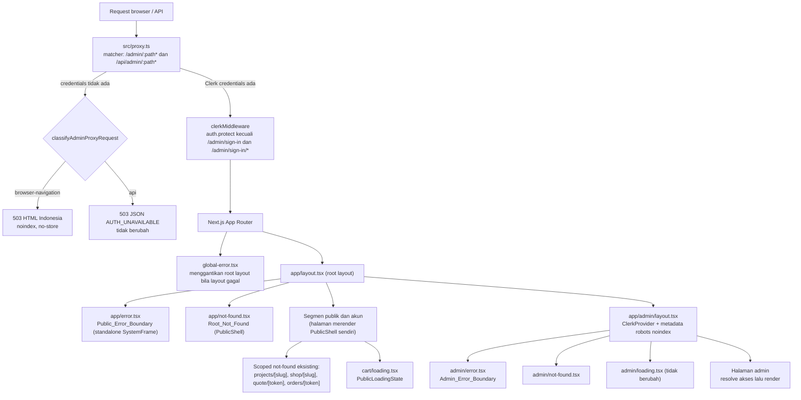
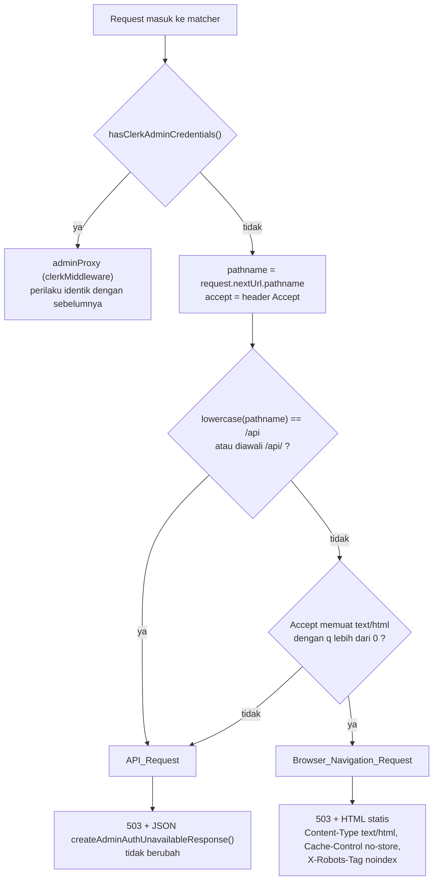
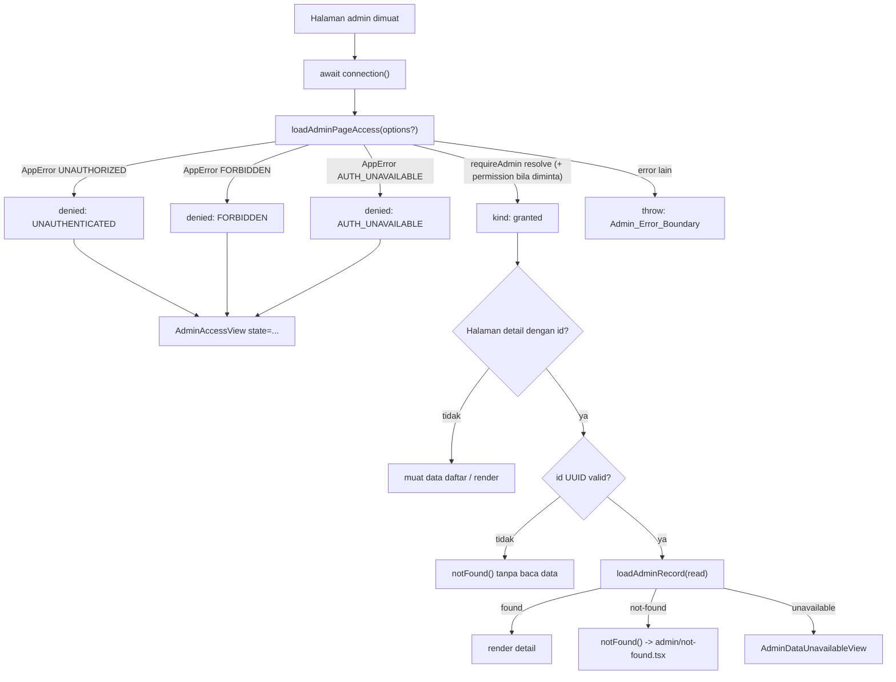
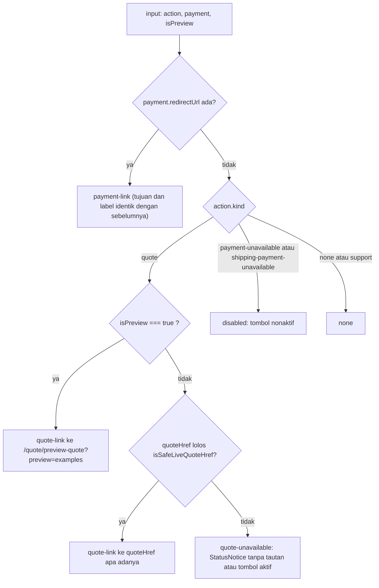

# Design Document: system-pages-and-error-states

## Overview

Spec ini menutup celah state sistem pada aplikasi Niuva (Next.js 16.3.2, App Router, `src/app`): 404 bermerek, error boundary (publik, admin, global), loading state, pemisahan state akses admin, respons browser untuk kegagalan auth di `src/proxy.ts`, verifikasi sign-in Clerk, pembedaan "record tidak ada" vs "sumber data tidak tersedia" pada detail admin, perbaikan `NextAction` pada status order, serta perapihan copy login Customer dan pembersihan direktori AUiS (bergantung persetujuan).

Prinsip desain:

- **Fail-closed tetap utuh.** Clerk + `requireAdmin()` tetap menjadi otoritas admin. Tidak ada pelonggaran `auth.protect`, CSP, atau pemeriksaan resource.
- **Tidak ada detail sensitif di UI.** Semua halaman sistem memakai copy statis; `error.message`, `stack`, `digest`, token, dan ID tidak pernah dirender.
- **Pakai yang sudah ada.** `PublicShell`, `StatusNotice`, `NiuvaLink`, `Button`, `src/design/typography.ts`, token semantik `globals.css`. Tidak ada dependency baru (R14.10).
- **Irisan kecil, kontrak eksisting dijaga.** Kontrak 404 yang sudah dipakai E2E (`/shop/[slug]`, `/quote/[token]`, `/orders/[token]`, `/services/[slug]`) dan redirect guard customer tidak diubah; itu menentukan cakupan loading state (Keputusan B).

Status penerimaan: **penerimaan visual belum ditinjau.** Lulus test atau build bukan persetujuan visual. Semua bukti verifikasi bersifat lokal/non-production; penerimaan perangkat fisik, teknologi bantu, provider, dan production tetap terpisah (lihat `AGENTS.md`).

### Ringkasan keputusan atas poin terbuka requirements

| Poin | Keputusan | Bagian |
| --- | --- | --- |
| (a) R3.10/R3.11 shell error publik | **Standalone** `SystemFrame` (R3.11). `PublicShell` tidak tersedia pada konteks `error.tsx`. Root 404 memakai `PublicShell` sungguhan. | Keputusan A |
| (b) R6.1 daftar segmen `connection()` | 21 segmen non-admin diklasifikasikan: **1 tercakup** (`/cart`), 20 dikecualikan dengan alasan. | Keputusan B |
| (c) R7.8 status 401/403/503 dari page | **Tidak bisa** di repo ini. Pertahankan HTTP 200 + `noindex` pada ketiga state. | Keputusan C |
| (d) R4.10/R14.3 `global-error` | Impor `globals.css` sendiri, font fallback Arial, skip link sendiri, `<meta robots>` + `<title>` React. | Keputusan D |
| (e) R10.1 verifikasi sub-step Clerk | Diverifikasi sebagian di Chromium lokal: sub-step **dialihkan ke `/admin/sign-in`** oleh proxy. Render langkah Clerk sebenarnya **belum terverifikasi**; perbaikan kondisional ditentukan. Ditemukan juga tautan "Sign up" pada instance dev. | Keputusan E |
| (f) R8 loader tri-state | `AdminRecordResult<T>`; **6 halaman detail** terdampak. | Keputusan F |
| (g) R12.3 sumber URL quote live | **Tidak ada sumber** pada proyeksi live. Jalur notice tanpa tautan ditetapkan; field opsional `quoteHref` disiapkan tanpa produsen. | Keputusan G |

### Rekonsiliasi redaksi requirements

Beberapa redaksi requirements tidak dapat dipenuhi secara harfiah atau saling berbenturan. Desain memilih tafsir berikut; semuanya perlu diketahui saat review.

| Requirement | Masalah | Tafsir desain |
| --- | --- | --- |
| R3.3, R3.7, R3.12, R4.8, R4.9, R5.4 ("fungsi reset") | Pada Next.js 16.3.2 `error.tsx` menerima `reset` dan `retry`. Dokumen `error.md` menyebut `retry` (stabil sejak v16.3.0) sebagai pemulihan yang mengambil ulang dan merender ulang children; `reset` hanya membersihkan state tanpa fetch ulang. | Tombol "Coba lagi" memanggil **`retry()`** tepat satu kali per aktivasi. Test menegaskan `retry` terpanggil 1x dan `reset` tidak dipanggil. |
| R6.7 ("tanpa main sendiri" tetapi "tepat satu main saat loading") | Dua klausa saling bertentangan bila dibaca harfiah. | Invarian yang dijaga: **tepat satu `main#main-content` pada setiap fase** (saat loading dan setelah halaman dirender). `loading.tsx` merender satu `main`; ia digantikan seluruhnya oleh `main` halaman, tidak pernah bersarang. |
| R1.7 / R2 (status 404) vs R6.1 (loading) | `loading.tsx` membuat response di-stream; `notFound()` setelah itu menghasilkan status 200 + `noindex` (`loading.md` "Status Codes", `not-found.md`). | Segmen yang kontrak 404-nya dipakai E2E atau R1.7 **tidak diberi** `loading.tsx` (Keputusan B). |
| R7.8 | Page tidak dapat mengatur status HTTP. | Fallback resmi R7.8: HTTP 200 + `robots` noindex (Keputusan C). |
| R10.9 (tanpa tautan sign-up) | Instance Clerk dev menampilkan tautan "Sign up" walau `withSignUp={false}`. | Mitigasi kode (sembunyikan `footerAction`) + tindak lanjut Owner di Clerk Dashboard (Keputusan E). |
| R14.5 ("memakai Status_Notice") | `StatusNotice` menambah label non-heading dan `role="alert"`; R3.2/R5.2 meminta satu heading + satu paragraf. | Halaman sistem memakai `h1` + `p` + `NiuvaLink`/`Button`. `StatusNotice` dipakai untuk notice inline (gagal keluar, `NextAction`). |
| R11.4 (frasa "login Customer") | Judul berawalan huruf besar ("Login Customer ...") tidak memuat "login Customer" secara case-sensitive. | Test memakai pencocokan case-insensitive; deskripsi memakai huruf kecil. |
| R5 (copy error admin) | "Tidak ada perubahan data" tidak boleh diklaim: error dapat terjadi setelah server action. | Copy admin error tidak mengklaim status mutasi. |

## Research Findings

### Next.js 16.3.2 (terpasang; dibaca dari `node_modules/next/dist/docs/01-app/`)

- **`03-api-reference/03-file-conventions/not-found.md`** — `not-found.js` dirender antara `loading.js` dan `page.js`; dibungkus Suspense dari `loading.js` dan error boundary `error.js` pada segmen yang sama. Root `app/not-found` juga menangani URL yang tidak cocok. Status: 200 untuk response yang di-stream, 404 untuk non-stream. `global-not-found.js` bersifat eksperimental dan butuh `experimental.globalNotFound` (tidak diaktifkan di `next.config.ts`); **tidak dipakai**.
- **`03-file-conventions/loading.md` (bagian Status Codes)** — saat streaming, status 200 dikirim; `notFound()` setelahnya hanya menambah `<meta name="robots" content="noindex">`. Untuk 404 sungguhan, resource harus dicek sebelum body di-stream.
- **`04-functions/not-found.md`** — `notFound()` melempar `NEXT_HTTP_ERROR_FALLBACK;404` dan menyuntik `noindex`; `try/catch` di sekitarnya menelan interupsi, gunakan `unstable_rethrow`.
- **`03-file-conventions/error.md`** — `error.js` wajib Client Component; **`retry` stabil sejak v16.3.0**, `reset` hanya mengosongkan state; `error.js` tidak membungkus `layout.js` pada segmen yang sama; pesan error dari Server Component di production generik dengan `digest`. `global-error` harus mendefinisikan `<html>` dan `<body>` sendiri, **tidak menyertakan global styles**, dan tidak mendukung `metadata` (gunakan komponen React `<title>`). Tipe terpasang (`client/components/error-boundary.d.ts`, `builtin/global-error.d.ts`) memuat `reset` dan `retry`.
- **`03-file-conventions/forbidden.md`, `04-functions/forbidden.md`, `05-config/01-next-config-js/authInterrupts.md`** — `forbidden()`/`unauthorized()` eksperimental, butuh `experimental.authInterrupts: true` (tidak ada di `next.config.ts`), tidak bisa dipanggil di root layout, dan di dalam Suspense/streaming tetap 200. Dokumen menyatakan 403 sungguhan harus diputuskan di `proxy`. → **tidak dipakai** (Keputusan C).
- **`03-file-conventions/proxy.md`** — `proxy.ts` berjalan di runtime Node.js, boleh mengembalikan `Response` langsung ("Producing a response"), `headers` dari `next.config` dieksekusi lebih dulu daripada proxy (urutan eksekusi), matcher harus konstanta, dan Server Function dicakup matcher path tempat ia dipanggil. Verifikasi auth tetap harus ada di tiap resource.
- **`04-functions/generate-metadata.md#robots`** — `robots: { index: false, follow: false }` → `<meta name="robots" content="noindex, nofollow">`.
- **`lib/metadata/resolve-metadata.js` (source, baris ±515–535 dan ±596)** — metadata konvensi error/not-found dikumpulkan lewat `errorConvention` dan ditaruh sebagai item terakhir ("layout -> layout -> not-found"). Artinya `export const metadata` pada `not-found.tsx` **didukung** pada versi ini (dokumen `not-found.md` hanya mencontohkannya untuk `global-not-found`). Catatan: metadata not-found tidak boleh memakai `params`/token (R2.7).

### Temuan repo

- `PublicShell` adalah komponen server yang mengimpor `isLocalDemoMode` dari `@/lib/env/server` (baca `process.env` server) dan `PublicNavigation` (client). Setiap halaman merender `PublicShell` sendiri; **tidak ada layout yang memuatnya**. Saat halaman melempar error, shell halaman itu ikut hilang; `error.tsx` hanya hidup di dalam `<body><TooltipProvider>` dari root layout.
- `src/app/admin/layout.tsx` hanya `ClerkProvider`; `AdminShell` dirender oleh tiap halaman. `src/app/admin/loading.tsx` memakai `main#main-content[role=status]` dan tidak diubah (R6.9).
- `AdminAccessUnavailableView` tidak menerima props. `loadAdminPageAccess()` mengembalikan `null` untuk ketiga kode `UNAUTHORIZED|FORBIDDEN|AUTH_UNAVAILABLE`, sehingga state hilang. Dua belas halaman admin (enam daftar dan enam detail) punya `loadAdminAccess()` privat yang menelan **semua** error (`catch { return null }`); dua halaman privacy menelan semua error dari `requireAdmin` + `requireAdminPermission`.
- `AdminOperationsService.getOrder/getInquiry/getCustomPrintRequest/getPortfolio/getProduct/getStockHistory` mengembalikan `null` bila record tidak ada. Loader privat pada halaman detail membungkusnya `try/catch → null`, jadi **record yang tidak ada tampil sebagai "belum dapat dimuat"** (salah lapor). Hanya halaman stok yang membedakan (`undefined` = tidak tersedia, `null` = tidak ada) lewat sentinel ad hoc.
- Token akses disimpan sebagai hash (`src/modules/shared/access-token.ts`, `tokenHash`); token mentah hanya ada saat penerbitan. `OrderStatusPreview.nextAction` tidak punya field URL; builder live (`toOrderStatusPreview`/`nextAction()` di `src/features/frontend-preview/order-status.ts`) hanya menghasilkan `kind` `"support"` atau `"none"`. `kind: "quote"` hanya muncul dari `order-status-fixture.ts`.
- Tidak ada `fast-check` (atau library PBT lain) di `package.json`. Vitest unit hanya mencakup `tests/unit/**`; integrasi di `tests/integration/**` dengan config terpisah.
- E2E (`playwright.config.ts`) menjalankan server dengan `NEXT_PUBLIC_CLERK_PUBLISHABLE_KEY` dan `CLERK_SECRET_KEY` kosong, sehingga proxy mengembalikan 503. `tests/e2e/admin-access.spec.ts` dan `admin-action-queue.spec.ts` menegaskan teks `AUTH_UNAVAILABLE` pada navigasi browser; setelah R9 navigasi browser menerima HTML, jadi kedua spec harus diperbarui.
- E2E eksisting menegaskan status 404 untuk `/shop/produk-tidak-ada`, `/quote/token-tidak-valid`, `/orders/token-tidak-valid`, `/services/layanan-tidak-ada` (`product-detail.spec.ts`, `quote-review.spec.ts`, `order-status.spec.ts`, `public-pages.spec.ts`).

## Architecture

### Hierarki boundary



### Alur proxy saat Clerk credentials tidak ada



Catatan: fetch RSC dari navigasi klien mengirim `Accept: text/x-component`, sehingga tergolong `api` dan menerima JSON 503. Router Next.js lalu jatuh ke navigasi penuh, yang menerima HTML. Ini perilaku yang diinginkan dan tercakup test.

### Alur akses dan detail halaman admin



Urutan baru pada halaman detail: **akses → validasi UUID → baca data**. Sebelumnya UUID dicek sebelum akses. Memindahkan akses ke depan memenuhi R8.9 (penolakan akses tidak boleh menghasilkan not-found atau unavailable) tanpa biaya tambahan.

### Resolusi kontrol `NextAction`



## Keputusan Desain

### Keputusan A — Shell error publik (R3.10, R3.11, R1.2)

- **Root_Not_Found** (`src/app/not-found.tsx`) adalah Server Component dan dirender di dalam `PublicShell scope="system-not-found"` (R1.2).
- **Public_Error_Boundary** (`src/app/error.tsx`) adalah Client Component. Konteks `PublicShell` **tidak tersedia** di sana: shell dirender oleh halaman yang gagal, dan `PublicShell` adalah pohon komponen server (membaca `process.env` server untuk badge demo, memuat profil perusahaan). Mengimpornya ke modul client akan menarik kode env server ke bundle client dan membuat `isLocalDemoMode()` salah (selalu "standard"). Maka berlaku **R3.11**: layout mandiri `SystemFrame` berisi skip link, bilah header gelap dengan `NiuvaLogo` yang menaut ke `/`, dan `main#main-content`. Tanpa navigasi, footer, atau badge demo.
- Error yang berasal dari `admin/layout.tsx` naik ke boundary root ini (karena `error.tsx` tidak membungkus layout di segmennya); hasilnya tetap aman karena copy statis.
- `SystemFrame` memakai atribut `data-foundation-scope="system"` dan `data-product-screen-proof-status="pending-owner-review"` agar status visual tetap "belum ditinjau".

### Keputusan B — Cakupan `loading.tsx` (R6.1)

Aturan pengecualian, dari fakta di atas:

- **X1 — kontrak 404.** Subtree memuat `notFound()` yang statusnya 404 dipakai E2E atau disebut R1.7/R2. Menambah `loading.tsx` pada segmen itu atau induknya membuat response di-stream sehingga status menjadi 200.
- **X2 — redirect guard.** Halaman memanggil `redirect()` untuk Customer yang belum login. Dengan streaming, 307 berubah menjadi redirect sisi-klien setelah skeleton tampil.
- **X3 — root.** `src/app/loading.tsx` akan membungkus `admin/layout.tsx` (`ClerkProvider dynamic` yang suspend), sehingga skeleton publik bisa berkedip di area admin.
- **X4 — non-produk.** Rute demo/pengujian internal yang `notFound()` di luar mode tertentu.

Inventaris lengkap segmen non-admin yang memakai `connection()` (hasil `grep` atas `src/app/**`, 21 berkas):

| # | Segmen | Berkas | Keputusan | Alasan |
| - | --- | --- | --- | --- |
| 1 | `/` | `src/app/page.tsx` | Dikecualikan | X3 |
| 2 | `/account` | `account/page.tsx` | Dikecualikan | X2; `loading.tsx` di `account/` juga membungkus `make/[id]`, `orders/[id]`, `inquiries/[id]` yang `notFound()` (R1.7 menyebutnya) → X1 |
| 3 | `/account/privacy` | `account/privacy/page.tsx` | Dikecualikan | X2 |
| 4 | `/account/privacy/confirm` | `account/privacy/confirm/page.tsx` | Dikecualikan | Berada di bawah `account/privacy` (X2); tidak ada induk yang dapat diberi loading tanpa X2 |
| 5 | `/account/inquiries/[id]` | `account/inquiries/[id]/page.tsx` | Dikecualikan | X1 (R1.7), X2 |
| 6 | `/account/orders/[id]` | `account/orders/[id]/page.tsx` | Dikecualikan | X1 (R1.7), X2 |
| 7 | `/account/make/[id]` | `account/make/[id]/page.tsx` | Dikecualikan | X1 (R1.7), X2 |
| 8 | `/cart` | `cart/page.tsx` | **Tercakup** | Tanpa `notFound()`, tanpa `redirect()`, tanpa anak |
| 9 | `/checkout` | `checkout/page.tsx` | Dikecualikan | X2 |
| 10 | `/custom-print` | `custom-print/page.tsx` | Dikecualikan | Anak `requests/[token]` memakai `notFound()` (R1.7) → X1; anak `request` memakai `redirect()` → X2 |
| 11 | `/custom-print/request` | `custom-print/request/page.tsx` | Dikecualikan | X2 |
| 12 | `/custom-print/requests/[token]` | `custom-print/requests/[token]/page.tsx` | Dikecualikan | X1 (R1.7, R2.4) |
| 13 | `/orders/[token]` | `orders/[token]/page.tsx` | Dikecualikan | X1 (`order-status.spec.ts`, R2.2) |
| 14 | `/quote/[token]` | `quote/[token]/page.tsx` | Dikecualikan | X1 (`quote-review.spec.ts`, R2.1) |
| 15 | `/project-brief` | `project-brief/page.tsx` | Dikecualikan | X2 |
| 16 | `/services/[slug]` | `services/[slug]/page.tsx` | Dikecualikan | X1 (`public-pages.spec.ts`, R1.3) |
| 17 | `/shop` | `shop/page.tsx` | Dikecualikan | Anak `shop/[slug]` memakai `notFound()` dengan 404 yang dites (`product-detail.spec.ts`) → X1 |
| 18 | `/shop/[slug]` | `shop/[slug]/page.tsx` | Dikecualikan | X1 |
| 19 | `/demo/action-queue` | `demo/action-queue/page.tsx` | Dikecualikan | X4 |
| 20 | `/internal-testing/policy` | `internal-testing/policy/page.tsx` | Dikecualikan | X4 |
| 21 | `/internal-testing/google-consent` | `internal-testing/google-consent/page.tsx` | Dikecualikan | X4 |

Hasil: **satu `loading.tsx` baru** (`src/app/cart/loading.tsx`) memakai komponen bersama `PublicLoadingState`. Komponen itu dibuat reusable agar segmen lain bisa ikut tanpa desain ulang.

**Opsi tindak lanjut (bukan bagian spec ini; perlu keputusan Owner):**
1. *Opsi B1 — terima 200 + noindex* untuk segmen X1/X2 dan ubah E2E yang menegaskan 404. Melanggar R1.7/R2 sebagaimana ditulis, jadi tidak dipilih.
2. *Opsi B2 — route group.* Pindahkan `shop/page.tsx`, `custom-print/page.tsx`, dan `account/page.tsx` ke `(list)/` agar `loading.tsx` tidak membungkus anak yang `notFound()`. Memindahkan berkas mengubah impor dan test yang merujuk `@/app/shop/page`; terlalu besar untuk irisan pertama.

Pengamanan agar klasifikasi tidak usang: test manifest (`tests/unit/system-pages-coverage.test.ts`) memindai `src/app/**/page.tsx` non-admin yang memuat `connection()` dan mewajibkan setiap berkas tercantum di manifest (tercakup/dikecualikan + alasan), setiap entri "tercakup" punya `loading.tsx`, dan setiap `loading.tsx` non-admin tercantum sebagai tercakup.

### Keputusan C — Status HTTP state akses admin (R7.8)

Tidak dapat ditetapkan dari page pada repo ini:

- Komponen page tidak punya API untuk mengubah status response. Satu-satunya jalur bawaan adalah `forbidden()`/`unauthorized()`, yang (1) eksperimental dan butuh `experimental.authInterrupts: true` yang **tidak** ada di `next.config.ts`, (2) tidak boleh dipanggil di root layout, dan (3) di dalam boundary Suspense/streaming tetap mengirim 200 (`04-functions/forbidden.md`). Halaman admin selalu berada di bawah `admin/loading.tsx`, jadi response di-stream.
- 503 untuk `AUTH_UNAVAILABLE` tidak punya jalur sama sekali dari page.

Maka berlaku fallback R7.8: **HTTP 200 + `robots: { index: false, follow: false }` pada ketiga state.** Status 401/403/503 tetap dimiliki proxy: `auth.protect` menangani belum login; kegagalan konfigurasi Clerk menghasilkan 503 di proxy (R9). `AUTH_UNAVAILABLE` tingkat halaman hanya terjadi bila `assertAdminAccessAvailable` menolak (database tidak tersedia) saat credentials Clerk ada.

Agar `noindex` dijamin walau sebuah halaman admin lupa mengekspor `metadata`, `src/app/admin/layout.tsx` menambahkan `export const metadata` dengan `robots: { index: false, follow: false }` (defense in depth; semua halaman admin yang ada sudah mengekspor nilai yang sama).

### Keputusan D — `global-error` (R4.5, R4.6, R4.10, R14.3)

- Komponen Client dengan `<html lang="id">` dan `<body>` sendiri; tidak memakai provider atau komponen dari root layout (R4.5). Hanya `Button`/`buttonVariants` dari `components/ui` dan `SkipLink` yang mandiri.
- **Styling:** `import "./globals.css"` di berkas ini, sesuai `error.md` (global-error tidak menerima global styles). Dengan demikian token semantik (`bg-background`, `text-foreground`, `min-h-11`, dst.) tersedia. **Font:** `next/font` dideklarasikan di root layout dan tidak diambil ulang; `body` jatuh ke fallback terdokumentasi di `DESIGN.md` (Arial, Helvetica, sans-serif) melalui aturan `body` di `globals.css` saat `--font-public-sans` tidak terdefinisi.
- **Gaya minimal bila token/CSS gagal dimuat (R4.10):** struktur HTML semantik tetap terbaca dan dapat dioperasikan dengan gaya bawaan browser (h1, p, button, a). Target 44px bergantung pada kelas `min-h-11`; bila CSS gagal, tombol tetap berfungsi dengan ukuran bawaan. Ini batas yang diterima dan dicatat.
- **Noindex:** `<head>` berisi `<title>Niuva belum dapat dimuat</title>` dan `<meta name="robots" content="noindex, nofollow">` (`metadata` tidak didukung pada boundary client).
- **Skip link:** `SkipLink` adalah elemen fokus pertama di `<body>` dan menuju `#main-content` pada dokumen yang sama.
- **Tautan beranda:** `<a href="/">` biasa (navigasi penuh), bukan `next/link`, karena konteks router tidak dijamin saat root layout gagal.
- **Coba lagi:** memanggil `retry()`; jika render ulang gagal lagi, Next.js merender ulang boundary yang sama (R4.9).
- **Verifikasi:** unit test atas `GlobalErrorView` (konten) dan markup statis seluruh dokumen. Perilaku browser untuk kegagalan root layout **belum terverifikasi otomatis**; verifikasi manual: lempar error sementara di `layout.tsx` pada build lokal, lalu kembalikan. Tidak ada hook pengujian yang ditambahkan ke kode produksi.

### Keputusan E — Verifikasi sub-step Clerk (R10)

**Metode.** Server dev Next.js 16.3.2 lokal (`next dev -p 3137`, `distDir` terpisah) dengan Clerk **Development instance** dari `.env.local`; Chromium (Playwright) tanpa sesi login. Untuk tiap path dicatat path diminta, URL akhir, dan klasifikasi. Tanggal: 2026-10-03. Bukti lokal/non-production.

**Hasil (sebelum perubahan):**

| Path diminta | URL akhir | Klasifikasi |
| --- | --- | --- |
| `/admin/sign-in` | `/admin/sign-in` | Halaman sign-in Clerk ter-render |
| `/admin/sign-in/factor-one` | `/admin/sign-in` | **Dialihkan kembali ke `/admin/sign-in`** |
| `/admin/sign-in/factor-two` | `/admin/sign-in` | **Dialihkan kembali ke `/admin/sign-in`** |
| `/admin/sign-in/sso-callback` | `/admin/sign-in` | **Dialihkan kembali ke `/admin/sign-in`** |
| `/admin/sign-in-other` | `/admin/sign-in` | Dialihkan (benar: harus tetap diproteksi) |

**Kesimpulan terverifikasi:** proxy saat ini hanya mengecualikan path persis `/admin/sign-in` (dan `/admin/sign-in/`), sehingga seluruh Clerk_Sub_Step dilindungi `auth.protect` dan dialihkan. Kondisi R10.3 terpenuhi → **perbaikan proxy wajib**: `isAdminSignInPath(p) ⇔ p === "/admin/sign-in" || p.startsWith("/admin/sign-in/")`. `/admin/sign-in-other` tetap diproteksi (R10.5, R10.6).

**Belum terverifikasi (dicatat sesuai R10.10):**
1. Apakah Clerk me-render langkah yang diminta (bukan sekadar form awal) di URL sub-step setelah proxy diperbaiki. Langkah seperti `factor-one` hanya muncul bila ada upaya sign-in yang sedang berjalan; itu membutuhkan akun uji Clerk dengan faktor kedua, yang tidak tersedia di lingkungan ini.
2. Apakah rute `src/app/admin/sign-in/page.tsx` (bukan catch-all) menghasilkan 404 pada sub-step setelah proxy diperbaiki. Tidak ada berkas rute untuk `/admin/sign-in/factor-one`, jadi 404 hampir pasti; ini **belum teramati** karena proxy mencegat lebih dulu.

**Perbaikan kondisional (urutan implementasi):**
1. Perbaiki proxy (wajib, terbukti).
2. Ulangi probe yang sama terhadap `/admin/sign-in/factor-one`, `/admin/sign-in/sso-callback`, dan satu path lain.
3. **Jika** salah satunya 404 atau tidak me-render Clerk: pindahkan `src/app/admin/sign-in/page.tsx` menjadi `src/app/admin/sign-in/[[...sign-in]]/page.tsx` (tidak boleh ada dua berkas rute pada URL yang sama), pertahankan `routing="path"`, `path="/admin/sign-in"`, `forceRedirectUrl="/admin"`, `withSignUp={false}` dan `metadata.robots` (R10.7, R10.8), lalu perbarui impor `tests/unit/admin-sign-in.test.tsx`.
4. **Jika** semua sub-step ter-render tanpa catch-all: catat "tidak ada perubahan rute diperlukan" beserta path, URL akhir, dan klasifikasi (R10.4).

**Temuan tambahan (R10.9).** Pada probe yang sama, `/admin/sign-in` menampilkan tautan **"Sign up"** menuju Account Portal Clerk (instance dev) walau `withSignUp={false}`. Itu bertentangan dengan R10.9 (tanpa tautan sign-up). Mitigasi kode: tambahkan `elements.footerAction: { display: "none" }` pada `appearance` (presentasi saja). Pengendalian sesungguhnya adalah konfigurasi Clerk Dashboard (nonaktifkan sign-up atau batasi dengan allowlist), yang termasuk konfigurasi provider dan **tidak diubah oleh spec ini**; tindak lanjut untuk Owner. Akses admin tetap tertutup karena `requireAdmin()` mensyaratkan `AdminProfile` aktif.

### Keputusan F — Loader tri-state dan halaman detail admin (R8)

Halaman yang terdampak (semuanya memakai pola `try/catch → null` yang menggabungkan "tidak ada" dan "gagal"):

| Halaman | Loader privat sekarang | Perubahan |
| --- | --- | --- |
| `admin/orders/[id]/page.tsx` | `loadOrder` → `getOrder` | `loadAdminRecord(() => service.getOrder(id))` |
| `admin/inquiries/[id]/page.tsx` | `loadInquiry` → `getInquiry` | `loadAdminRecord(() => service.getInquiry(id))` |
| `admin/custom-print/[id]/page.tsx` | `loadRequest` → `getCustomPrintRequest` | `loadAdminRecord(...)` di dalam `Promise.all` yang sama |
| `admin/portfolio/[id]/page.tsx` | `loadProject` → `getPortfolio` | `loadAdminRecord(...)` |
| `admin/products/[id]/page.tsx` | `loadProduct` → `getProduct` | `loadAdminRecord(...)` |
| `admin/products/[id]/stock/[variantId]/page.tsx` | `loadHistory` (sentinel `undefined`/`null`) | `loadAdminRecord(...)`; sentinel dihapus |

Pembacaan sekunder yang tidak dibungkus (`B2BQuoteService.listForAdmin`, `CustomPrintEstimateService.latestForAdmin`) tetap; bila gagal, errornya ditangkap `Admin_Error_Boundary` tanpa bocor detail. Halaman daftar (`orders`, `inquiries`, `custom-print`, `portfolio`, `products`, `pricing`, `queue`, `page`) tidak punya pembedaan record, hanya berpindah ke `loadAdminPageAccess` bersama agar state akses diteruskan (R7.6).

Perilaku baru yang disengaja: error tak terduga saat evaluasi akses (bukan `UNAUTHORIZED|FORBIDDEN|AUTH_UNAVAILABLE`) kini **dilempar** ke `Admin_Error_Boundary` pada semua halaman (sebelumnya dua belas halaman menelannya menjadi "akses belum tersedia"). Tetap fail-closed dan tidak membocorkan detail, tetapi tidak lagi menyamarkan kegagalan infrastruktur sebagai masalah izin.

Status HTTP `notFound()` admin tetap 200 + noindex karena halaman berada di bawah `admin/loading.tsx` (sama dengan Keputusan C).

### Keputusan G — URL quote pada proyeksi live (R12.3, R12.4)

- **Sumber tidak ada hari ini.** `OrderStatusPreview.nextAction` tidak punya field URL; builder live tidak pernah menghasilkan `kind: "quote"`; token quote hanya tersimpan sebagai hash sehingga URL `/quote/<token>` tidak dapat direkonstruksi saat membaca status order. `PublicOrderStatus` juga tidak membawa ID request custom print.
- **Kandidat sumber masa depan** (di luar spec ini, butuh perluasan repository `findForPublicStatusById` dan tinjauan Tech Design): proyeksi membawa ID request custom print milik order sehingga `nextAction.quoteHref = "/account/make/<requestId>"` (rute akun yang sudah mengelola keputusan quote, dilindungi login Customer).
- **Yang dirancang sekarang:** tambahkan field opsional `quoteHref?: string` pada `OrderStatusPreview["nextAction"]` (tanpa produsen), fungsi murni `resolveNextActionControl`, dan validator `isSafeLiveQuoteHref`. Untuk `kind: "quote"` pada live tanpa URL valid, komponen merender `StatusNotice` ("Tautan quote belum tersedia") tanpa `<a>`/`<button>` aktif (R12.4). Mode preview vs live hanya ditentukan prop `isPreview === true` (R12.5, R12.6).
- `isSafeLiveQuoteHref(value)`: string tidak kosong, diawali `/` tetapi bukan `//` dan tanpa `\`, tanpa spasi/karakter kontrol, panjang ≤ 2048, `new URL(value, "http://niuva.invalid").origin === "http://niuva.invalid"` (satu-origin), dan **tidak memuat `preview` (case-insensitive)**, yang mencakup `/quote/preview-quote` dan `preview=examples`.

## Daftar Perubahan Berkas

### Berkas baru

| Path | Tujuan | Requirements |
| --- | --- | --- |
| `src/app/not-found.tsx` | Root_Not_Found di dalam `PublicShell`; `metadata.robots` noindex/nofollow | R1, R2.5, R14 |
| `src/app/error.tsx` | Public_Error_Boundary (Client) di `SystemFrame` | R3, R14 |
| `src/app/global-error.tsx` | Global_Error_Boundary (Client), `html`/`body` sendiri | R4, R14 |
| `src/app/admin/error.tsx` | Admin_Error_Boundary (Client) | R5, R14 |
| `src/app/admin/not-found.tsx` | Not-found admin (Server), `metadata.robots` | R8.5, R8.6, R14 |
| `src/app/cart/loading.tsx` | Satu-satunya Loading_State baru | R6 |
| `src/app/admin/admin-record-loader.ts` | `AdminRecordResult<T>` dan `loadAdminRecord` | R8 |
| `src/components/niuva/system-state-copy.ts` | Seluruh copy halaman sistem (satu sumber, dapat dites R14.9) | R1–R8, R14 |
| `src/components/niuva/system-state-view.tsx` | `h1` + `p` + slot aksi; varian `public`/`admin` | R1, R3, R5, R7, R8, R14 |
| `src/components/niuva/system-frame.tsx` | Frame mandiri publik untuk `error.tsx` | R3.11 |
| `src/components/niuva/skip-link.tsx` | Skip link bersama | R14.3 |
| `src/components/niuva/system-focus-target.tsx` | Client: fokus programatik ke `h1` saat mount | R14.7 |
| `src/components/niuva/public-loading-state.tsx` | Skeleton + `role="status"` di dalam `PublicShell` | R6 |
| `src/components/niuva/admin-access-actions.tsx` | Client: `AdminSignOutButton`, `AdminReloadButton` | R7.3, R7.4, R7.12–R7.14 |
| `src/lib/auth/admin-proxy-response.ts` | `classifyAdminProxyRequest`, `isAdminSignInPath`, respons HTML 503 | R9, R10.3, R10.5, R10.6 |
| `src/app/orders/[token]/next-action.ts` | `resolveNextActionControl`, `isSafeLiveQuoteHref` (murni) | R12 |
| `tests/unit/*.test.ts(x)` dan `tests/e2e/system-pages.spec.ts` | Lihat Testing Strategy | R15 |

### Berkas yang diubah

| Path | Perubahan | Requirements |
| --- | --- | --- |
| `src/proxy.ts` | Cabang tanpa credentials memilih HTML/JSON berdasar klasifikasi; allowlist sign-in prefix; `createAdminAuthUnavailableResponse()` **tidak diubah** | R9, R10 |
| `src/app/admin/admin-access-view.tsx` | `AdminAccessUnavailableView` → `AdminAccessView({ state })` dengan copy/aksi per state | R7 |
| `src/app/admin/admin-page-access.ts` | `loadAdminPageAccess(options?)` mengembalikan `AdminPageAccessResult`; tambah `toAdminAccessState` | R7.6 |
| `src/app/admin/layout.tsx` | Tambah `metadata.robots` noindex/nofollow | R7.9, R5.7 |
| `src/app/admin/page.tsx`, `queue/page.tsx` | Konsumsi `AdminPageAccessResult` | R7 |
| `src/app/admin/{custom-print,inquiries,orders,portfolio,pricing,products}/page.tsx` | Hapus `loadAdminAccess` privat; pakai `loadAdminPageAccess` | R7.6, R7.7 |
| `src/app/admin/privacy/page.tsx`, `privacy/policy/page.tsx` | `loadAdminPageAccess({ permission: "PRIVACY_REQUEST_MANAGE" })` | R7 |
| `src/app/admin/{orders,inquiries,custom-print,portfolio,products}/[id]/page.tsx` dan `products/[id]/stock/[variantId]/page.tsx` | Urutan akses → UUID → `loadAdminRecord`; cabang `not-found`/`unavailable` | R8 |
| `src/app/orders/[token]/order-status.tsx` | `NextAction` memakai `resolveNextActionControl` | R12 |
| `src/features/frontend-preview/order-status.ts` | Tipe: `nextAction.quoteHref?: string` (tanpa produsen) | R12.3 |
| `src/app/admin/sign-in/page.tsx` | `elements.footerAction: { display: "none" }`; **kondisional** dipindah ke `[[...sign-in]]/page.tsx` | R10 |
| `src/app/checkout/page.tsx`, `project-brief/page.tsx`, `custom-print/request/page.tsx`, `custom-print/page.tsx` | Copy "login Customer" netral (tabel R11 di bawah) | R11 |
| `tests/unit/admin-access-view.test.tsx` | Judul/aksi per state (lihat Testing Strategy) | R7, R15 |
| `tests/unit/admin-proxy.test.ts` | Tambah kasus HTML/JSON/prefix sign-in | R9, R10 |
| `tests/integration/admin-page-route.test.ts` | Teks "Akses admin belum tersedia" → judul state `FORBIDDEN` | R7 |
| `tests/e2e/admin-access.spec.ts`, `admin-action-queue.spec.ts` | Navigasi browser kini menerima HTML (bukan teks `AUTH_UNAVAILABLE`); tambah kasus API JSON | R9, R15 |

Tidak diubah: `package.json`, `.github/workflows/`, migrasi, `next.config.ts`, `src/app/admin/loading.tsx`, empat not-found eksisting, `createAdminAuthUnavailableResponse()`.

### Copy login Customer (R11)

| Berkas | Teks baru |
| --- | --- |
| `checkout/page.tsx` (deskripsi notice, judul "Login Customer belum tersedia." tetap) | "Checkout membutuhkan login Customer. Lengkapi konfigurasi autentikasi non-production sebelum melanjutkan." |
| `project-brief/page.tsx` (deskripsi; judul tetap) | "Project Brief memerlukan login Customer sebelum dapat dikirim pada runtime ini." |
| `custom-print/request/page.tsx` (deskripsi; judul tetap) | "Request MAKE memerlukan login Customer sebelum dapat dikirim pada runtime ini." |
| `custom-print/page.tsx` (a) judul notice | "Login Customer belum tersedia pada runtime ini." |
| `custom-print/page.tsx` (b) teks ajakan | "Pengajuan menunggu login Customer tersedia." |
| `custom-print/page.tsx` (c) judul status | "Pengiriman menunggu login Customer." |

Kondisi gating, flag `customerGoogle`, dan redirect `/login` tidak disentuh (R11.5). Catatan: `checkout/page.tsx` baris body ("Identitas Customer berasal dari Google session") juga menyebut Google tetapi berada di luar cakupan R11; ditandai untuk keputusan Owner, tidak diubah. Tidak ada test eksisting yang menegaskan copy lama (pencarian `tests/`), sehingga R11.7 tidak memerlukan pembaruan test; test baru menegaskan copy baru dan tidak adanya "Google" (case-insensitive).

### Pembersihan AUiS (R13)

Keadaan saat verifikasi desain: `src/app/auis/{_data,proofs,styleguide,welcome,wireframes}` dan `src/app/api/auis/brand` hanya berisi subdirektori, **nol berkas**. Prosedur yang hanya dijalankan setelah instruksi tertulis Owner yang menyebut penghapusan AUiS_Empty_Directories: (1) ulangi hitung berkas per direktori (`Get-ChildItem -Recurse -File`); lewati dan laporkan jalur serta jumlah bila ≥ 1; (2) cari impor/referensi string ke tiap jalur di `src`, konfigurasi, dan dokumen aktif, laporkan hasilnya, lewati yang direferensikan; (3) hapus hanya direktori tersebut (terdalam dulu), tidak menyentuh `src/app/auis` dan `src/app/api/auis`; (4) jalankan `corepack pnpm typecheck` dan `corepack pnpm build`, laporkan exit code. Git tidak melacak direktori kosong, jadi rollback = membuat ulang direktori kosong. Desain ini **bukan** otorisasi penghapusan.

## Components and Interfaces

### Copy dan tampilan sistem

```ts
// src/components/niuva/system-state-copy.ts
export const SYSTEM_HEADING_ID = "system-state-title" as const;

export type SystemStateCopy = Readonly<{ title: string; description: string }>;

export const systemCopy = {
  notFound: {
    title: "Halaman ini tidak tersedia.",
    description: "Alamat yang Anda buka tidak tersedia atau sudah dipindahkan. Lanjutkan dari beranda atau katalog.",
  },
  publicError: {
    title: "Halaman belum dapat dimuat.",
    description: "Terjadi kegagalan saat menyiapkan halaman ini. Coba lagi, atau kembali ke beranda.",
  },
  globalError: {
    title: "Niuva belum dapat dimuat.",
    description: "Terjadi kegagalan pada aplikasi. Coba lagi dalam beberapa saat, atau kembali ke beranda.",
  },
  adminError: {
    title: "Ruang Admin belum dapat dimuat.",
    description: "Terjadi kesalahan saat memuat halaman ini. Coba lagi, atau kembali ke Overview.",
  },
  adminNotFound: {
    title: "Data admin tidak ditemukan.",
    description: "Data yang diminta tidak ada atau sudah tidak tersedia. Kembali ke Overview untuk melanjutkan.",
  },
  adminAccess: {
    UNAUTHENTICATED: {
      title: "Masuk untuk membuka ruang Admin",
      description: "Sesi Anda belum aktif atau sudah berakhir. Masuk dengan akun Owner atau Admin Niuva.",
    },
    FORBIDDEN: {
      title: "Akun ini tidak memiliki akses Admin",
      description: "Akun yang sedang masuk belum terdaftar sebagai Owner atau Admin aktif. Keluar, lalu masuk dengan akun lain.",
    },
    AUTH_UNAVAILABLE: {
      title: "Layanan autentikasi belum tersedia",
      description: "Akses Admin belum dapat diperiksa saat ini. Muat ulang halaman, atau coba lagi beberapa saat lagi.",
    },
  },
  signOutFailed: { title: "Keluar belum berhasil", description: "Coba keluar lagi." },
  loading: { cart: "Memuat keranjang" },
  actions: {
    retry: "Coba lagi",
    home: "Kembali ke beranda",
    shop: "Lihat Shop",
    adminHome: "Kembali ke Overview",
    publicSite: "Ke halaman publik",
    signIn: "Masuk",
    signOut: "Keluar",
    reload: "Muat ulang",
  },
} as const satisfies Record<string, unknown>;
```

Aturan copy (R14.9), dites otomatis: setiap kalimat ≤ 20 kata, bahasa Indonesia, dan tidak memuat "exception", "stack", atau "digest" (case-insensitive).

```tsx
// src/components/niuva/system-state-view.tsx  (tanpa "use client"; aman diimpor dari client maupun server)
export type SystemStateViewProps = Readonly<{
  variant: "public" | "admin";
  title: string;
  description: string;
  eyebrow?: string;
  stateId: string;            // dirender sebagai data-system-state untuk selektor E2E
  children: ReactNode;        // aksi: NiuvaLink / Button
}>;
// Merender: [varian admin: <SkipLink/>] <main id="main-content" data-system-state=...>
//   <p eyebrow/> <h1 id={SYSTEM_HEADING_ID} tabIndex={-1} class={type.heading.className}/> <p description/> <div aksi/> </main>
// Varian public tidak merender SkipLink (disediakan PublicShell atau SystemFrame).
```

```tsx
// src/components/niuva/system-frame.tsx
export function SystemFrame({ children }: Readonly<{ children: ReactNode }>): JSX.Element;
// <div data-foundation-scope="system" data-product-screen-proof-status="pending-owner-review">
//   <SkipLink/> <header class="dark ..."><Link href="/"><NiuvaLogo/></Link></header> {children}
```

```tsx
// src/components/niuva/skip-link.tsx
export function SkipLink(): JSX.Element; // <a href="#main-content">Lewati ke konten utama</a>, kelas sama dengan PublicShell

// src/components/niuva/system-focus-target.tsx
"use client";
export function SystemFocusTarget(props: Readonly<{ targetId?: string }>): null;
// useEffect(() => document.getElementById(targetId ?? SYSTEM_HEADING_ID)?.focus({ preventScroll: true }), [])
```

Dengan `h1` berfokus (`tabIndex={-1}`), satu Tab berikutnya mendarat pada aksi pemulihan pertama karena urutan DOM `h1 → p → aksi` (R14.7). Skip link berada sebelum `h1` sehingga tetap elemen fokus pertama pada muat halaman penuh.

### Boundary

```tsx
// src/app/not-found.tsx (Server)
export const metadata: Metadata = { title: "Halaman tidak tersedia · Niuva", robots: { index: false, follow: false } };
export default function RootNotFound() {
  return (
    <PublicShell scope="system-not-found">
      <SystemFocusTarget />
      <SystemStateView variant="public" stateId="not-found" {...systemCopy.notFound}>
        <NiuvaLink href="/" className="min-h-11">{a.home}</NiuvaLink>
        <NiuvaLink href="/shop" variant="outline" className="min-h-11">{a.shop}</NiuvaLink>
      </SystemStateView>
    </PublicShell>
  );
}
```

```tsx
// src/app/error.tsx
"use client";
type ErrorBoundaryProps = Readonly<{ error: Error & { digest?: string }; reset: () => void; retry: () => void }>;
export default function PublicError({ retry }: ErrorBoundaryProps) {
  return (
    <SystemFrame>
      <meta name="robots" content="noindex, nofollow" />
      <SystemFocusTarget />
      <SystemStateView variant="public" stateId="error" {...systemCopy.publicError}>
        <Button type="button" className="min-h-11" onClick={() => retry()}>{a.retry}</Button>
        <NiuvaLink href="/" variant="outline" className="min-h-11">{a.home}</NiuvaLink>
      </SystemStateView>
    </SystemFrame>
  );
}
// `error` tidak pernah dibaca atau dirender.
```

`src/app/admin/error.tsx` identik secara struktur dengan `variant="admin"`, tautan ke `/admin`, dan tanpa `SystemFrame`. `src/app/global-error.tsx`:

```tsx
"use client";
import "./globals.css";
export function GlobalErrorView({ onRetry }: Readonly<{ onRetry: () => void }>): JSX.Element; // SkipLink + main + h1 + p + Button + <a href="/">
export default function GlobalError({ retry }: ErrorBoundaryProps) {
  return (
    <html lang="id">
      <head><title>Niuva belum dapat dimuat</title><meta name="robots" content="noindex, nofollow" /></head>
      <body className="min-h-dvh bg-background text-foreground"><GlobalErrorView onRetry={() => retry()} /></body>
    </html>
  );
}
```

```tsx
// src/app/admin/not-found.tsx (Server, berada di bawah admin/layout = konteks admin)
export const metadata: Metadata = { title: "Data tidak ditemukan · Niuva Admin", robots: { index: false, follow: false } };
export default function AdminNotFound(): JSX.Element; // SystemStateView variant="admin" + NiuvaLink ke /admin; tidak memanggil requireAdmin, tidak menampilkan peran atau ID
```

### Loading

```tsx
// src/components/niuva/public-loading-state.tsx (Server)
export function PublicLoadingState(props: Readonly<{ scope: string; label: string }>): JSX.Element;
// <PublicShell scope={scope}><main id="main-content" aria-busy="true">
//   <p role="status" aria-label={label}>{label}…</p>
//   <div aria-hidden="true" class="motion-safe:animate-pulse ...skeleton dari token semantik...">
// Tanpa h1; tanpa data pengguna.
// src/app/cart/loading.tsx
export default function CartLoading() { return <PublicLoadingState scope="cart" label={systemCopy.loading.cart} />; }
```

`motion-safe:animate-pulse` berarti pada `prefers-reduced-motion: reduce` tidak ada kelas animasi yang berlaku (animasi terhitung "none") dan dimensi kerangka tetap sama; aturan global reduced-motion di `globals.css` menjadi lapis kedua.

### Akses admin

```tsx
// src/app/admin/admin-access-view.tsx (Server)
export function AdminAccessView({ state }: Readonly<{ state: AdminAccessState }>): JSX.Element;
// UNAUTHENTICATED  : NiuvaLink "Masuk" -> /admin/sign-in  + tautan "Ke halaman publik" -> /
// FORBIDDEN        : <AdminSignOutButton/>                + tautan "Ke halaman publik" -> /
// AUTH_UNAVAILABLE : <AdminReloadButton/>                 + tautan "Ke halaman publik" -> /
// Tepat satu tautan ke "/" pada tiap state; tidak menampilkan email, ID, peran, atau pesan error.

// src/components/niuva/admin-access-actions.tsx
"use client";
export function AdminSignOutButton(): JSX.Element;
// useClerk().signOut({ redirectUrl: "/" }). Saat gagal: StatusNotice tone="error" role="alert"
// (systemCopy.signOutFailed) langsung ditampilkan (<< 5 detik), tombol tetap aktif untuk dicoba lagi.
export function AdminReloadButton(): JSX.Element;
// useRouter().refresh() di dalam useTransition; label "Memuat ulang…" saat pending.
// Jika evaluasi ulang tetap AUTH_UNAVAILABLE, server merender state yang sama dan tombol tetap aktif.
```

`AdminSessionActions` **tidak diubah** (masih dipakai `AdminShell` dan `AdminDataUnavailableView`). Tipe `SignOut`/`SignOutOptions` tersedia pada `@clerk/shared` terpasang (`clerk.d.ts`); signature dikonfirmasi ulang saat implementasi.

```ts
// src/app/admin/admin-page-access.ts
export const ADMIN_ACCESS_STATES = ["UNAUTHENTICATED", "FORBIDDEN", "AUTH_UNAVAILABLE"] as const;
export type AdminAccessState = (typeof ADMIN_ACCESS_STATES)[number];

export type AdminPageAccessResult =
  | Readonly<{ kind: "granted"; access: AdminAccess }>
  | Readonly<{ kind: "denied"; state: AdminAccessState }>;

export function toAdminAccessState(error: unknown): AdminAccessState | null;
// UNAUTHORIZED -> UNAUTHENTICATED, FORBIDDEN -> FORBIDDEN, AUTH_UNAVAILABLE -> AUTH_UNAVAILABLE;
// AppError lain dan non-AppError -> null (dilempar ulang oleh pemanggil).

export async function loadAdminPageAccess(
  options?: Readonly<{ permission?: AdminPermission }>,
): Promise<AdminPageAccessResult>;
```

### Loader record admin

```ts
// src/app/admin/admin-record-loader.ts
export type AdminRecordResult<T> =
  | Readonly<{ status: "found"; record: T }>
  | Readonly<{ status: "not-found" }>
  | Readonly<{ status: "unavailable" }>;

export async function loadAdminRecord<T>(read: () => Promise<T | null>): Promise<AdminRecordResult<T>>;
// resolve non-null  -> found
// resolve null      -> not-found
// throw AppError NOT_FOUND -> not-found
// throw lainnya     -> unavailable   (unstable_rethrow(error) dipanggil lebih dulu agar
//                                     kontrol-alur Next.js seperti notFound()/redirect() tidak tertelan)
```

Pola pemakaian pada halaman detail:

```tsx
await connection();
const gate = await loadAdminPageAccess();
if (gate.kind === "denied") return <AdminAccessView state={gate.state} />;
const { id } = await params;
if (!z.uuid().safeParse(id).success) notFound();
const result = await loadAdminRecord(() => new AdminOperationsService({ authorize: async () => gate.access }).getOrder(id));
if (result.status === "not-found") notFound();
if (result.status === "unavailable") return <AdminDataUnavailableView active="orders" role={gate.access.profile.role} title="Detail order belum dapat dimuat" />;
const order = result.record;
```

### Proxy

```ts
// src/lib/auth/admin-proxy-response.ts  (murni; tanpa impor Clerk)
export type AdminProxyRequestKind = "browser-navigation" | "api";

export function classifyAdminProxyRequest(
  input: Readonly<{ pathname: string; accept: string | null }>,
): AdminProxyRequestKind;
// 1. p = pathname.toLowerCase(); jika p === "/api" atau p.startsWith("/api/") -> "api"
// 2. Pecah Accept dengan ","; tiap range: jenis (sebelum ";") dinormalisasi lowercase+trim.
//    Jika jenis === "text/html" dan parameter q (bila ada) bernilai angka > 0 -> "browser-navigation"
// 3. selain itu -> "api"   (termasuk accept === null, "*/*", "application/json", "text/x-component")

export function isAdminSignInPath(pathname: string): boolean;
// pathname === "/admin/sign-in" || pathname.startsWith("/admin/sign-in/")

export function createAdminAuthUnavailableHtmlResponse(): NextResponse;
// status 503; Content-Type "text/html; charset=utf-8"; Cache-Control "no-store";
// X-Robots-Tag "noindex, nofollow"; Content-Language "id". Body = konstanta string statis.
```

```ts
// src/proxy.ts (diff konseptual)
export default function proxy(request: NextRequest, event: NextFetchEvent) {
  if (!hasClerkAdminCredentials()) {
    const kind = classifyAdminProxyRequest({
      pathname: request.nextUrl.pathname,
      accept: request.headers.get("accept"),
    });
    return kind === "browser-navigation"
      ? createAdminAuthUnavailableHtmlResponse()
      : createAdminAuthUnavailableResponse(); // tidak berubah (R9.9)
  }
  return adminProxy(request, event);
}
// adminProxy: `if (isAdminSignInPath(pathname)) return;` menggantikan dua perbandingan string.
// config.matcher dan opsi { contentSecurityPolicy: { strict: true } } tidak berubah.
```

Isi HTML (semua konstan, tanpa interpolasi data request, sehingga tidak ada refleksi/injeksi):

```html
<!doctype html>
<html lang="id"><head><meta charset="utf-8"><meta name="viewport" content="width=device-width, initial-scale=1">
<meta name="robots" content="noindex, nofollow"><title>Layanan autentikasi belum tersedia · Niuva Admin</title>
<style>/* ±10 deklarasi inline; lihat catatan palet */</style></head>
<body><a class="skip" href="#main-content">Lewati ke konten utama</a>
<main id="main-content"><p class="eyebrow">Niuva / Admin</p>
<h1>Layanan autentikasi admin belum tersedia</h1>
<p>Ruang Admin belum dapat dibuka saat ini. Coba lagi nanti, atau kembali ke halaman publik.</p>
<a class="action" href="/">Kembali ke beranda</a></main></body></html>
```

Catatan palet: respons proxy tidak dapat memuat CSS Tailwind ber-hash dan tidak boleh memuat stylesheet eksternal (R9.6), sehingga memakai `<style>` inline dengan nilai yang disalin dari front matter `DESIGN.md` (canvas, surface, graphite, primary action, line slate; font Arial/Helvetica fallback; target 44px; ring fokus 3px). Ini satu-satunya tempat nilai literal dipakai dan merupakan pengecualian terdokumentasi dari "token semantik". CSP dari `next.config.ts` (`style-src 'unsafe-inline'`) mengizinkannya; `headers` config dieksekusi sebelum proxy (`proxy.md`), tetapi penerapannya pada respons buatan proxy **belum diverifikasi secara empiris** dan dicek saat implementasi.

### Status order

```ts
// src/app/orders/[token]/next-action.ts (murni; hanya `import type`)
export const PREVIEW_QUOTE_HREF = "/quote/preview-quote?preview=examples" as const;

export type NextActionControl =
  | Readonly<{ kind: "payment-link"; href: string; label: string }>
  | Readonly<{ kind: "quote-link"; href: string; label: string }>
  | Readonly<{ kind: "disabled"; label: string }>
  | Readonly<{ kind: "quote-unavailable" }>
  | Readonly<{ kind: "none" }>;

export function isSafeLiveQuoteHref(value: unknown): value is string;

export function resolveNextActionControl(input: Readonly<{
  action: OrderStatusPreview["nextAction"];
  payment: OrderStatusPreview["payment"];
  isPreview: boolean | undefined;   // hanya `=== true` berarti preview
}>): NextActionControl;
```

`NextAction` di `order-status.tsx` memetakan `NextActionControl` ke elemen: `payment-link` → `<a href target="_blank" rel="noreferrer">` (persis seperti sekarang), `quote-link` → `Link`, `disabled` → `Button disabled`, `quote-unavailable` → `StatusNotice tone="warning"` dengan judul "Tautan quote belum tersedia" dan tanpa `action`, `none` → tanpa kontrol. Prop `isPreview` diteruskan dari `OrderStatus`; parameter query browser tidak pernah dibaca komponen (R12.5).

## Data Models

```ts
// Akses admin
type AdminAccessState = "UNAUTHENTICATED" | "FORBIDDEN" | "AUTH_UNAVAILABLE";
type AdminPageAccessResult =
  | { kind: "granted"; access: AdminAccess }
  | { kind: "denied"; state: AdminAccessState };

// Pemetaan error -> state (total atas ERROR_CODES; kode lain -> dilempar ulang)
//   UNAUTHORIZED     -> UNAUTHENTICATED
//   FORBIDDEN        -> FORBIDDEN
//   AUTH_UNAVAILABLE -> AUTH_UNAVAILABLE

// Hasil loader record (tri-state eksplisit, tanpa null/undefined sebagai sinyal)
type AdminRecordResult<T> =
  | { status: "found"; record: T }
  | { status: "not-found" }
  | { status: "unavailable" };

// Klasifikasi request proxy (fungsi total atas (pathname, accept))
type AdminProxyRequestKind = "browser-navigation" | "api";

// Kontrol NextAction (fungsi total atas (action.kind, payment, isPreview, quoteHref))
type NextActionControl = /* lihat Components and Interfaces */;

// Perluasan tipe proyeksi (tanpa produsen pada slice ini)
type OrderStatusPreviewNextAction = {
  kind: "none" | "quote" | "payment-unavailable" | "shipping-payment-unavailable" | "support";
  label?: string; title: string; description: string; tone: "success" | "warning" | "info" | "error";
  quoteHref?: string;   // BARU: URL relatif satu-origin milik customer; hanya untuk kind "quote" pada live
};

// Manifest cakupan loading (dipakai test, bukan runtime)
type LoadingCoverageEntry =
  | { file: string; decision: "covered"; loading: string }
  | { file: string; decision: "excluded"; reason: "X1-404-contract" | "X2-redirect-guard" | "X3-root-wraps-admin" | "X4-non-product" };

// Catatan verifikasi Clerk (didokumentasikan di Keputusan E; bukan tipe runtime)
type ClerkVerificationRecord = {
  path: string; finalPath: string;
  classification: "sign-in-rendered" | "not-found-404" | "redirected-to-sign-in" | "unverified";
  reason?: string;
};
```

Transisi state tidak ada yang bersifat persisten: tidak ada perubahan skema database, migrasi, atau penyimpanan baru.

## Correctness Properties

*A property is a characteristic or behavior that should hold true across all valid executions of a system-essentially, a formal statement about what the system should do. Properties serve as the bridge between human-readable specifications and machine-verifiable correctness guarantees.*

**Penerapan PBT.** Properti berikut berlaku untuk logika murni dan pemetaan total (klasifikasi proxy, resolusi kontrol `NextAction`, loader tri-state, pemetaan state akses, validator URL) serta untuk invarian render yang dikuantifikasi atas input yang dihasilkan (string sisipan). Bagian yang murni rendering/layout, konfigurasi, dan I/O framework (status HTTP, header, perilaku Suspense) **tidak** diuji sebagai properti; keduanya memakai test berbasis contoh, snapshot markup, dan E2E (lihat Testing Strategy).

**Tidak ada library PBT di `package.json`** (tidak ada `fast-check` atau sejenisnya) dan R14.10 melarang penambahan dependency. Maka setiap properti diimplementasikan sebagai **test tabel/enumerasi**:

- domain berhingga (kombinasi `isPreview × kind × payment × quoteHref`, tiga state akses, seluruh `ERROR_CODES`, enam halaman detail) diuji **secara exhaustive**;
- domain string (token, pesan error, pathname, header `Accept`, ID non-UUID) diuji dengan korpus adversarial tetap ditambah ≥ 100 kasus dari generator ber-seed deterministik di `tests/unit/helpers/corpus.ts` (± 15 baris, bukan library PBT). Seed dicetak pada kegagalan agar dapat direproduksi.

Ini menyimpang dari pedoman "pakai library PBT" semata-mata karena R14.10. Bila Owner menyetujui `fast-check` sebagai devDependency (perlu pemeriksaan tujuan, pemeliharaan, keamanan, biaya sesuai `AGENTS.md`), properti dapat dialihkan tanpa mengubah pernyataannya. Tag komentar tiap test: `// Feature: system-pages-and-error-states, Property N: <judul>`.

### Property 1: Isolasi NextAction pada mode live

*For any* kombinasi `isPreview ∈ {false, undefined}`, `action.kind ∈ {none, quote, payment-unavailable, shipping-payment-unavailable, support}`, `payment ∈ {tanpa, dengan redirectUrl, tanpa redirectUrl}`, dan `quoteHref` dari korpus (tidak ada, kosong, memuat `/quote/preview-quote`, memuat `preview=examples` dalam variasi huruf, URL absolut, protocol-relative `//host`, `javascript:`, berisi spasi/backslash, dan URL relatif valid), kontrol yang dihasilkan tidak memuat `href` yang mengandung `preview` (case-insensitive); untuk `kind: quote` kontrolnya `quote-link` dengan `href` **sama persis** dengan `quoteHref` bila dan hanya bila `isSafeLiveQuoteHref(quoteHref)`, selain itu `quote-unavailable` tanpa elemen tautan/tombol aktif; untuk `isPreview === true` dan `kind: quote` tautan tetap `/quote/preview-quote?preview=examples`.

**Validates: Requirements 12.1, 12.2, 12.3, 12.4, 12.5, 12.6, 12.7, 12.9**

### Property 2: Prioritas tautan pembayaran tidak berubah

*For any* `isPreview`, `action.kind`, dan `quoteHref`, bila `payment.redirectUrl` ada maka kontrol adalah `payment-link` dengan `href` sama persis dengan `redirectUrl` dan label "Buka pembayaran" (atau "Buka pembayaran pengiriman" untuk `purpose: CUSTOM_SHIPPING`), persis seperti perilaku sebelum perubahan.

**Validates: Requirements 12.8**

### Property 3: Klasifikasi proxy total dan respons tanpa credentials konsisten

*For any* `pathname` (termasuk variasi huruf besar/kecil `/API/admin/x`, `/api`, `/api/admin/...`, `/admin/...`) dan nilai header `Accept` (null, kosong, `*/*`, `application/json`, `text/x-component`, daftar dengan `text/html`, `text/html;q=0`, `TEXT/HTML`, parameter `q` rusak), `classifyAdminProxyRequest` mengembalikan tepat satu dari `"browser-navigation"` atau `"api"`, hasilnya sama untuk input yang sama, dan: (i) setiap `pathname` yang (setelah lowercase) sama dengan `/api` atau diawali `/api/` menghasilkan `"api"` apa pun `Accept`-nya; (ii) selain itu hasilnya `"browser-navigation"` bila dan hanya bila `Accept` memuat range `text/html` dengan `q` tidak ada atau > 0. Untuk setiap input, `proxy` tanpa credentials merespons status 503, dengan body HTML statis bila `"browser-navigation"` dan JSON persis `{"error":{"code":"AUTH_UNAVAILABLE","message":"Layanan autentikasi admin belum tersedia."}}` bila `"api"`, tanpa pernah menjalankan handler `clerkMiddleware`.

**Validates: Requirements 9.1, 9.2, 9.3, 9.11**

### Property 4: Allowlist sign-in persis

*For any* `pathname`, `isAdminSignInPath(pathname)` bernilai true bila dan hanya bila `pathname === "/admin/sign-in"` atau `pathname.startsWith("/admin/sign-in/")`; pada proxy dengan credentials, `auth.protect` tidak dipanggil tepat untuk path tersebut dan dipanggil (dengan `unauthenticatedUrl` absolut ke `/admin/sign-in`) untuk semua path lain, termasuk `/admin/sign-in-other`, `/admin/sign-inx`, dan `/admin/sign-in%2Fx`.

**Validates: Requirements 10.3, 10.5, 10.6, 9.10**

### Property 5: Renderer sistem tidak membocorkan string sisipan

*For any* error sisipan (`message`, `stack`, `digest`, `name` dari korpus: token berbentuk `v1.<base64>.<secret>`, email, path berkas, potongan HTML/`<script>`, serta ≥ 100 string acak) dan *any* token/ID/slug sisipan pada parameter rute, markup yang dirender oleh `Root_Not_Found`, `Public_Error_Boundary`, `GlobalErrorView`, `Admin_Error_Boundary`, not-found admin, dan `AdminAccessView` (ketiga state) — teks dan nilai atribut, termasuk `title`, `aria-*`, dan `data-*` — tidak memuat string sisipan tersebut, dan untuk Admin_Error_Boundary markup identik dengan markup baseline (teks sama untuk semua jenis error).

**Validates: Requirements 1.9, 2.5, 2.7, 3.5, 4.4, 5.3, 5.9, 7.11, 8.8**

### Property 6: Semua kegagalan token berakhir pada notFound tanpa pembeda

*For any* penyebab kegagalan token (format salah, `getRouteAccessTokenEntityId → null`, `AppError` `NOT_FOUND`, `UNAUTHORIZED`, dan untuk quote juga `CONFLICT` dan `QUOTE_NOT_READY`) dan *any* string token, halaman `/quote/[token]`, `/orders/[token]`, dan `/custom-print/requests/[token]` memanggil `notFound()` dan tidak merender cabang lain; komponen not-found yang dipakai tidak menerima token dan menghasilkan markup yang identik untuk semua token.

**Validates: Requirements 2.1, 2.2, 2.4**

### Property 7: Loader record tri-state eksklusif dan exhaustive

*For any* hasil pembacaan `read()` dari {resolve dengan nilai non-null (termasuk nilai falsy seperti `0`, `""`, objek kosong), resolve `null`, throw `AppError` `NOT_FOUND`, throw `AppError` dengan kode lain mana pun di `ERROR_CODES`, throw `Error` biasa, throw nilai non-Error}, `loadAdminRecord` tidak melempar dan mengembalikan tepat satu status dari `found | not-found | unavailable`, dengan `found` bila dan hanya bila nilai non-null, `not-found` bila dan hanya bila `null` atau `NOT_FOUND`, dan `unavailable` untuk sisanya; `record` hanya ada pada `found`.

**Validates: Requirements 8.1, 8.2, 8.3**

### Property 8: Pemetaan error ke state akses total atas ERROR_CODES

*For any* `code ∈ ERROR_CODES`, `toAdminAccessState(appError(code))` adalah `UNAUTHENTICATED` untuk `UNAUTHORIZED`, `FORBIDDEN` untuk `FORBIDDEN`, `AUTH_UNAVAILABLE` untuk `AUTH_UNAVAILABLE`, dan `null` untuk seluruh kode lain serta untuk nilai non-`AppError`; `loadAdminPageAccess` mengembalikan `denied` dengan state tersebut tanpa mengubahnya dan **melempar ulang** error yang tidak terpetakan.

**Validates: Requirements 7.6**

### Property 9: Konten `AdminAccessView` per state

*For any* `state ∈ {UNAUTHENTICATED, FORBIDDEN, AUTH_UNAVAILABLE}`, tampilan memuat satu judul dan satu deskripsi Indonesia tidak kosong yang berbeda dari kedua state lain; memuat tepat satu tautan ke `/`; `UNAUTHENTICATED` memuat tepat satu tautan ke `/admin/sign-in`; `FORBIDDEN` memuat tepat satu kontrol "Keluar"; `AUTH_UNAVAILABLE` memuat tepat satu kontrol "Muat ulang"; dan tidak ada state yang memuat kontrol dari state lain.

**Validates: Requirements 7.1, 7.2, 7.3, 7.4, 7.5**

### Property 10: Urutan gerbang pada halaman detail admin

*For any* halaman detail admin dari enam halaman terdampak dan *any* `state` akses yang ditolak, loader data tidak dipanggil, `notFound` tidak dipanggil, dan keluaran adalah `AdminAccessView` dengan state yang sama; *for any* `id` non-UUID (korpus ≥ 100 string) dengan akses diberikan, `notFound()` dipanggil dan loader data tidak dipanggil; untuk `id` UUID valid, loader dipanggil tepat satu kali.

**Validates: Requirements 7.7, 8.7, 8.9**

### Property 11: Manifest cakupan loading lengkap

*For any* berkas `src/app/**/page.tsx` di luar `src/app/admin` yang memuat `connection()`, berkas tersebut tercantum di manifest sebagai `covered` atau `excluded` dengan alasan; *for any* entri `covered` terdapat `loading.tsx` pada segmennya; *for any* `loading.tsx` di luar `src/app/admin` terdapat entri `covered`; dan `src/app/admin/loading.tsx` tidak berubah dari isi referensi.

**Validates: Requirements 6.1, 6.9**

### Property 12: Invarian struktur permukaan sistem

*For any* permukaan sistem dari {`Root_Not_Found` (di `PublicShell`), `Public_Error_Boundary`, `GlobalErrorView`, `Admin_Error_Boundary`, not-found admin, `AdminAccessView` × 3 state}, dokumen yang dirender memuat tepat satu `h1` Indonesia tidak kosong, tepat satu `main#main-content`, satu skip link ke `#main-content` yang mendahului semua elemen fokusabel lain (disediakan `PublicShell`, `SystemFrame`, atau `SkipLink` sendiri), dan setiap `a`/`button` selain skip link berkelas `min-h-11` serta tanpa kelas animasi non-esensial; `PublicLoadingState` memuat tepat satu `role="status"` berlabel, nol `h1`, dan tepat satu `main`.

**Validates: Requirements 14.1, 14.2, 14.3, 7.10, 3.8, 6.3, 6.7**

### Property 13: Batasan copy sistem

*For any* string pada `systemCopy` (termasuk salinan teks HTML respons proxy), setiap kalimat terdiri dari ≤ 20 kata, tidak memuat "exception", "stack", atau "digest" (case-insensitive), dan tidak kosong.

**Validates: Requirements 14.9**

## Error Handling

| Kondisi | Penanganan | Yang terlihat pengguna |
| --- | --- | --- |
| URL tidak cocok rute | `Root_Not_Found`, status 404 pada tingkat routing | Judul/paragraf statis, tautan beranda dan `/shop` |
| `notFound()` di segmen tanpa scoped not-found | `Root_Not_Found` (status 404 selama segmen tidak diberi `loading.tsx`) | Sama seperti di atas; path/token tidak disebut |
| Token quote/order/request salah, kedaluwarsa, dicabut, atau tidak ada | Semua berakhir di `notFound()`; not-found tanpa props | Not-found yang identik; tidak ada petunjuk keberadaan token |
| Exception tak tertangkap di render segmen publik/akun | `app/error.tsx` dengan `SystemFrame` | Judul, paragraf, "Coba lagi" (`retry()`), tautan beranda |
| Error di root layout | `global-error.tsx` | Dokumen mandiri Indonesia dengan "Coba lagi" dan `<a href="/">` |
| Exception tak tertangkap di segmen admin | `admin/error.tsx` | Copy identik untuk semua error; tautan `/admin`; tanpa peran/email |
| Akses admin ditolak (`UNAUTHORIZED`/`FORBIDDEN`/`AUTH_UNAVAILABLE`) | `AdminAccessView` sesuai state (HTTP 200 + noindex) | Judul dan aksi sesuai state |
| Error tak terduga saat evaluasi akses | Dilempar ke `admin/error.tsx` (fail-closed) | Halaman error admin generik |
| ID detail admin bukan UUID | `notFound()` sebelum membaca data | Not-found admin |
| Record valid tidak ada | `notFound()` → `admin/not-found.tsx` | "Data admin tidak ditemukan." |
| Pembacaan data gagal | `AdminDataUnavailableView`; tidak memanggil `notFound()` | "… belum dapat dimuat", "Tidak ada perubahan operasional yang dibuat." |
| Clerk credentials tidak ada, navigasi browser | Proxy 503 HTML statis | Halaman pemeliharaan Indonesia dengan tautan beranda |
| Clerk credentials tidak ada, API/`/api/admin/*`/RSC | Proxy 503 JSON `AUTH_UNAVAILABLE` | Klien API menerima JSON yang sama seperti sebelumnya |
| Keluar (sign out) gagal | `StatusNotice` `role="alert"` "Keluar belum berhasil. Coba keluar lagi." | State `FORBIDDEN` tetap, tombol dapat dicoba lagi |
| `NextAction` quote live tanpa URL valid | `StatusNotice` "Tautan quote belum tersedia", tanpa `<a>`/`<button>` aktif | Penjelasan tanpa tautan |
| `retry()` menghasilkan kegagalan yang sama | Next.js merender ulang boundary yang sama; komponen tanpa state dan tanpa efek navigasi | Konten sama, aksi masih dapat dioperasikan |

Logging: tidak ada `console.error` dari boundary. `error.message`/`stack` tidak dirender; untuk error Server Component, Next.js sudah menyamarkan pesan di production dan mencatat `digest` di log server, yang dapat dicocokkan secara internal tanpa menampilkannya.

## Security Considerations

- **Tanpa Sensitive_Detail.** Semua copy berasal dari `systemCopy` (konstan). Komponen error tidak membaca `error`, `error.message`, `stack`, atau `digest`. `AdminAccessView`, not-found admin, dan `AdminDataUnavailableView` tidak menerima atau merender ID, email, peran, atau pesan penyedia autentikasi. Proxy HTML adalah string statis tanpa interpolasi request, sehingga tidak ada refleksi/injeksi, dan tidak memuat nama variabel env, nama penyedia, atau stack (R9.5).
- **Non-revealing untuk token.** Semua cabang gagal (format salah, kedaluwarsa, dicabut, tidak ada, dan untuk quote juga `CONFLICT`/`QUOTE_NOT_READY`) berakhir di `notFound()` tanpa props; not-found tidak memakai `generateMetadata`/`params`, sehingga `title`/meta tidak bergantung token. `next.config.ts` sudah memberi `Cache-Control: private, no-store` untuk `/custom-print/requests/:token`. Jalur preview `access-denied` pada `/orders/[token]` hanya aktif di `NODE_ENV=development` untuk token `preview-order` dan tidak mencakup live.
- **Tidak melemahkan Clerk + `requireAdmin`.** Proxy tetap memanggil `auth.protect` untuk semua path di matcher kecuali `/admin/sign-in` dan `/admin/sign-in/*`; opsi `contentSecurityPolicy.strict` tetap; `requireAdmin()` tetap dipanggil di setiap resource. Pelonggaran prefix sign-in aman karena satu-satunya rute di bawah prefix itu adalah halaman sign-in (atau catch-all-nya). **Risiko residual:** bila kelak ada rute terlindungi di bawah `/admin/sign-in/`, ia akan ikut terbuka di tingkat proxy; test `Property 4` dan komentar di `isAdminSignInPath` mencatat ini, dan `requireAdmin()` tetap menjadi lapisan terakhir.
- **Urutan akses sebelum data.** Halaman detail memanggil akses sebelum validasi UUID dan pembacaan data (R8.9); penolakan tidak pernah berujung pada not-found atau unavailable.
- **`isSafeLiveQuoteHref`.** Hanya URL relatif satu-origin tanpa penanda preview yang dapat menjadi `href`, menutup `javascript:`, URL absolut, dan protocol-relative. Token quote milik pengguna lain tidak dapat masuk DOM karena satu-satunya jalur adalah field proyeksi milik order yang sedang dirender (saat ini tanpa produsen).
- **Konfigurasi provider tidak diubah.** Sign-up Clerk Dashboard adalah tindak lanjut Owner (Keputusan E). `.env*`, workflow CI, migrasi, dan `next.config.ts` tidak disentuh.
- **Endpoint tanpa autentikasi baru.** Tidak ada endpoint atau API baru. Satu-satunya respons buatan proxy baru adalah HTML 503 statis pada rute yang sudah ada di matcher.

## Accessibility and Reduced Motion

- **Struktur:** satu `h1`, satu `main#main-content`, skip link sebagai elemen fokus pertama (dari `PublicShell`, `SystemFrame`, atau `SkipLink` sendiri untuk admin, `global-error`, dan HTML proxy). `lang="id"` pada `global-error` dan HTML proxy.
- **Fokus:** `SystemFocusTarget` memfokuskan `h1` (`tabIndex={-1}`, `preventScroll`) saat mount sehingga satu Tab berikutnya mendarat pada aksi pemulihan pertama. Pada muat halaman penuh tanpa JS, Tab pertama adalah skip link dan Tab kedua aksi pertama.
- **Target dan fokus terlihat:** semua tautan/tombol memakai `NiuvaLink`/`Button` (`min-h-11`, radius 8px, ring `focus-visible` 3px sesuai `DESIGN.md`). Rasio kontras aktual dan ketampakan ring **harus diukur pada implementasi** di browser; test unit hanya memeriksa kelas.
- **Semantik:** tombol untuk aksi (coba lagi, keluar, muat ulang), tautan untuk navigasi. Pesan gagal keluar memakai `role="alert"`. `PublicLoadingState` memakai satu `role="status"` berlabel dan `aria-hidden` pada kerangka; `aria-busy="true"` pada `main`.
- **Reduced motion:** halaman sistem tidak memiliki animasi. Kerangka memakai `motion-safe:animate-pulse` sehingga pada `prefers-reduced-motion: reduce` tidak ada animasi dan dimensi tetap; aturan global di `globals.css` menjadi lapis kedua (dan ikut tersedia di `global-error` karena berkas CSS diimpor). Proxy HTML tidak memakai animasi/transisi.
- **Batas klaim:** emulasi browser bukan bukti perangkat fisik atau screen reader; keduanya tetap terpisah dan belum dijalankan.

## Testing Strategy

### Pendekatan

Dua lapis yang saling melengkapi:

- **Test berbasis contoh dan integrasi** untuk perilaku spesifik: struktur komponen, wiring proxy, status HTTP, header, metadata, perilaku browser.
- **Test properti berbasis tabel/enumerasi** untuk Property 1–13 (tanpa library; alasan di atas). Tiap test ditandai `// Feature: system-pages-and-error-states, Property N: ...`, domain berhingga diuji penuh, domain string ≥ 100 kasus ber-seed.

Tata letak mengikuti repo: Vitest + RTL di `tests/unit/**` (jsdom; `tests/setup.ts` me-mock `next/font/google`), integrasi di `tests/integration/**` (database uji), E2E di `tests/e2e/**` (Playwright). Pola mock mengikuti `tests/unit/admin-proxy.test.ts` (mock `@clerk/nextjs/server`), `tests/unit/admin-access-view.test.tsx` (mock `@/lib/auth/clerk`, `next/server`), dan `tests/unit/admin-sign-in.test.tsx`.

### Test unit

| Berkas | Isi | Properti / requirements |
| --- | --- | --- |
| `tests/unit/helpers/corpus.ts` | Korpus adversarial + generator ber-seed (bukan test) | — |
| `tests/unit/system-surfaces.test.tsx` | `Root_Not_Found`, `Public_Error_Boundary`, `GlobalErrorView` + markup dokumen penuh (`renderToStaticMarkup`), `Admin_Error_Boundary`, not-found admin: pesan utama + aksi, `retry` tepat sekali per klik dan `reset` tidak dipanggil, meta robots, fokus `h1` + urutan DOM, kelas target 44px | P5, P12; R1, R3, R4, R5, R8.5, R8.6, R14, R15.1, R15.5 |
| `tests/unit/system-pages-copy.test.ts` | Batasan copy (≤ 20 kata, bebas istilah terlarang) termasuk teks HTML proxy; pemindaian sumber berkas baru untuk hex/`rgb()`/`hsl()`/`[Npx]` | P13; R1.8, R4.6, R6.5, R14.5, R14.9 |
| `tests/unit/admin-access-view.test.tsx` (diubah) | Satu kasus per state (judul, aksi, satu tautan beranda), `AdminSignOutButton` (sukses memanggil `signOut({ redirectUrl: "/" })`; gagal menampilkan alert dan tombol tetap aktif), `AdminReloadButton` (`router.refresh` dipanggil; state tetap); pengujian route eksisting diperbarui ke judul state `FORBIDDEN` | P9, P5; R7, R15.1 |
| `tests/unit/admin-page-access.test.ts` | Pemetaan atas seluruh `ERROR_CODES`, rethrow error tak terpetakan, varian `permission` | P8; R7.6 |
| `tests/unit/admin-record-loader.test.ts` | Enumerasi hasil `read()` | P7; R8.1–8.3 |
| `tests/unit/admin-detail-pages.test.tsx` | Enam halaman detail: not-found saat service mengembalikan `null`, unavailable saat service melempar, non-UUID tanpa pembacaan, akses ditolak tanpa pembacaan | P10, P7; R8.4, R8.7, R8.9, R15.4 |
| `tests/unit/admin-proxy-classification.test.ts` | Fungsi murni klasifikasi dan `isAdminSignInPath` | P3, P4; R9.1–9.3, R9.11, R10.3, R10.5, R10.6 |
| `tests/unit/admin-proxy.test.ts` (diperluas) | Tanpa credentials: HTML 503 untuk `Accept: text/html`, JSON 503 untuk API, tidak memanggil Clerk; dengan credentials: delegasi dan `protect` seperti sebelumnya; `config.matcher` tidak berubah; `createAdminAuthUnavailableResponse()` identik; HTML tanpa env var/provider/sumber eksternal | P3, P4; R9, R10.5, R15.2 |
| `tests/unit/order-next-action.test.ts` dan `order-status.test.tsx` | Resolver murni (exhaustive) dan DOM `OrderStatus` untuk live/preview | P1, P2; R12, R15.3 |
| `tests/unit/token-not-found-pages.test.tsx` | Tiga halaman token dengan service di-mock untuk tiap penyebab gagal | P6; R2 |
| `tests/unit/public-loading-state.test.tsx` | Satu `role=status` berlabel, tanpa `h1`, tanpa `animate-pulse` tanpa prefix `motion-safe:`, satu `main`, atribut shell | P12; R6.2–R6.7 |
| `tests/unit/system-pages-coverage.test.ts` | Manifest cakupan loading (memindai berkas) + isi referensi `admin/loading.tsx` | P11; R6.1, R6.9 |
| `tests/unit/customer-login-copy.test.ts` | Copy baru tanpa "Google" (case-insensitive), memuat "login Customer" (case-insensitive), judul "Login Customer belum tersedia" tidak berubah | R11 |
| `tests/unit/admin-sign-in.test.tsx` (diubah) | `footerAction` tersembunyi; tidak ada rute sign-up; (kondisional) impor dari lokasi catch-all | R10.7–R10.9 |

### Test integrasi

- `tests/integration/admin-page-route.test.ts` (diubah): kasus "tidak ada profil aktif" menegaskan judul state `FORBIDDEN`; kasus sukses tidak berubah. Tambah satu kasus: ID valid tanpa record pada salah satu halaman detail → `notFound()` (bukan unavailable).

### E2E (Playwright, `playwright.config.ts` berjalan dengan Clerk kosong)

- Berkas baru `tests/e2e/system-pages.spec.ts`:
  - URL acak → status 404, `h1` "Halaman ini tidak tersedia.", `meta[name=robots]` memuat `noindex`, teks tidak memuat path acak, satu Tab dari keadaan muat mendarat pada "Kembali ke beranda";
  - `/services/tidak-ada` → 404 dengan `Root_Not_Found`;
  - `/quote/<dua token tak valid berbeda>` dan `/orders/<...>` → masing-masing 404, `main` identik, tidak memuat token yang diminta; `/custom-print/requests/<token tak valid>` → 404 `Root_Not_Found` (kasus token berbentuk valid tapi tidak ada bergantung ketersediaan database uji; dilewati dengan alasan tercatat bila database tidak ada);
  - `/admin`, `/admin/queue?group=orders`, dan path detail stok dengan `Accept: text/html` → 503, HTML Indonesia dengan `h1` "Layanan autentikasi admin belum tersedia", satu tautan ke `/`, tidak memuat `AUTH_UNAVAILABLE`, env var, atau "Clerk"; `request.get("/api/admin/privacy")` dengan `Accept: text/html` dan `/admin` dengan `Accept: application/json` → 503 JSON `AUTH_UNAVAILABLE`.
- `tests/e2e/admin-access.spec.ts` dan `admin-action-queue.spec.ts` (diubah): teks `AUTH_UNAVAILABLE` pada navigasi browser diganti penegasan copy HTML baru; penegasan negatif (tanpa "Owner", "Action Queue", dst.) dipertahankan.
- Kontrak eksisting yang harus tetap hijau tanpa modifikasi: `product-detail.spec.ts` (404 `/shop/produk-tidak-ada`), `quote-review.spec.ts`, `order-status.spec.ts`, `public-pages.spec.ts` (404 `/services/layanan-tidak-ada`), `reference-intake.spec.ts` (200 `account/make`).

### Verifikasi manual dan hal yang tidak dapat diotomatiskan

1. **Probe Clerk ulang setelah perbaikan proxy** (Keputusan E, langkah 2), butuh `.env.local` dengan kunci dev; hasilnya menentukan perlunya catch-all. Rendering langkah `factor-one` yang sebenarnya butuh akun uji dengan faktor kedua dan **tetap belum terverifikasi** bila akun itu tidak ada.
2. **`global-error`** di browser: lempar error sementara di root layout pada build lokal lalu kembalikan.
3. **Header pada respons proxy** (CSP/`X-Content-Type-Options` dari `next.config.ts`) diperiksa dengan `curl -i` pada server lokal.
4. **Kontras, ring fokus, target 44px, reduced motion, dan tampilan 320/390/768/1024/1280/1440px** dilihat di route sebenarnya; perangkat fisik dan screen reader di luar cakupan.

### Perintah

`corepack pnpm lint`, `typecheck`, `test`, `build`, lalu `test:e2e` bila lingkungan mendukung; `test:integration` bila database uji tersedia. Hasil dilaporkan per perintah; kegagalan ditandai "belum terverifikasi" (R15.7–R15.13).

## Traceability

| Requirement | Keputusan / komponen | Properti | Test utama |
| --- | --- | --- | --- |
| R1 | `app/not-found.tsx`, `SystemStateView`, Keputusan A | P5, P12 | `system-surfaces`, E2E `system-pages` |
| R2 | Scoped not-found eksisting, Root_Not_Found, Keputusan B (kontrak 404) | P5, P6 | `token-not-found-pages`, E2E |
| R3 | `app/error.tsx`, `SystemFrame`, Keputusan A | P5, P12 | `system-surfaces` |
| R4 | `global-error.tsx`, Keputusan D | P5, P12 | `system-surfaces` (markup penuh) |
| R5 | `admin/error.tsx`, `admin/layout.tsx` metadata | P5, P12 | `system-surfaces` |
| R6 | `cart/loading.tsx`, `PublicLoadingState`, Keputusan B | P11, P12 | `public-loading-state`, `system-pages-coverage` |
| R7 | `AdminAccessView`, `admin-page-access.ts`, `admin-access-actions.tsx`, Keputusan C | P8, P9, P5 | `admin-access-view`, `admin-page-access` |
| R8 | `admin-record-loader.ts`, enam halaman detail, `admin/not-found.tsx`, Keputusan F | P7, P10 | `admin-record-loader`, `admin-detail-pages` |
| R9 | `admin-proxy-response.ts`, `src/proxy.ts` | P3 | `admin-proxy*`, E2E |
| R10 | Perbaikan proxy, Keputusan E, `sign-in/page.tsx` | P4 | `admin-proxy-classification`, `admin-sign-in`, probe manual |
| R11 | Tabel copy R11 | — | `customer-login-copy` |
| R12 | `next-action.ts`, `order-status.tsx`, Keputusan G | P1, P2 | `order-next-action`, `order-status` |
| R13 | Prosedur R13 (butuh persetujuan Owner) | — | Laporan prosedur |
| R14 | `SkipLink`, `SystemFocusTarget`, `systemCopy` | P12, P13 | `system-surfaces`, `system-pages-copy` |
| R15 | Testing Strategy | — | Seluruh suite dan laporan akhir |

## Risiko dan Butir Terbuka

1. **Cakupan loading sempit (Keputusan B).** Hanya `/cart` yang mendapat `loading.tsx`; 20 segmen dikecualikan demi kontrak 404 dan redirect yang ada. Keputusan Owner diperlukan bila ingin Opsi B2 (route group) atau menerima 200 + noindex untuk sebagian segmen.
2. **Clerk sub-step sebagian belum terverifikasi (Keputusan E).** Perbaikan proxy terbukti perlu; perlu-tidaknya catch-all ditentukan oleh probe ulang. Tautan "Sign up" pada instance dev memerlukan tindakan Owner di Clerk Dashboard.
3. **Respons HTML proxy dan header `next.config`.** Penerapan CSP pada respons buatan proxy berdasar urutan eksekusi di dokumen, belum teramati.
4. **`not-found.tsx` metadata** didukung menurut source `resolve-metadata.js`, bukan dokumen; test mengunci hasilnya pada build.
5. **Perubahan perilaku yang disengaja:** error tak terduga saat evaluasi akses admin kini menuju `Admin_Error_Boundary` alih-alih "akses belum tersedia"; record admin yang tidak ada kini not-found, bukan "belum dapat dimuat".
6. **Tanpa library PBT.** Properti diimplementasikan sebagai test tabel/ber-seed; dapat dialihkan ke `fast-check` bila Owner menyetujui dependency.
7. **Teks `checkout/page.tsx`** ("Identitas Customer berasal dari Google session") masih menyebut Google di luar cakupan R11.
8. **Produsen `quoteHref` belum ada**; jalur live `quote` praktis tidak terjangkau sampai repository status order diperluas (butuh tinjauan Tech Design).
9. **Kebersihan lingkungan desain.** Probe Clerk memakai `next dev` sementara dengan `distDir` terpisah; direktori, skrip, dan perubahan `tsconfig.json` yang dibuat probe sudah dibersihkan, `next-env.d.ts` (gitignored) dikembalikan ke rujukan `.next` dan akan ditulis ulang oleh `next typegen`.
10. **Penerimaan visual belum ditinjau.** Lulus test atau build bukan persetujuan visual; seluruh bukti bersifat lokal/non-production dan tidak mencakup perangkat fisik, teknologi bantu, provider, atau production.

**Rollback:** semua perubahan adalah berkas kode/test yang dapat di-revert per berkas; tidak ada perubahan skema, dependency, atau konfigurasi provider. Jika `src/proxy.ts` bermasalah, mengembalikan cabang tanpa credentials ke `createAdminAuthUnavailableResponse()` memulihkan perilaku lama.

## Sumber

- Dokumen Next.js 16.3.2 terpasang: `node_modules/next/dist/docs/01-app/03-api-reference/03-file-conventions/{not-found,loading,error,forbidden,proxy}.md`, `04-functions/{not-found,forbidden,generate-metadata}.md`, `05-config/01-next-config-js/authInterrupts.md`, dan `node_modules/next/dist/lib/metadata/resolve-metadata.js`.
- Clerk, [komponen `<SignIn />`](https://clerk.com/docs/nextjs/reference/components/authentication/sign-in) dan diskusi [SignIn tidak dikonfigurasi benar pada catch-all route](https://stackoverflow.com/questions/78529760/nextjs-clerk-the-signin-component-is-not-configured-correctly) (dirangkum, bukan dikutip; isi direphrase untuk kepatuhan lisensi). Bukti perilaku sub-step berasal dari probe lokal pada Keputusan E, bukan dari dokumen tersebut.
