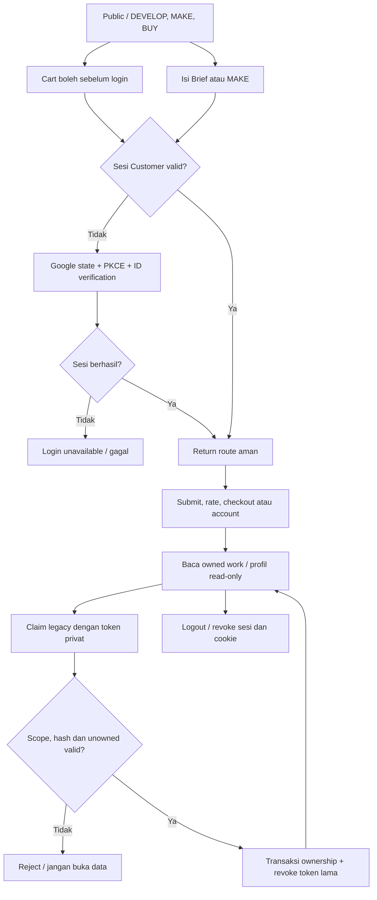
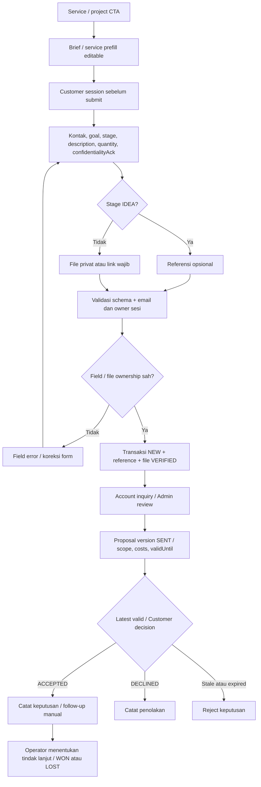
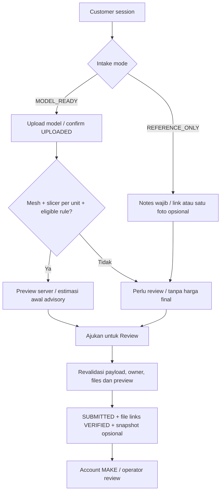
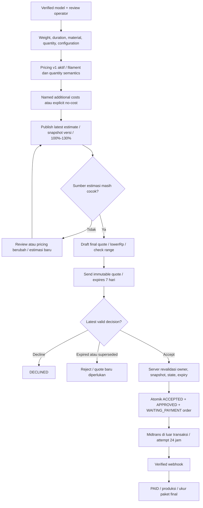
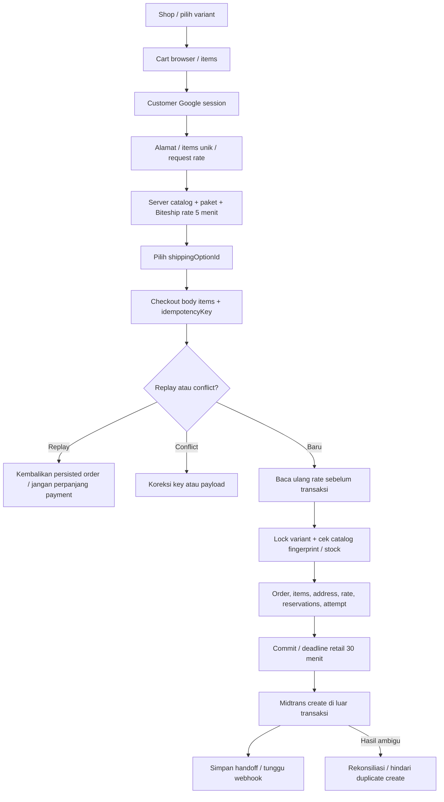
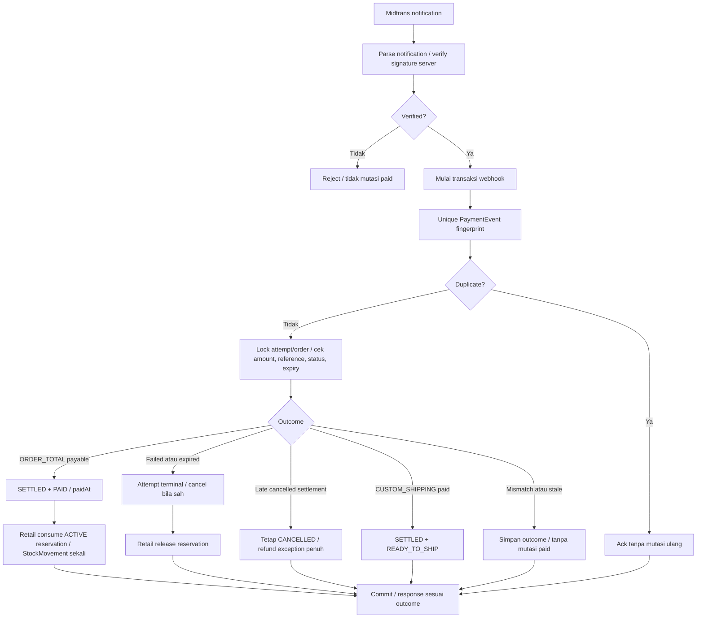
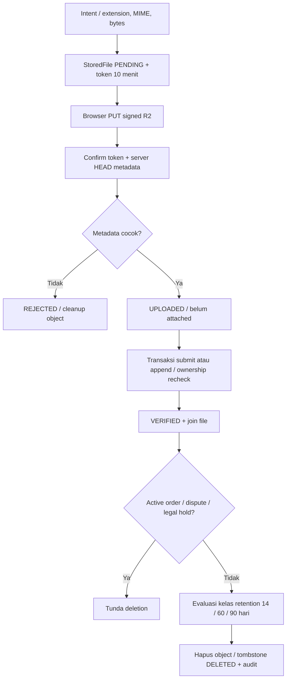
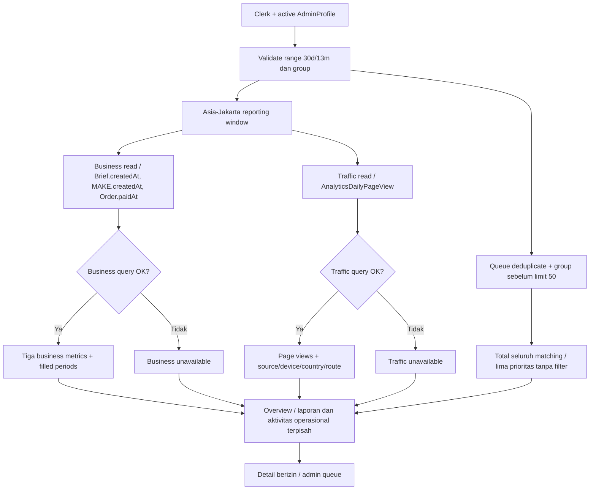
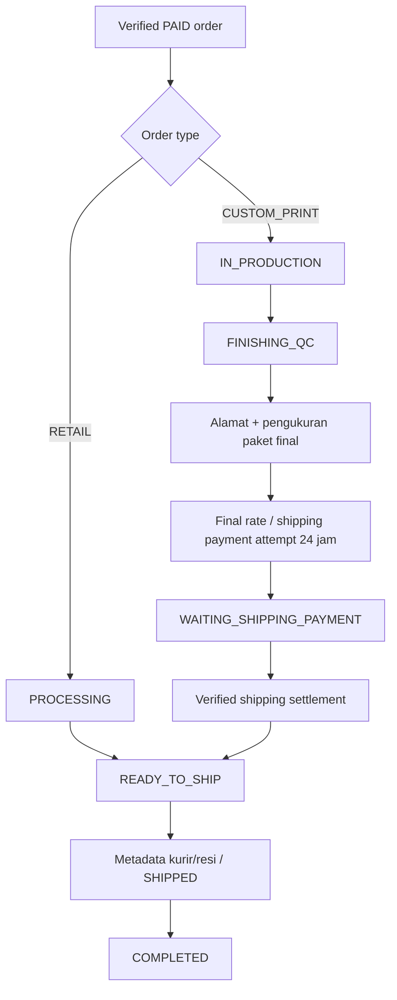

# NIUVA — Activity Diagrams & User Flow

> **Status:** Draft v0.3 — REFERENCE. Referensi penjelas, bukan sumber keputusan baru.
>
> **Pemeriksaan sumber:** 2026-09-30 (Asia/Jakarta), `main` pada `9605a96`
> (`9605a96e936236b7e54b526f05e6b344747b24ab`). Perilaku yang berlaku
> memakai commit tersebut sebagai baseline API/data. Revisi navigasi Admin pada checkout kerja
> dikirim melalui branch `codex/admin-navigation-docs-v03`. Owner menerima visual shell
> pada Overview Admin lokal pada 2026-10-01; activation/AT/perangkat/produksi tetap mengikuti gate sumber.
>
> **Authority:** [PRD](../PRD-Niuva-MVP.md), [Tech Design](../TechDesign-Niuva-MVP.md),
> [lifecycle](../backend/lifecycle-contract.md), [Phase 2 closure](../backend/phase-2-closure-decisions.md),
> [pricing/shipping](../backend/phase-3-pricing-biteship-contract.md).
> Schema, handler dan service menjadi bukti pemetaan runtime; addenda/closure terbaru dibaca bersama authority.
> [DESIGN](../../DESIGN.md), [Action Queue](../backend/SPEC-action-queue.md), dan
> [keputusan Owner sesi ini](NIUVA_Use_Case_Specification.md#9-keputusan-owner-dan-input-terbuka)
> melengkapi traceability. Keputusan sesi dibedakan dari capability yang sudah diimplementasikan.
>
> **Asal:** draf repo v0.2 direkonsiliasi dengan sumber di atas. Artefak diagram sumber
> asli yang pernah disebut belum ditemukan di repo. Lampiran memuat kandidat/model lama
> dengan label eksplisit; tidak menjadi kontrak implementasi.

## Perilaku yang berlaku

### 1. Notasi dan traceability

Panah menunjukkan langkah/decision, bukan kebebasan mengubah status.
Service dan [lifecycle](../backend/lifecycle-contract.md) menentukan transisi.
28 ID dirujuk dari [Specification](NIUVA_Use_Case_Specification.md).
Wireframe tujuan setiap langkah ada pada [UI Flow](NIUVA_UI_Flow_Wireframes.md).

### 2. Eksplorasi, auth, account dan claim

UC-PUB-HOME-01 sampai UC-PUB-SHOP-02, UC-AUTH-C-01, UC-AUTH-C-02,
UC-ACCOUNT-01 dan UC-ACCOUNT-02.

Tidak ada guest checkout. Login tidak mengubah cart browser menjadi tabel
database. Email/company saja tidak memberi ownership inquiry/MAKE.

### 3. DEVELOP — Brief dan proposal B2B

UC-BRIEF-01, UC-BRIEF-02, UC-ADMIN-B2B-01.

Field lengkap dan enum pada [Specification](NIUVA_Use_Case_Specification.md#4-develop--project-brief).
Empat service detail tetap terpisah. ACCEPTED tidak membuat order/payment.

### 4. MAKE — intake dan simulasi Customer

UC-MAKE-01, UC-PUB-CUSTOM-02.

STL/OBJ/3MF dapat eligible; STEP/STP/reference/photo tidak dihitung otomatis.
Input slicer Customer tidak menjadi evidence operator. Server menyimpan
`customerPreviewSnapshot` historis tanpa menjadikannya quote.

### 5. MAKE — operator sampai payable order

UC-ADMIN-MAKE-01, UC-MAKE-02, UC-OWNER-PRICING-01.

Request milik Customer wajib mempunyai estimasi terbaru sebelum quote.
Source matching mencakup reviewUpdatedAt, weight/duration/quantity/material,
filament dan pricing version. Ongkir perkiraan tidak menjadi pos quote.

### 6. Retail — browser cart, rate dan checkout

UC-CART-01, UC-CHECKOUT-01, UC-ORDER-C-01.

Cart tidak menjamin availability. Transaksi checkout memakai Decimal dan
catalog canonical, tanpa total/harga authoritative dari browser.
Key replay teknis berumur 24 jam, terpisah dari payment 30 menit.

### 7. Webhook, stock dan late settlement

UC-ORDER-C-01, UC-ADMIN-ORDER-01, UC-ADMIN-PRODUCT-01.

Custom payments tidak menahan retail stock. Consumed reservation mengurangi
on-hand dan membuat ORDER_CONSUMPTION; release hanya mengembalikan available.
Expired reservation langsung tidak aktif bagi availability, meski cleanup
belum berjalan. Browser return tidak menjalankan diagram ini.

### 8. File privat dan lifecycle

UC-BRIEF-01, UC-MAKE-01, UC-MAKE-02.

CAD/model maksimal 100 MiB; foto referensi 10 MiB. Download privat signed
lima menit setelah otorisasi owning record. Akuntansi/legal record retention
tidak memakai jadwal binary. Lihat [API files](NIUVA_API_Contract.md#4-file-privat).

### 9. Admin Overview, analytics dan queue

UC-AUTH-A-01 dan UC-ADMIN-OPS-01.

Collection off default; jika diaktifkan, allowlisted public routes mengirim
`{routeGroup, source, landing}`, endpoint melakukan atomic daily upsert.
Retensi authenticated cron menghapus sebelum bulan tertua 13m; bisnis tetap.
Range/group saling dipertahankan. Unavailable bukan nol.

Revisi navigasi lokal 2026-10-01: toggle di footer sidebar desktop hanya
mengubah preferensi sidebar lokal; tidak mengubah hasil queue, range/group
atau status pekerjaan. Logo dan footer tetap terlihat, daftar menu menggulir
sendiri. Situs publik berada di header kanan desktop sebelum role/Keluar.
Logo lengkap versi terang dan simbol biru memakai putih dengan skala selaras.
Di bawah lg, Menu Admin tetap disclosure berlabel penuh dengan Situs publik.
Payment-event exceptions dan alert stok tetap di luar projection sampai gate
lifecycle/policy masing-masing terpenuhi. Visual shell revisi ACCEPTED_OWNER_LOCAL pada 2026-10-01 setelah tinjauan Overview Admin aktual.

### 10. Operasi Admin lain dan fulfillment

| UC | Langkah runtime |
| --- | --- |
| UC-ADMIN-PRODUCT-01 | Detail product/variant -> validated action -> repository lock bila stock -> audit -> revalidate. |
| UC-ADMIN-B2B-01 | Inquiry review -> status/proposal action -> persisted version -> account manual decision. |
| UC-ADMIN-MAKE-01 | Private file/review -> latest estimate -> draft/send -> account acceptance. |
| UC-ADMIN-PORTFOLIO-01 | Edit content/media -> publication gate -> published/card-only read model. |
| UC-OWNER-PRICING-01 | Owner permission -> explicit semantics/confirmation -> guarded activation; bukan deployment. |

Provider shipping/payment berada di luar transaksi database. Retry tidak
membuat referensi baru selama hasil PENDING ambigu; terminal attempt mengikuti
replacement policy. Aksi pembatalan paid bukan shortcut balik state.

## Lampiran — Usulan dan model konseptual lama

### A.1 Pemisahan contoh lama

Draf v0.2 memecah flow per halaman dan mencampur operasi konseptual dengan
runtime. Diagram utama v0.3 menyatukan decision bisnis yang telah diputuskan.
Database cart, wishlist, profile editor/address book dan CRUD REST Admin tetap
kandidat. Diagram konseptual tidak boleh menambah edge pembayaran otomatis B2B
atau menghilangkan latest-estimate gate MAKE.

### A.2 Gate terbuka

Provider/staging/production activation, calibration kisaran estimasi, fakta/izin
konten baru yang belum terverifikasi, Owner/legal privacy notice, edge analytics
dan accounting retention mengikuti authority pemiliknya. Nama/logo yang sudah
CONFIRMED tidak dibuka ulang. Render diagram adalah pemeriksaan dokumentasi,
bukan bukti provider atau penerimaan visual product.
