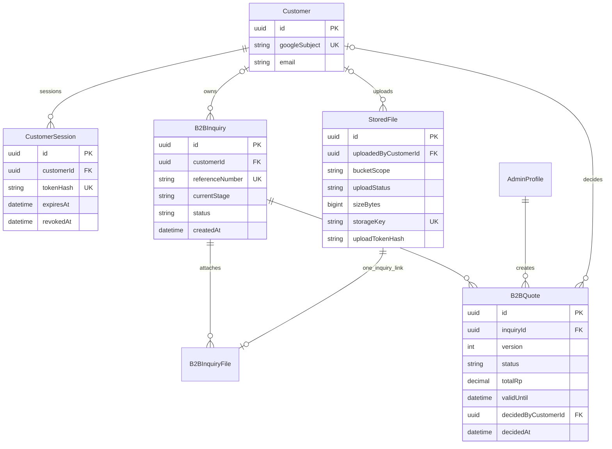
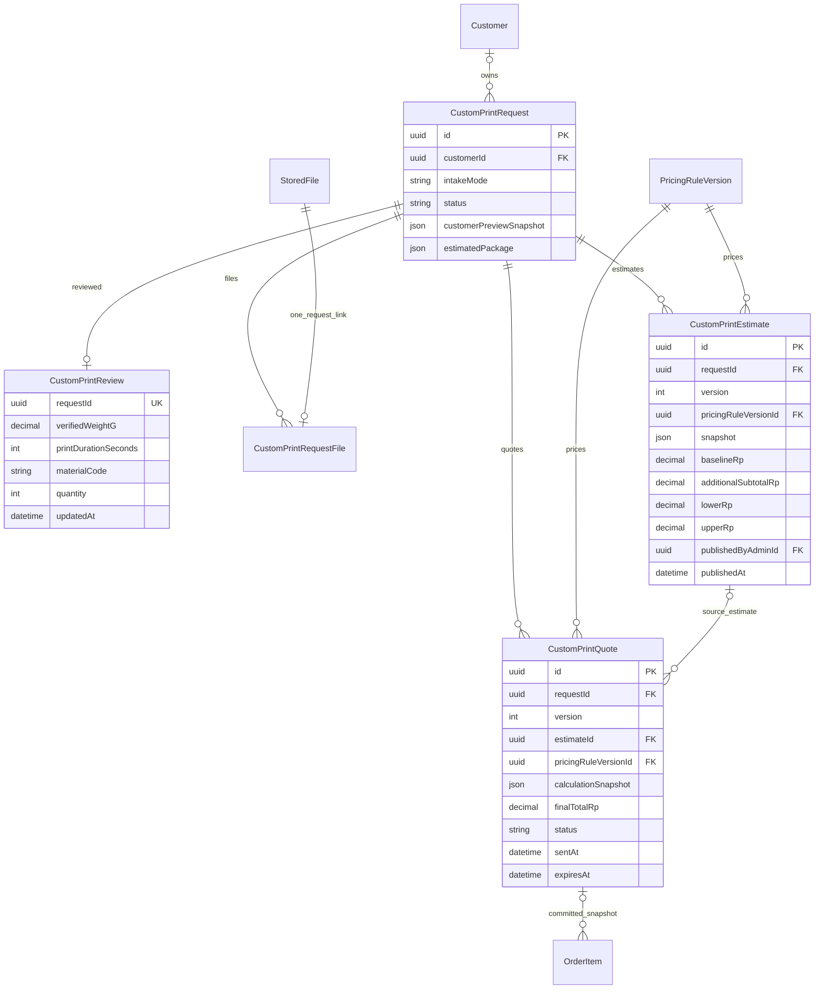
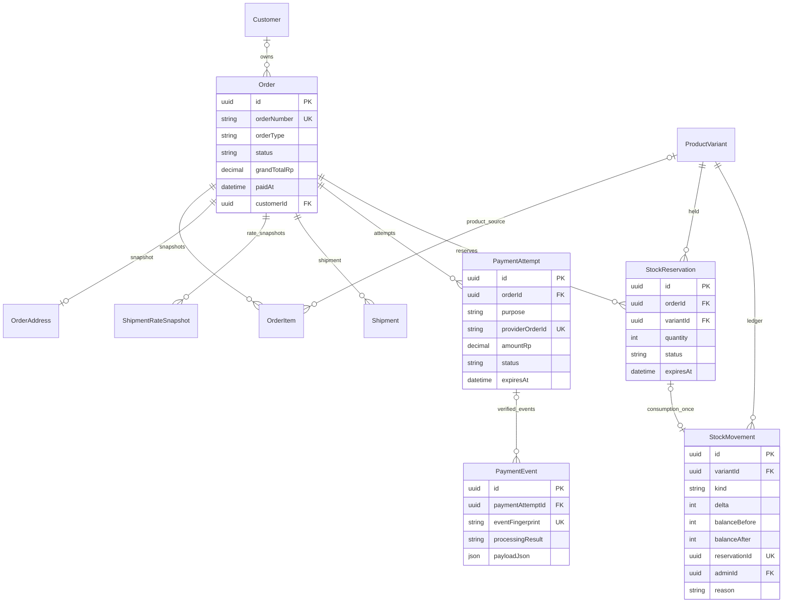
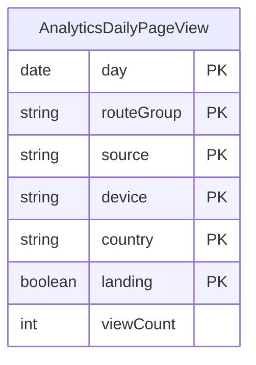
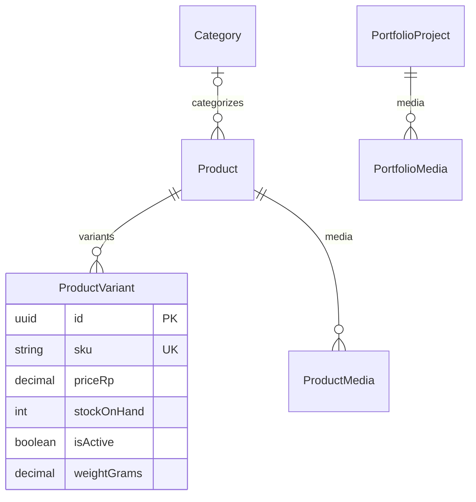
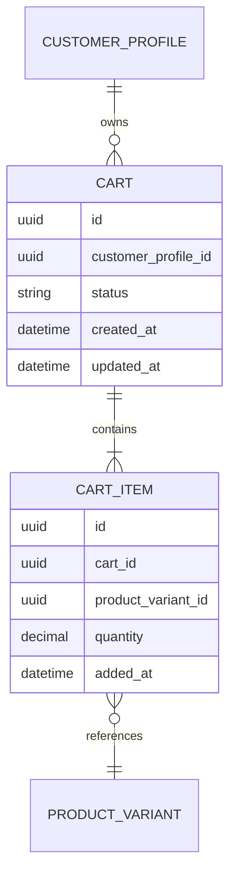

# NIUVA — Domain & Data Model

> **Status:** Draft v0.3 — REFERENCE. Referensi penjelas, bukan sumber keputusan baru.
>
> **Pemeriksaan sumber:** 2026-09-30 (Asia/Jakarta), `main` pada `9605a96`
> (`9605a96e936236b7e54b526f05e6b344747b24ab`). Perilaku yang berlaku
> memakai commit tersebut sebagai baseline API/data. Revisi navigasi Admin pada checkout kerja
> dikirim melalui branch `codex/admin-navigation-docs-v03`. Owner menerima visual shell
> pada Overview Admin lokal pada 2026-10-01; activation/AT/perangkat/produksi tetap mengikuti gate sumber.
>
> **Authority:** [PRD](../PRD-Niuva-MVP.md), [Tech Design](../TechDesign-Niuva-MVP.md),
> [lifecycle](../backend/lifecycle-contract.md), [Phase 2 closure](../backend/phase-2-closure-decisions.md),
> [pricing/shipping](../backend/phase-3-pricing-biteship-contract.md).
> Schema, handler dan service menjadi bukti pemetaan runtime; addenda/closure terbaru dibaca bersama authority.
> [DESIGN](../../DESIGN.md), [Action Queue](../backend/SPEC-action-queue.md), dan
> [keputusan Owner sesi ini](NIUVA_Use_Case_Specification.md#9-keputusan-owner-dan-input-terbuka)
> melengkapi traceability. Keputusan sesi dibedakan dari capability yang sudah diimplementasikan.
>
> **Asal:** draf repo v0.2 direkonsiliasi dengan sumber di atas. Artefak diagram sumber
> asli yang pernah disebut belum ditemukan di repo. Lampiran memuat kandidat/model lama
> dengan label eksplisit; tidak menjadi kontrak implementasi.

## Perilaku yang berlaku

### 1. Model fisik dan sumber

Nama model/enum pada bagian utama sesuai [schema Prisma](../../prisma/schema.prisma).
Diagram ERD memilih field penting; field yang tidak digambar tetap mengikuti
schema. Optional FK mencerminkan data legacy, bukan izin melewati invariant
service. [Technical Sequence](NIUVA_Technical_Sequence_Diagrams.md) menjelaskan
transaksi; [API](NIUVA_API_Contract.md) menjelaskan DTO.

### 2. Identity, Brief dan file privat

- CustomerSession menyimpan hash token/revokedAt/expiry 30 hari. GoogleSubject
  identity tidak digabung otomatis saat ada konflik.
- B2BInquiry berisi name/email/phone, goal/stage/description/targetQuantity,
  confidentialityAck dan field opsional. Email/owner submit mengikuti Customer
  session; acknowledgment kerahasiaan berbeda dari opt-in WhatsApp roadmap.
- File intent PENDING, confirm HEAD UPLOADED; submit/append rechecks ownership
  dan status lalu VERIFIED + join file atomik. Join table fileId unik membatasi
  pemakaian pada record domain; service juga memeriksa cross-domain attachment.
- B2BQuote unique `(inquiryId, version)`, scope/assumptions/lineItems snapshot.
  Latest valid SENT dapat diputuskan; decidedByCustomerId/decidedAt tersimpan.
  ACCEPTED tidak memiliki relasi order otomatis.

### 3. MAKE, harga dan snapshot versi

| Informasi harga | Model / authoritative boundary |
| --- | --- |
| Simulasi Customer | `CustomPrintRequest.customerPreviewSnapshot`; declared slicer per unit, eligible mesh/active PER_UNIT rule; unverified historis, bukan quote. |
| Review operator | `CustomPrintReview` satu per request; weight Decimal, duration seconds, material/qty/config, Admin/reviewedAt/updatedAt. |
| Estimasi produksi | `CustomPrintEstimate` versi unik per request; active rule/definition, reviewId/reviewUpdatedAt, pricingInputs, biaya tambahan/no-cost, factor 1.00/1.30, calibrated false, operator/waktu. |
| Quote final | `CustomPrintQuote` versioned; material/machine/additional subtotal, unrounded/final total, source estimate dan calculationSnapshot. Final baseline memakai lowerRp; check range/source wajib. |
| Order | `OrderItem.customQuoteId` snapshot quote yang telah accepted/revalidated. Order tidak menghitung ulang sejarah memakai rule terbaru. |

**Owned request wajib latest estimate sebelum draft quote.** Field estimateId
nullable mendukung sejarah/legacy; tidak melemahkan gate tersebut. Service
membandingkan pricing rule/version, filament, material, weight/duration/quantity
dan reviewUpdatedAt. Source berubah -> publish estimasi baru. Pos tambahan
dibaca dari snapshot terbaru. SENT immutable; koreksi membuat quote versi baru.
Accept memeriksa kalkulasi frozen snapshot, latest quote, expiry/owner/state,
lalu request APPROVED, quote ACCEPTED dan payable order atomik.

PricingRuleVersion memuat code/version/definition/status DRAFT/ACTIVE/RETIRED,
approval Admin dan waktu. Quantity semantics PER_UNIT/AGGREGATE eksplisit.
Pricing v1 1–49 g dan communal ABS sudah ditutup pada
[pricing addendum](../backend/phase-3-pricing-biteship-contract.md).

### 4. Retail, payment, shipment dan inventory

**Cart hanya browser**, localStorage `niuva.cart.v1`, bukan schema Prisma.
Payload items mempunyai variantId/quantity; client cap 99, server 1–50 items
unik dan quantity positive integer, tanpa mempercayai harga browser.

Checkout transaction lock variant, cek active/published stock/package/price,
fingerprint rate dan Decimal totals; menyimpan Order PENDING_PAYMENT, items,
OrderAddress, ShipmentRateSnapshot, ACTIVE StockReservations dan PENDING
PaymentAttempt. Midtrans create setelah commit dan hasil handoff tersimpan.
IdempotencyRecord scope/key unique + requestHash/response/status/expiry
menangani checkout replay 24 jam; commercial deadline retail tetap 30 menit.

Available = stockOnHand dikurangi quantity reservation ACTIVE dengan
expiresAt di masa depan. Reserve/release tidak mengubah stockOnHand.
Settlement consume membuat movement ORDER_CONSUMPTION dan mengurangi
stockOnHand atomik; unique reservationId mencegah konsumsi dua kali.
Ledger kind: OPENING_BALANCE, CATALOG_IMPORT, MANUAL_ADJUSTMENT, ORDER_CONSUMPTION.
Stock adjustment terkunci, named permission, reason/actor/before/after audit.

Webhook mencatat minimized immutable PaymentEvent dengan unique fingerprint,
lock attempt/order, memeriksa amount/status/reference/deadline dan menerapkan
payment/order/consume atau release dalam transaksi yang sama. Audit service
berada setelah persist. Unknown/mismatch/stale/late tetap mempunyai hasil event.
Browser return tidak mengubah state.

Shipment memuat finalWeightGrams/length/width/height, shippingAmountRp,
courier/service/tracking/status. Custom SHIPPING payment berpurpose
CUSTOM_SHIPPING dan deadline 24 jam, tidak menahan retail stock.
Final rate memerlukan alamat dan final measurements di FINISHING_QC;
rough package pada request tidak boleh mengisi snapshot final diam-diam.

### 5. Lifecycle dan invariants

| Aggregate | State / policy |
| --- | --- |
| B2BInquiry | NEW -> CONTACTED -> QUALIFIED -> QUOTED -> WON/LOST/CLOSED menurut transition service. Customer proposal decision tidak otomatis WON. |
| B2BQuote | DRAFT / SENT / ACCEPTED / DECLINED; latest valid proposal, replay keputusan sama. |
| StoredFile | PENDING -> UPLOADED -> VERIFIED; REJECTED/DELETED mengikuti lifecycle teknis. |
| CustomPrintRequest | SUBMITTED -> UNDER_REVIEW -> QUOTE_READY -> QUOTE_SENT -> APPROVED; DECLINED/CANCELLED hanya edge service sah. |
| CustomPrintQuote | DRAFT -> SENT -> ACCEPTED / DECLINED / EXPIRED; seven calendar days dari SENT, latest version, snapshot frozen. |
| Retail Order | PENDING_PAYMENT -> PAID -> PROCESSING -> READY_TO_SHIP -> SHIPPED -> COMPLETED; unpaid expiry/cancel -> CANCELLED. |
| Custom Order | WAITING_PAYMENT -> PAID -> IN_PRODUCTION -> FINISHING_QC -> WAITING_SHIPPING_PAYMENT -> READY_TO_SHIP -> SHIPPED -> COMPLETED. |
| PaymentAttempt | PENDING / SETTLED / FAILED / EXPIRED / CANCELLED / REFUNDED menurut verified event dan policy. ORDER_TOTAL atau CUSTOM_SHIPPING. |
| StockReservation | ACTIVE -> CONSUMED atau RELEASED; 30 menit retail, expired segera diabaikan availability. |
| Late settlement | Cancelled order tetap cancelled, event/audit + full-refund exception; tidak consume/reopen/fulfill. |
| Paid cancellation | Owner-only full refund terverifikasi; generic status mutation fail closed. Partial refund/standard post-processing cancellation bukan MVP. |

Enum OrderStatus historis mempunyai nilai tambahan SUBMITTED/UNDER_REVIEW/
WAITING_FOR_APPROVAL. Keberadaan nilai enum bukan izin transisi atau penggabungan
request lifecycle ke order. Edge aktual ada pada
[order transitions](../../src/modules/order/transitions.ts).

Binary retention: abandoned/rejected/unattached 14 hari, cancelled/declined/
unpaid 60 hari, completed custom 90 hari dari completion. Holds/dispute/active
order menunda deletion; object removed lalu tombstone DELETED/audit. Foto
referensi 10 MiB, model/CAD 100 MiB. Financial/audit/order/provider retention
membutuhkan kebijakan legal/accounting terpisah.

Uang authoritative memakai Decimal; subtotals presisi, final IDR HALF_UP
sekali pada boundary yang ditentukan calculator. Timestamp tersimpan
Timestamptz; analytics reporting menggunakan hari/bulan Asia/Jakarta.

### 6. Analytics dan read models

Model fisik `analytics_daily_page_views` mempunyai composite PK
`(day, routeGroup, source, device, country, landing)`. day adalah
tanggal kalender Jakarta dalam PostgreSQL Date; viewCount atomic upsert.
String route/source/device dibatasi contract Zod, country 2 huruf/ZZ.
Tidak ada relasi visitor, Customer, Order atau session dalam tabel.

| Read model | Sumber / semantik |
| --- | --- |
| Analytics business | B2BInquiry.createdAt, CustomPrintRequest.createdAt, Order.paidAt; range 30d/13m, zero-filled periods ketika query berhasil. |
| Analytics traffic | Daily aggregate digroup saat read; landing-only sources; device/country/routes semua views. Collection off default. |
| Failure isolation | Business/traffic queries independen; null berarti unavailable, tidak mengganti nol. |
| Operational dashboard | NEW/SUBMITTED/PAID status counts dan createdAt activity 30 hari, berbeda dari business paidAt report. |
| Action Queue | Proyeksi current domain states; deduplicate, group filter sebelum limit 50, total sebelum limit, top 5 overview tanpa filter. Bukan tabel state baru. |

Retention daily traffic menghapus `day` sebelum awal bulan tertua dalam
13m (bulan berjalan + 12 sebelumnya); tanpa raw event/backfill. Data bisnis
tidak ikut dihapus. Analytics privacy/edge activation terpisah dari schema.

### 7. Catalog, portfolio dan inventory model lengkap

| Area | Seluruh model Prisma dalam area |
| --- | --- |
| Identity | AdminProfile, Customer, CustomerSession. |
| Content/catalog | Service, PortfolioProject, PortfolioMedia, Category, Product, ProductVariant, ProductMedia. |
| Brief/files | B2BInquiry, B2BQuote, StoredFile, B2BInquiryFile. |
| MAKE/pricing | CustomPrintRequest, CustomPrintReview, CustomPrintRequestFile, CustomPrintEstimate, CustomPrintQuote, PricingRuleVersion. |
| Order/stock/payment/shipping | Order, OrderItem, OrderAddress, StockReservation, StockMovement, ShipmentRateSnapshot, Shipment, PaymentAttempt, PaymentEvent. |
| Support | AuditLog, AnalyticsDailyPageView, IdempotencyRecord. |

Service tidak mempunyai FK ke PortfolioProject; serviceLabel pada portfolio adalah teks.
Portfolio/detail publication dan catalog readiness mengikuti services; copy
kurasi tidak mengubah name/slug/price/stock/publication canonical. Tidak ada
physical model Cart, Wishlist, saved CustomerAddress atau OperationalQueue.

Tidak ada model database preferensi sidebar: browser menyimpan
`niuva.admin.sidebar.v1` (`expanded`/`collapsed`). Action Queue tetap projection
tujuh jenis signal, tanpa lifecycle payment-exception/alert stok tambahan.
Record payment dan stock tidak dihapus atau ditafsirkan selesai karena tidak
masuk queue. Durasi record legal/accounting masih memerlukan sumber Owner dan
penasihat; persetujuan retensi per kategori belum menentukan angkanya.

## Lampiran — Usulan dan model konseptual lama

### A.1 Logical Cart dan aggregate sketches

Draf v0.2 pernah memakai Cart/CartItem, CustomerAddress, operational task/event
dan generic payment/shipping ownership sebagai model konseptual. Model fisik
utama di atas menggantikannya untuk penjelasan runtime. Address saat checkout
adalah OrderAddress snapshot, bukan address book.

Cuplikan Mermaid v0.2 berikut **HISTORICAL / konseptual**, bukan model Prisma.
CUSTOMER_PROFILE/CART/CART_ITEM di bawah tidak ada pada schema runtime.

### A.2 Kandidat perlu keputusan baru

Saved addresses/profile mutation, wishlist, generic outbox/domain event store,
shared company ownership dan schema API terpisah masih kandidat. Relasi file
join, stock ledger, latest estimate quote, timezone report dan states tidak
lagi unresolved. Accounting/legal record retention tetap terbuka pada Owner/
legal sesuai Phase 2; tidak diisi angka baru di sini.
