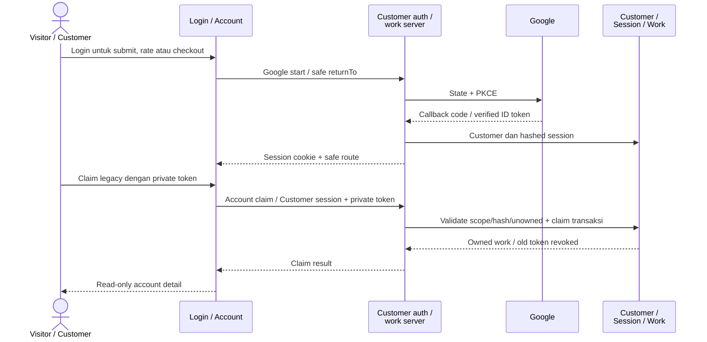
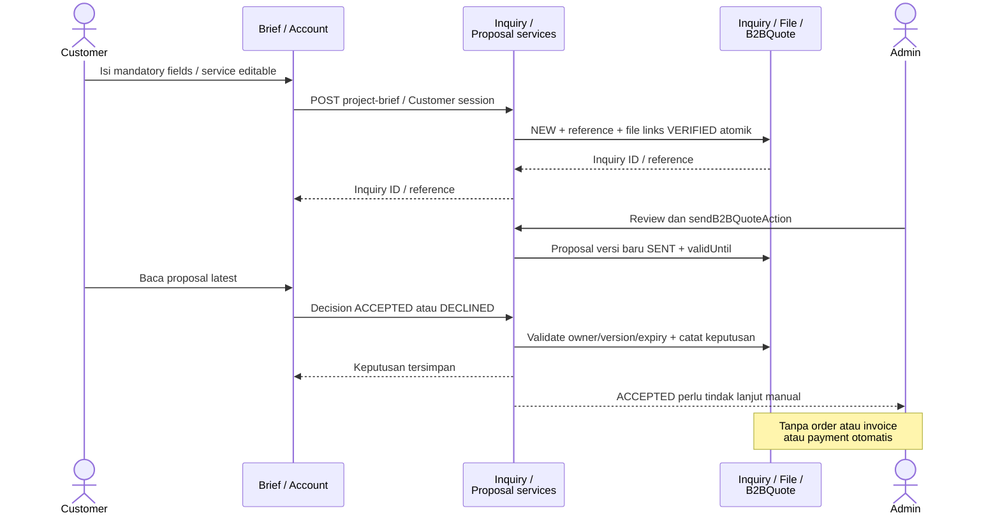
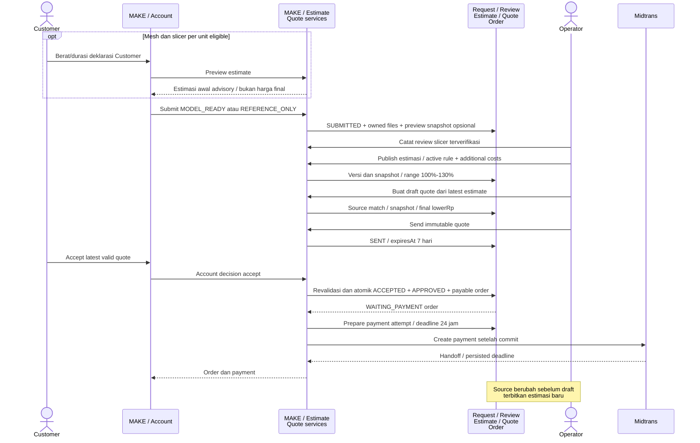
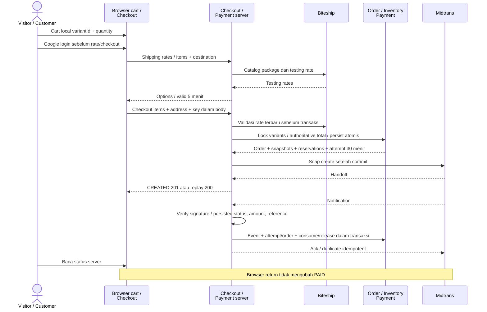
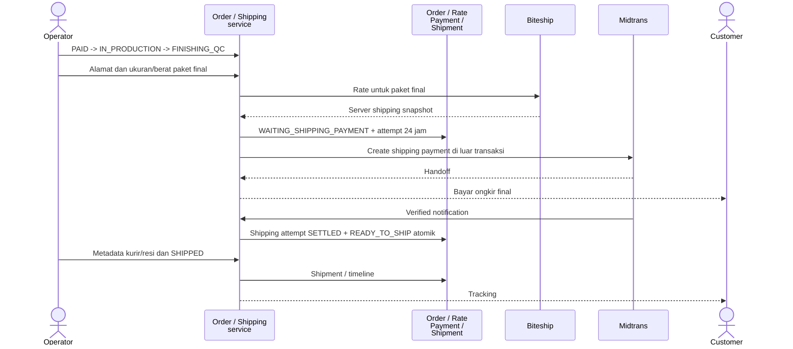
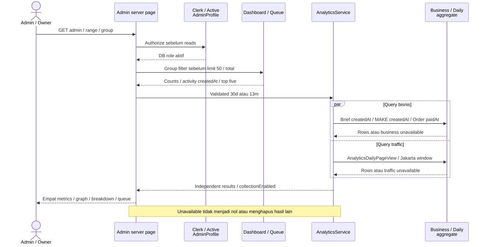

# NIUVA — Sequence Diagrams

> **Status:** Draft v0.3 — REFERENCE. Referensi penjelas, bukan sumber keputusan baru.
>
> **Pemeriksaan sumber:** 2026-09-30 (Asia/Jakarta), `main` pada `9605a96`
> (`9605a96e936236b7e54b526f05e6b344747b24ab`). Perilaku yang berlaku
> memakai commit tersebut sebagai baseline API/data. Revisi navigasi Admin pada checkout kerja
> dikirim melalui branch `codex/admin-navigation-docs-v03`. Owner menerima visual shell
> pada Overview Admin lokal pada 2026-10-01; activation/AT/perangkat/produksi tetap mengikuti gate sumber.
>
> **Authority:** [PRD](../PRD-Niuva-MVP.md), [Tech Design](../TechDesign-Niuva-MVP.md),
> [lifecycle](../backend/lifecycle-contract.md), [Phase 2 closure](../backend/phase-2-closure-decisions.md),
> [pricing/shipping](../backend/phase-3-pricing-biteship-contract.md).
> Schema, handler dan service menjadi bukti pemetaan runtime; addenda/closure terbaru dibaca bersama authority.
> [DESIGN](../../DESIGN.md), [Action Queue](../backend/SPEC-action-queue.md), dan
> [keputusan Owner sesi ini](NIUVA_Use_Case_Specification.md#9-keputusan-owner-dan-input-terbuka)
> melengkapi traceability. Keputusan sesi dibedakan dari capability yang sudah diimplementasikan.
>
> **Asal:** draf repo v0.2 direkonsiliasi dengan sumber di atas. Artefak diagram sumber
> asli yang pernah disebut belum ditemukan di repo. Lampiran memuat kandidat/model lama
> dengan label eksplisit; tidak menjadi kontrak implementasi.

## Perilaku yang berlaku

### 1. Level diagram

Diagram ini menjelaskan urutan aktor dan sistem. Rincian transaksi, locking,
DTO dan replay ada pada [Technical Sequence](NIUVA_Technical_Sequence_Diagrams.md)
dan [API](NIUVA_API_Contract.md). “Sistem” selalu berarti service server,
bukan authority browser.

### 2. Customer login dan claim

UC-AUTH-C-01, UC-ACCOUNT-01, UC-ACCOUNT-02.

Clerk bukan Customer login. Profile edit dan saved address CRUD belum ada.
Legacy claim bukan lookup berdasarkan email saja.

### 3. DEVELOP — Brief sampai keputusan manual

UC-BRIEF-01, UC-BRIEF-02, UC-ADMIN-B2B-01.

### 4. MAKE — tiga tingkat biaya dan quote acceptance

UC-MAKE-01, UC-MAKE-02, UC-ADMIN-MAKE-01.

Runtime account decision tidak menerima header idempotency wajib. Replay
berdasarkan state/order terikat. Quote expired/superseded gagal di server.

### 5. BUY — cart sampai webhook

UC-CART-01, UC-CHECKOUT-01, UC-ORDER-C-01.

Late settlement terhadap order cancelled tidak consume stock/reopen order;
dibukukan sebagai exception refund penuh. Provider uncertainty tidak
diatasi dengan create payment ulang tanpa pemeriksaan.

### 6. Custom fulfillment dan ongkir final

UC-ADMIN-ORDER-01, UC-ORDER-C-01.

Rough shipping account menggunakan paket **perkiraan**, range kurir dan
destinasi; tidak mengubah quote/order. Gagal atau belum ada data -> “Ongkir
menyusul”. Hasil provider ambiguous ditahan untuk rekonsiliasi.

### 7. Overview Admin dan analytics independen

UC-AUTH-A-01, UC-ADMIN-OPS-01.

Collection mati default, retensi 13 bulan kalender. Sumber masuk dihitung
hanya landing. Tidak ada unique visitor, conversion atau atribusi order.
Kontrak collect/retention ada pada [API analytics](NIUVA_API_Contract.md#7-analytics).

Setelah halaman berizin dirender, client memulihkan preferensi sidebar lokal.
Revisi lokal 2026-10-01 menempatkan toggle di footer sidebar; toggle tidak
memanggil API atau mengubah queue dan mempertahankan fokus tombol. Menu
dapat menggulir terpisah dari logo/footer. Situs publik berada di header kanan
desktop atau disclosure mobile. Logo penuh versi terang dan simbol biru
tetap pada putih dengan skala selaras. Full/rail dan mobile disclosure mengikuti
[wireframe](NIUVA_UI_Flow_Wireframes.md#7-workspace-admin-aktual).
Visual shell revisi ACCEPTED_OWNER_LOCAL pada 2026-10-01 setelah tinjauan Overview Admin aktual.
Payment-event exceptions dan alert stok tidak ditambahkan ke hasil server.

### 8. Operasi Admin dan rujukan

| UC | Boundary |
| --- | --- |
| UC-ADMIN-PRODUCT-01 | Server Actions -> catalog/inventory service -> transactional stock ledger. |
| UC-ADMIN-PORTFOLIO-01 | Server Actions -> portfolio service -> publication read model. |
| UC-OWNER-PRICING-01 | Owner permission -> activation guard -> versioned rule. |
| UC-AUTH-C-02 | Same-origin logout -> session revoke/cookie delete. |

Mutasi Admin nyata tersedia pada [actions](../../src/app/admin/actions.ts);
tidak ada REST Admin CRUD runtime. File intents/confirm mempunyai urutan
terpisah pada [Technical Sequence](NIUVA_Technical_Sequence_Diagrams.md#2-file-privat).

## Lampiran — Usulan dan model konseptual lama

### A.1 Contoh konseptual

Urutan profile PATCH, address CRUD, cart database, payment endpoint terpisah,
dan REST Admin dari draf v0.2 adalah kandidat. Contoh nama endpoint dipertahankan
di lampiran [API](NIUVA_API_Contract.md#lampiran--usulan-dan-model-konseptual-lama).
Tidak ada tahap kandidat yang menjadi prasyarat alur runtime utama.

### A.2 Hal yang memang masih terbuka

Calibration estimasi, activation provider/produksi, accounting/legal retention,
fakta/izin konten baru yang belum terverifikasi dan privacy approval mengikuti
authority. Nama/logo yang sudah CONFIRMED tidak dibuka ulang. Diagram hanya
memeriksa urutan implementasi yang ada pada commit sumber.
