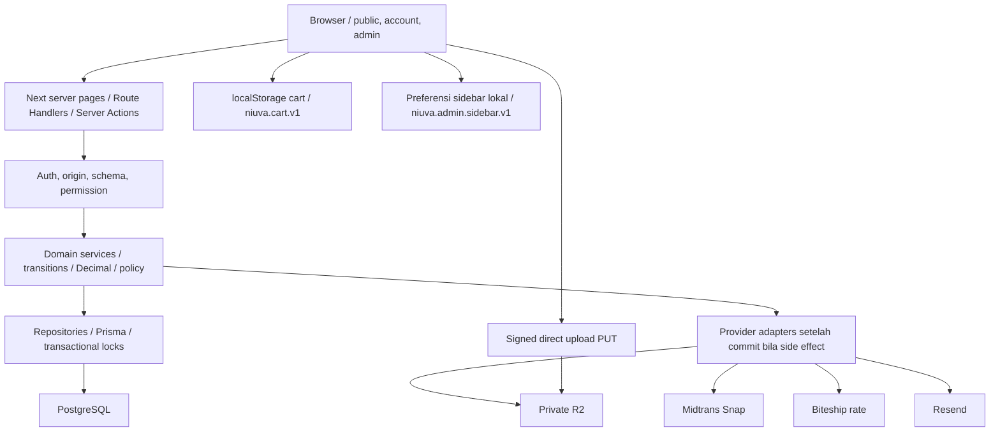
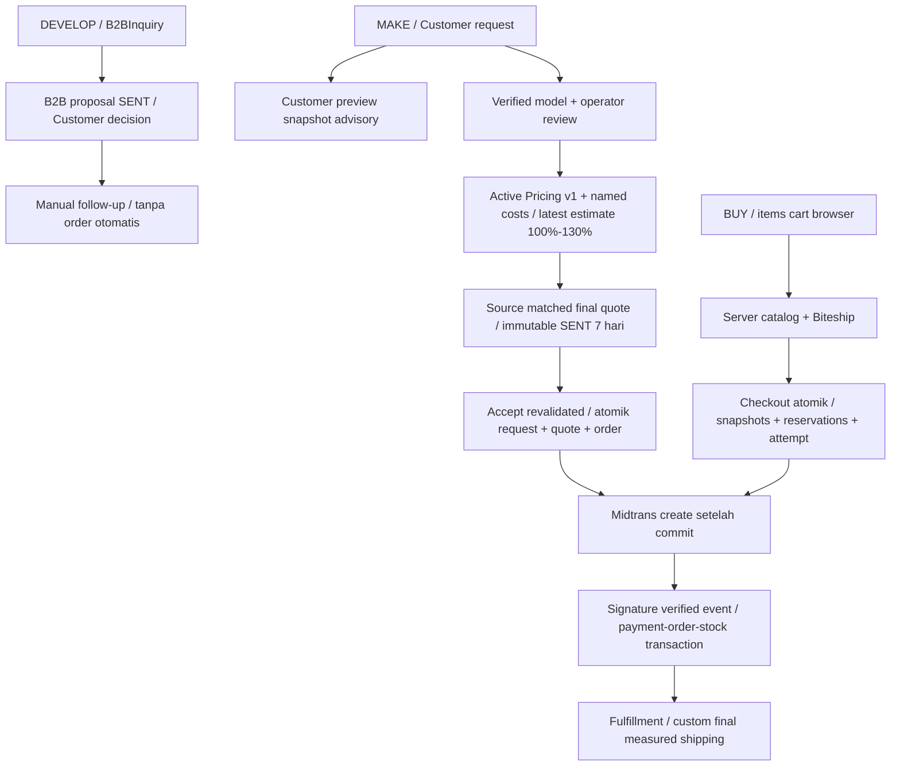
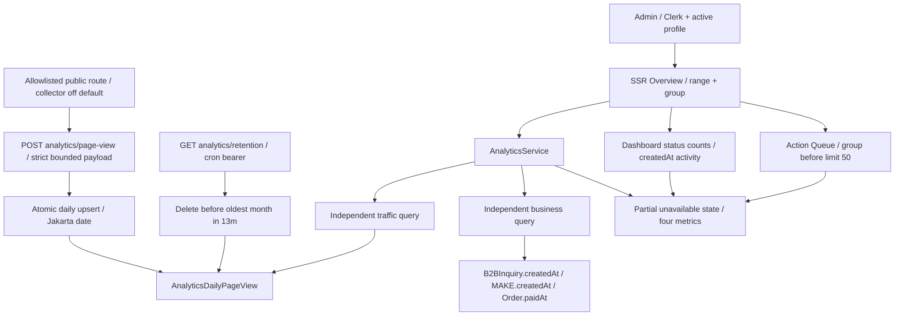

# NIUVA — System Architecture

> **Status:** Draft v0.3 — REFERENCE. Referensi penjelas, bukan sumber keputusan baru.
>
> **Pemeriksaan sumber:** 2026-09-30 (Asia/Jakarta), `main` pada `9605a96`
> (`9605a96e936236b7e54b526f05e6b344747b24ab`). Perilaku yang berlaku
> memakai commit tersebut sebagai baseline API/data. Revisi navigasi Admin pada checkout kerja
> dikirim melalui branch `codex/admin-navigation-docs-v03`. Owner menerima visual shell
> pada Overview Admin lokal pada 2026-10-01; activation/AT/perangkat/produksi tetap mengikuti gate sumber.
>
> **Authority:** [PRD](../PRD-Niuva-MVP.md), [Tech Design](../TechDesign-Niuva-MVP.md),
> [lifecycle](../backend/lifecycle-contract.md), [Phase 2 closure](../backend/phase-2-closure-decisions.md),
> [pricing/shipping](../backend/phase-3-pricing-biteship-contract.md).
> Schema, handler dan service menjadi bukti pemetaan runtime; addenda/closure terbaru dibaca bersama authority.
> [DESIGN](../../DESIGN.md), [Action Queue](../backend/SPEC-action-queue.md), dan
> [keputusan Owner sesi ini](NIUVA_Use_Case_Specification.md#9-keputusan-owner-dan-input-terbuka)
> melengkapi traceability. Keputusan sesi dibedakan dari capability yang sudah diimplementasikan.
>
> **Asal:** draf repo v0.2 direkonsiliasi dengan sumber di atas. Artefak diagram sumber
> asli yang pernah disebut belum ditemukan di repo. Lampiran memuat kandidat/model lama
> dengan label eksplisit; tidak menjadi kontrak implementasi.

## Perilaku yang berlaku

### 1. Stack terpilih dan bukti runtime

| Layer | Keputusan / implementasi pada baseline |
| --- | --- |
| Web | Next.js 16.3.2 App Router, React 19.2.8, TypeScript strict, target Node.js 24 LTS. |
| UI | Tailwind CSS 4, shadcn/ui dengan Base UI; tokens/typography mengikuti `DESIGN.md`. |
| Database | PostgreSQL (Neon dipilih untuk hosted), Prisma 7.10.0; schema/migrations sudah ada. |
| Customer identity | Google OAuth/OIDC custom, state/PKCE, verified ID token, opaque database session. |
| Admin identity | Clerk + active AdminProfile database dan named permission service. |
| Storage | Private R2 untuk CAD/model/reference; public media mempunyai scope lain. |
| Commerce | Midtrans Snap, Biteship rate, Resend notifications melalui adapter server. |
| Hosting / observability | Vercel Pro dan Sentry dipilih Tech Design; pilihan tersebut tidak membuktikan deployment/aktivasi atau SDK Sentry sudah terintegrasi. |
| Analytics | Agregat internal PostgreSQL, disabled default; tanpa analytics SaaS tambahan. |

Versi package dibaca dari [manifest](../../package.json). Stack selected adalah
keputusan, sedangkan credential/provider/staging/produksi dan visual acceptance
adalah gate evidence terpisah pada [readiness](../frontend/mvp-release-readiness.md).

### 2. Modular monolith dan boundary

Route handlers/actions memiliki request/response boundary; service memiliki
aturan bisnis, repository memiliki akses data. Provider create/payment/email
tidak berada di dalam transaksi database. Rate yang diperlukan sebelum commit
dibaca dahulu, lalu input catalog/package dibandingkan lagi dalam transaksi.
R2 direct PUT tidak memberi hak attachment; confirm dan attach tetap server.

### 3. Auth, ownership dan data privat

| Boundary | Aturan |
| --- | --- |
| Public | Published catalog/projects dan empat service slugs; cart local dapat sebelum login. |
| Customer mutation | Session sebelum Brief/MAKE/preview/rate/checkout. Owner/email dari sesi, bukan browser. |
| Account reads | SSR `/account` dan detail owned inquiry/request/order, profil read-only. |
| Legacy capability | Route-bound hash/scope token untuk record yang belum diklaim; claim atomik merevoke akses lama. Tidak ada claim berdasarkan company/email saja. |
| Admin | Clerk valid + isActive AdminProfile; role berasal database. Service mengecek permission lagi sebelum mutasi. |
| Files | Intent 10 menit -> direct PUT -> server HEAD confirm UPLOADED -> attach VERIFIED atomik. Model 100 MiB, foto 10 MiB, download signed 5 menit. |
| Retention | Binary 14/60/90 hari dengan hold/dispute/active order; object removal lalu DELETED/audit. Legal/accounting records terpisah. |

Owner memiliki semua named permission; Admin hanya routine operations.
`PRICING_RULE_ACTIVATE`, `ADMIN_PROFILE_MANAGE`, `ORDER_CANCEL_PAID`,
`PAYMENT_REFUND_FULL` dan `SYSTEM_POLICY_MANAGE` milik Owner.
Permission tidak otomatis menyediakan UI finance atau refund provider.
Lihat [permissions](../../src/modules/admin/permissions.ts) dan
[Phase 2](../backend/phase-2-closure-decisions.md).

### 4. Commerce dan harga

Tiga tingkat biaya MAKE:

1. **Simulasi Customer:** deklarasi slicer per unit, tanpa review, snapshot
   historis. Preview mengembalikan READY atau REVIEW_REQUIRED.
2. **Estimasi produksi operator:** verified review, rule aktif, source/pos
   tambahan/operator/waktu/versi; 100%–130%, `calibrated:false`.
3. **Quote final:** wajib latest estimate untuk owned request, range/source
   diperiksa; baseline total adalah lowerRp. SENT immutable, revisi versi baru.

Acceptance atomik menciptakan custom WAITING_PAYMENT order; preparation attempt
dan Midtrans handoff mengikuti commit. Retail atomik menyimpan order, items,
address, rate snapshot, reservations dan attempt 30 menit. Custom payments
24 jam. Browser redirect tidak settle. Late settlement yang tidak lagi payable
memerlukan refund exception penuh, tidak membuka order cancelled.

Rough shipping adalah range advisory paket perkiraan. Final shipping hanya
setelah final measurements di FINISHING_QC, dengan attempt 24 jam dan
verified payment sebelum READY_TO_SHIP.

### 5. Analytics dan Overview

| Aspek | Runtime |
| --- | --- |
| Empat metrik | Tayangan route publik, Brief dibuat, MAKE dibuat, order dibayar. |
| Periode | `30d` default, 30 hari termasuk hari ini; `13m` bulan berjalan + 12 sebelumnya; Asia/Jakarta. |
| Semantik order | Laporan bisnis memakai paidAt, tidak menghitung createdAt sebagai paid; paid order tetap dihitung setelah status maju. |
| Operasional | NEW inquiry, SUBMITTED request, PAID order status counts; aktivitas createdAt 30 hari berbeda dari laporan paidAt. |
| Kegagalan | Business/traffic Promise.allSettled independen; failed result null/unavailable, bukan nol. Overview/queue mempunyai failure state sendiri. |
| Queue | group all/inquiries/custom-print/orders, invalid -> all; deduplicate, shipping exception lalu oldest; filter sebelum 50, total sebelum limit; Overview top 5 tanpa filter. |
| Queue exclusions | Payment-event exceptions sampai lifecycle penyelesaian server; alert stok sampai ambang/tindakan ditetapkan. Shipping EXCEPTION tetap included. |
| Admin shell | Client boundary hanya preference/toggle/tooltip; server pages tetap authorize/data read. Desktop 13.25rem/4rem mulai lg, mobile disclosure tetap. Tidak ada API/schema preference. |
| Query state | range invalid -> 30d; perubahan range mempertahankan group, perubahan group mempertahankan range. |
| Dimensi traffic | Sumber **landing-only**, perangkat desktop/tablet/mobile/unknown, negara 2 huruf/ZZ, route group; no PII in laporan. |

Collector hanya dipasang ketika `NIUVA_ANALYTICS_ENABLED=true`; endpoint juga
mati default. Payload `{routeGroup, source, landing}` tanpa URL/query/token/IP/
email/visitor ID/cookie analytics. Fetch credentials omit, referrerPolicy
no-referrer. IP hanya hash sementara dalam rate limiter proses, tidak disimpan
dalam tabel. User-agent diklasifikasikan menjadi device; platform country header
dua huruf atau ZZ. Tidak ada raw event/backfill.

Agregat view_count dinaikkan atomik dengan key
`(day, routeGroup, source, device, country, landing)`. Retention cron bearer
CRON_SECRET menghapus sebelum bulan tertua 13 bulan; data bisnis tetap.
Schedule `vercel.json` adalah 20.00 UTC / 03.00 WIB, bukan bukti job deployed.

Analytics approximate karena bot/pemblokir, tanpa unique visitors, visits,
active users, conversions atau atribusi order. Rate limiter 60/minute per
hash/process belum cukup untuk edge produksi. Aktivasi produksi memerlukan
Owner/legal privacy notice dan edge/WAF evidence. Drafnya di
[analytics privacy notice](../frontend/analytics-privacy-notice-draft.md).

### 6. Pemetaan implementasi

| Area | Sumber runtime |
| --- | --- |
| Customer auth | [customer auth](../../src/lib/auth/customer.ts), [auth module](../../src/modules/customer-auth/core.ts). |
| Admin guard | [Clerk guard](../../src/lib/auth/clerk.ts), [permissions](../../src/modules/admin/permissions.ts). |
| Brief / B2B | [inquiry schema](../../src/modules/inquiry/schema.ts), [proposal service](../../src/modules/inquiry/b2b-quote.ts). |
| MAKE | [request schema](../../src/modules/custom-print/schema.ts), [estimate](../../src/modules/custom-print/estimate.ts), [quote](../../src/modules/quote/service.ts). |
| Retail | [cart](../../src/features/cart/cart-state.ts), [checkout](../../src/modules/checkout/service.ts), [repository](../../src/modules/checkout/repository.ts). |
| Webhook | [service](../../src/modules/payment/webhook-service.ts), [transaction](../../src/modules/payment/webhook-repository.ts). |
| Analytics | [contract](../../src/modules/analytics/contract.ts), [service](../../src/modules/analytics/service.ts), [repository](../../src/modules/analytics/repository.ts). |
| Screens/actions | [API map](NIUVA_API_Contract.md), [wireframes](NIUVA_UI_Flow_Wireframes.md), [Admin actions](../../src/app/admin/actions.ts). |
| Physical models | [Prisma](../../prisma/schema.prisma), [Domain Model](NIUVA_Domain_Data_Model.md). |

## Lampiran — Usulan dan model konseptual lama

### A.1 Konsep yang bukan runtime

Microservices per domain, message broker/outbox generik, REST namespace
`/api/v1`, database Cart, profile/address editors dan API Admin CRUD adalah
kandidat arsitektur dari draf lama. Modular monolith, session/permission,
Prisma join tables, transactions dan overview projection sudah dipilih/ada.

### A.2 Pertanyaan yang masih sah

Accounting/legal retention, calibration estimate, fakta/izin konten baru yang
belum terverifikasi dan provider/production activation masih mengikuti Owner
dan authority terkait. Nama/logo yang sudah CONFIRMED tidak dibuka ulang.
Aktivasi analytics membutuhkan review legal/Owner dan pembuktian edge. Tidak
ada pilihan teknologi baru atau kebijakan komersial baru pada revisi ini.
