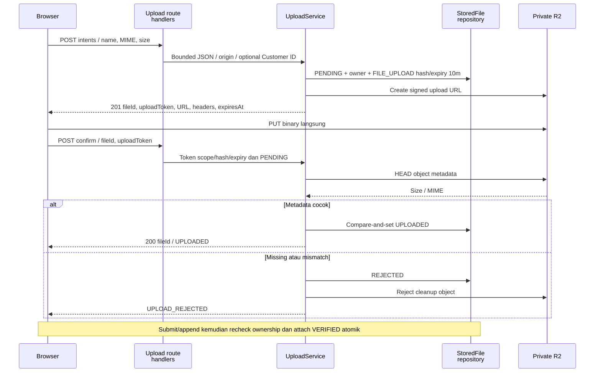
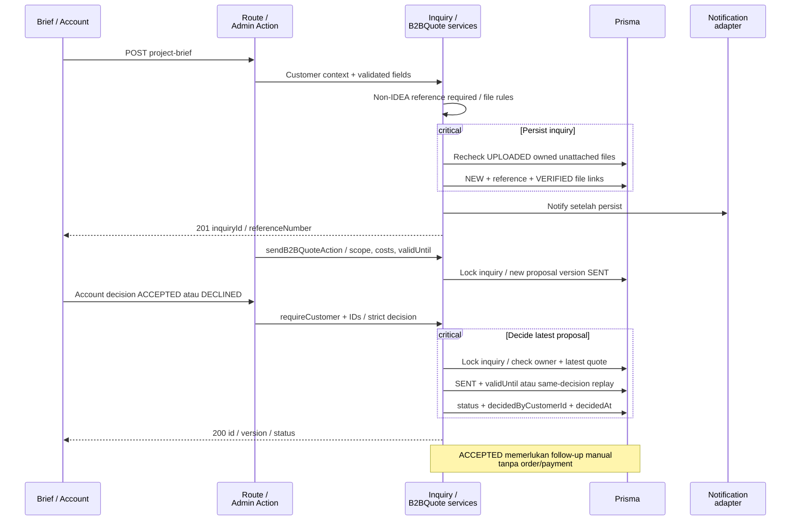
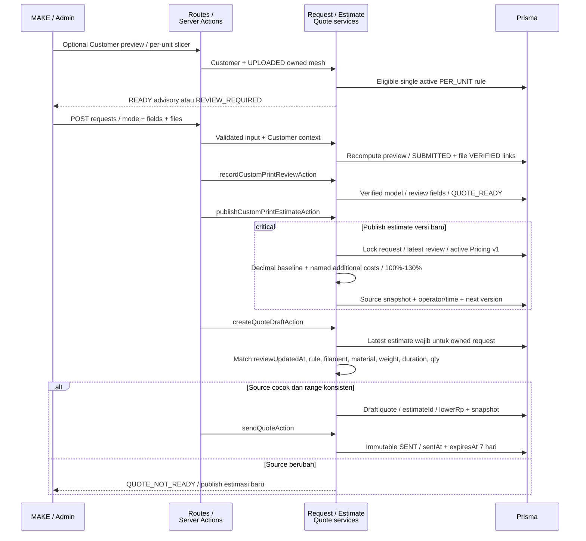
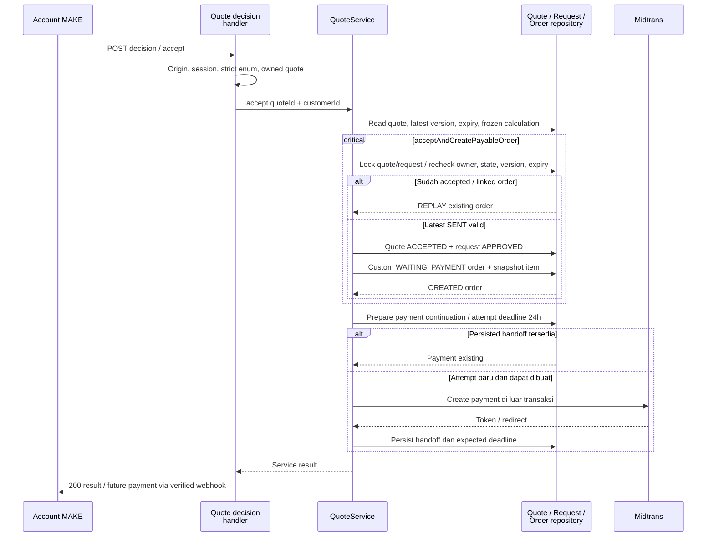
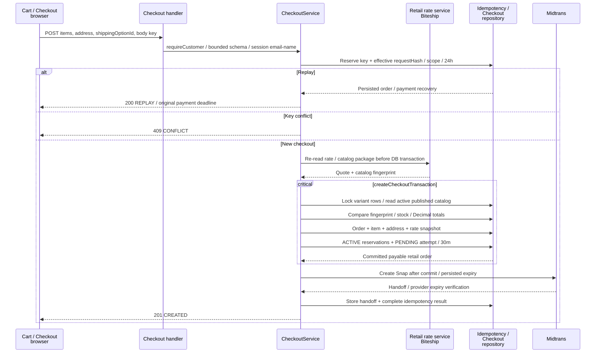
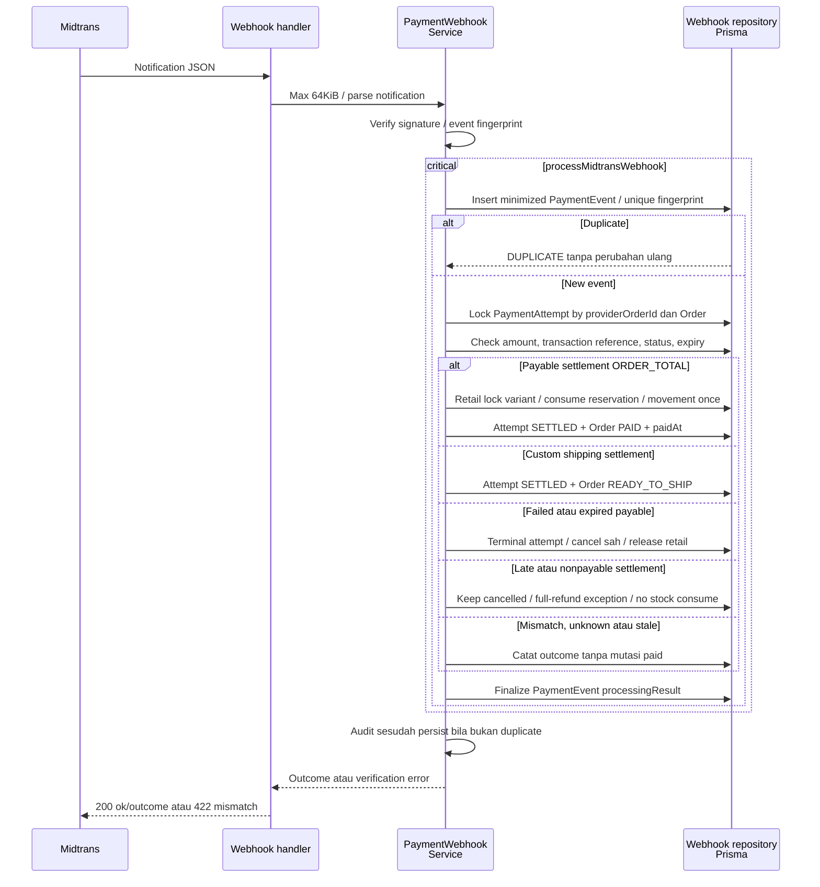
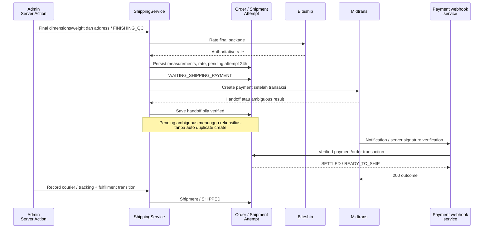
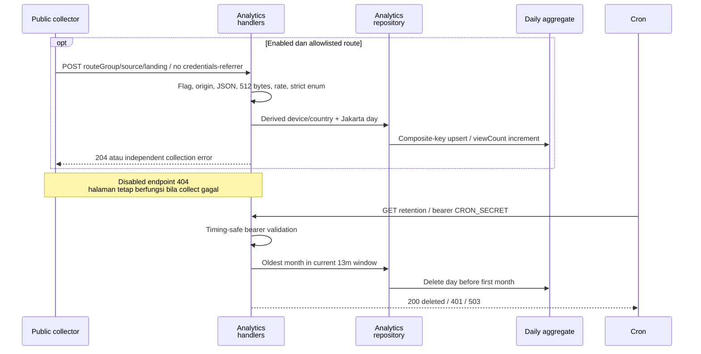
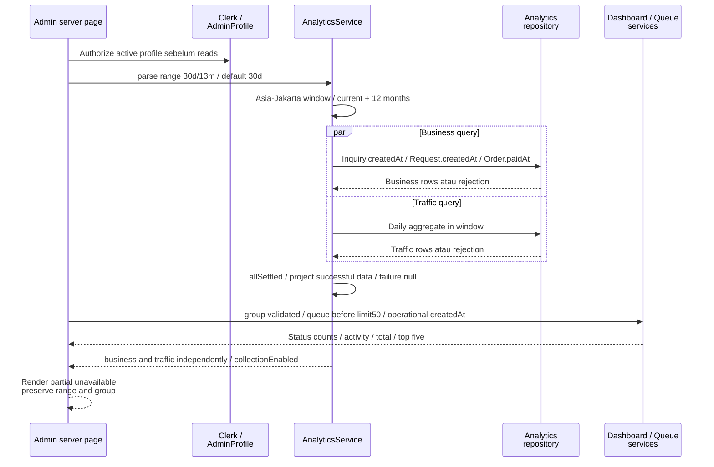
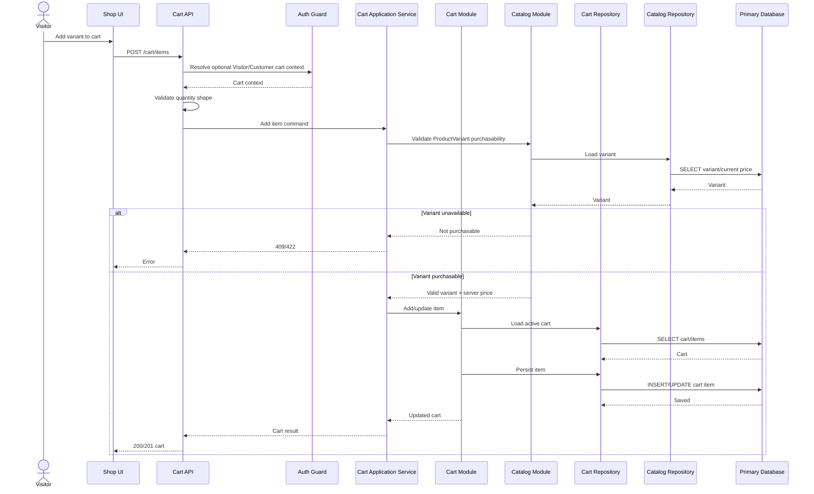

# NIUVA — Technical Sequence Diagrams

> **Status:** Draft v0.3 — REFERENCE. Referensi penjelas, bukan sumber keputusan baru.
>
> **Pemeriksaan sumber:** 2026-09-30 (Asia/Jakarta), `main` pada `9605a96`
> (`9605a96e936236b7e54b526f05e6b344747b24ab`). Perilaku yang berlaku
> memakai commit tersebut sebagai baseline API/data. Revisi navigasi Admin pada checkout kerja
> dikirim melalui branch `codex/admin-navigation-docs-v03`. Owner menerima visual shell
> pada Overview Admin lokal pada 2026-10-01; activation/AT/perangkat/produksi tetap mengikuti gate sumber.
>
> **Authority:** [PRD](../PRD-Niuva-MVP.md), [Tech Design](../TechDesign-Niuva-MVP.md),
> [lifecycle](../backend/lifecycle-contract.md), [Phase 2 closure](../backend/phase-2-closure-decisions.md),
> [pricing/shipping](../backend/phase-3-pricing-biteship-contract.md).
> Schema, handler dan service menjadi bukti pemetaan runtime; addenda/closure terbaru dibaca bersama authority.
> [DESIGN](../../DESIGN.md), [Action Queue](../backend/SPEC-action-queue.md), dan
> [keputusan Owner sesi ini](NIUVA_Use_Case_Specification.md#9-keputusan-owner-dan-input-terbuka)
> melengkapi traceability. Keputusan sesi dibedakan dari capability yang sudah diimplementasikan.
>
> **Asal:** draf repo v0.2 direkonsiliasi dengan sumber di atas. Artefak diagram sumber
> asli yang pernah disebut belum ditemukan di repo. Lampiran memuat kandidat/model lama
> dengan label eksplisit; tidak menjadi kontrak implementasi.

## Perilaku yang berlaku

### 1. Boundary, locking dan replay

Route handler/Server Action -> auth/origin/schema/permission -> domain service
-> repository -> Prisma. Semua label operasi menunjuk inventory
[API](NIUVA_API_Contract.md); diagram bisnis pada
[Sequence](NIUVA_Sequence_Diagrams.md). Blok `critical` adalah transaksi
repository, bukan claim bahwa provider ikut dalam DB transaction.

| Boundary | Mekanisme aktual |
| --- | --- |
| Customer | Verified Google identity + database session; server ownership before reads/mutations. |
| Admin | Clerk + active AdminProfile; role database, permission service. |
| Checkout | Body idempotencyKey, scope checkout.retail, requestHash, replay TTL 24h; payment 30m terpisah. |
| Quote/proposal | State/version/ownership + order terikat menangani replay; tidak ada required Idempotency-Key header. |
| Webhook | Unique eventFingerprint + locked attempt/order dan variant; event outcome persisted. |
| Upload | Scoped FILE_UPLOAD token hash/expiry 10m; confirm status transition, tidak universal replay. |
| Provider uncertain | Persisted reference/handoff + reconciliation, jangan auto-create dua kali. |

### 2. File privat

UC-BRIEF-01, UC-MAKE-01, UC-MAKE-02.

Extension/MIME allowlist, 100 MiB CAD/model, foto 10 MiB. Confirm tidak berarti
operator telah memeriksa geometri. Append model hanya REFERENCE_ONLY pada
SUBMITTED/UNDER_REVIEW sebelum review; STL memerlukan unitConfirmation. Download melalui owning-record permission
memberi signed URL lima menit. Cleanup 14/60/90 hari dengan hold/dispute/active
order; object removal lalu tombstone DELETED/audit. Tidak ada invented files API.

### 3. Brief dan B2B decision

UC-BRIEF-01, UC-BRIEF-02, UC-ADMIN-B2B-01.

Field wajib Brief sesuai [API bagian 5](NIUVA_API_Contract.md#5-brief-make-simulasi-dan-quote).
validUntil proposal berasal tanggal operator, akhir hari Jakarta, bukan quote
MAKE TTL tujuh hari. Same decision replay tidak membuat proposal versi baru.

### 4. MAKE review, estimasi dan quote

UC-MAKE-01, UC-ADMIN-MAKE-01, UC-MAKE-02.

#### 4.1 Submit dan production estimate

Biaya tambahan max 20, name 2–80 chars, amountRp integer string positif.
`noAdditionalCosts` harus cocok dengan daftar kosong. Rule aktif/versioned dan
quantity semantics eksplisit; label `calibrated:false` menunjukkan belum ada
kalibrasi riwayat pekerjaan. Quote memakai lowerRp dan memeriksa
lower/upper/additional subtotal/snapshot hasil Pricing v1.

#### 4.2 Account acceptance dan payment continuation

Acceptance revalidasi frozen quote calculation; source matching latest estimate
berada pada draft creation. Perubahan source sebelum draft memerlukan estimasi
baru, bukan perubahan diam-diam pada SENT snapshot. Legacy token acceptance
hanya untuk request unclaimed. Expired/superseded/opposite decision reject.
Provider uncertainty bukan izin automatic retry-create.

### 5. Retail checkout

UC-CART-01, UC-CHECKOUT-01.

Tidak ada read Cart database atau cart API. Server quantities berasal items
payload tetapi harga/stock/package authoritative berasal catalog terkunci.
Jika provider gagal/ambigu, persisted reference/attempt memerlukan recovery;
TTL key dan commercial expiry tidak ditukar.

### 6. Midtrans webhook dan inventory

UC-ORDER-C-01, UC-ADMIN-PRODUCT-01, UC-ADMIN-ORDER-01.

Signature diverifikasi server; handler tidak melakukan external status-API
fetch tambahan. Invalid signature tidak mencapai transaction. Amount mismatch/
unknown/stale outcome dicatat sesuai repository; tidak dianggap PAID.
Retail consumption memakai unique reservationId movement; custom payments
tanpa retail reservation. Browser callback tidak hadir dalam transaksi.

### 7. Final measured custom shipping

UC-ADMIN-ORDER-01, UC-ORDER-C-01.

Diagram menyingkat webhook pada bagian 6.
Rough account rate/paket perkiraan tidak mengisi final measurements.
Terminal replacement memakai referensi baru sesuai
[technical closure](../backend/phase-3-technical-closure.md), tanpa melanjutkan
expired attempt. Existing PENDING dengan hasil hilang/deadline konflik gagal aman.

### 8. Analytics collection, retention dan read

UC-ADMIN-OPS-01 mencakup laporan; collect dan cron adalah supporting operations.

#### 8.1 Collect dan retention

Raw URL/query/token/IP/email/cookie/visitor ID tidak disimpan. Country header
2-letter/ZZ; IP hashed sementara hanya rate limiter. Retensi tidak menghapus
tabel bisnis. Schedule 03.00 WIB bukan bukti production execution.

#### 8.2 Admin independent report reads

Success queries fill empty reporting periods with zero; failed query bukan
zero. Sources breakdown landing-only; countries/devices/routes semua views.
Operational counts dan createdAt activity tidak mengganti paidAt report.
Overview queue read failure mempunyai page unavailable state tersendiri.

Client AdminSidebarLayout menggunakan snapshot browser untuk memulihkan
`niuva.admin.sidebar.v1`; SSR default terbuka, kemudian hydration membaca
preferensi. Toggle menulis lokal dan memicu pembaruan client tanpa API/DB.
Storage ditolak mempunyai fallback memori. Disclosure mobile tetap independen.
Payment-event exceptions/alert stok tidak termasuk tujuh jenis signal queue
runtime; gate lanjutan ada pada [spec](../backend/SPEC-action-queue.md#batas-payment-dan-stock).

### 9. Pemetaan operations lain

| UC | Runtime |
| --- | --- |
| UC-ADMIN-PRODUCT-01 | Product/variant/media actions -> catalog service; adjustStockAction -> inventory lock/ledger/audit. |
| UC-ADMIN-PORTFOLIO-01 | Portfolio/media actions -> publication service/read model. |
| UC-OWNER-PRICING-01 | activatePricingRuleAction -> Owner permission/development guard/explicit semantics. |
| UC-AUTH-C-02 | POST logout -> same-origin/session revoke/cookie deletion. |
| UC-ACCOUNT-02 | Claim -> token scope/hash/unowned locked -> owner + revoke token transaction. |
| UC-ADMIN-OPS-01 | SSR /admin dan /admin/queue, bukan JSON dashboard endpoint baru. |

Rujukan sumber: [actions](../../src/app/admin/actions.ts),
[checkout repository](../../src/modules/checkout/repository.ts),
[webhook repository](../../src/modules/payment/webhook-repository.ts),
[estimate](../../src/modules/custom-print/estimate.ts),
[quote service](../../src/modules/quote/service.ts),
[analytics service](../../src/modules/analytics/service.ts).

## Lampiran — Usulan dan model konseptual lama

### A.1 Contoh REST/cart lama

Namespace `/api/v1`, generic Idempotency-Key middleware, database cart read,
payment endpoint terpisah, profile PATCH dan address CRUD bukan kontrak runtime.
Cuplikan lama berikut hanya model konseptual; padanannya adalah browser items
dan checkout body key pada bagian 5.

Cuplikan Mermaid v0.2 berikut **HISTORICAL / konseptual**, bukan operasi implementasi.
Cart API dan Cart Repository pada diagram ini tidak terdapat pada flow runtime.

### A.2 Penutupan klaim lama

“Upload pattern belum diputuskan”, “reservation belum baseline”, “payment/order
state mapping TBD” dan “latest estimate relation belum final” telah dijawab
implementasi dan closure contracts. Bagian utama menunjukkan transaksi/
permission/response aktual. Legal/accounting retention, provider activation,
calibration, publication/privacy approval dan edge evidence tetap terbuka.
