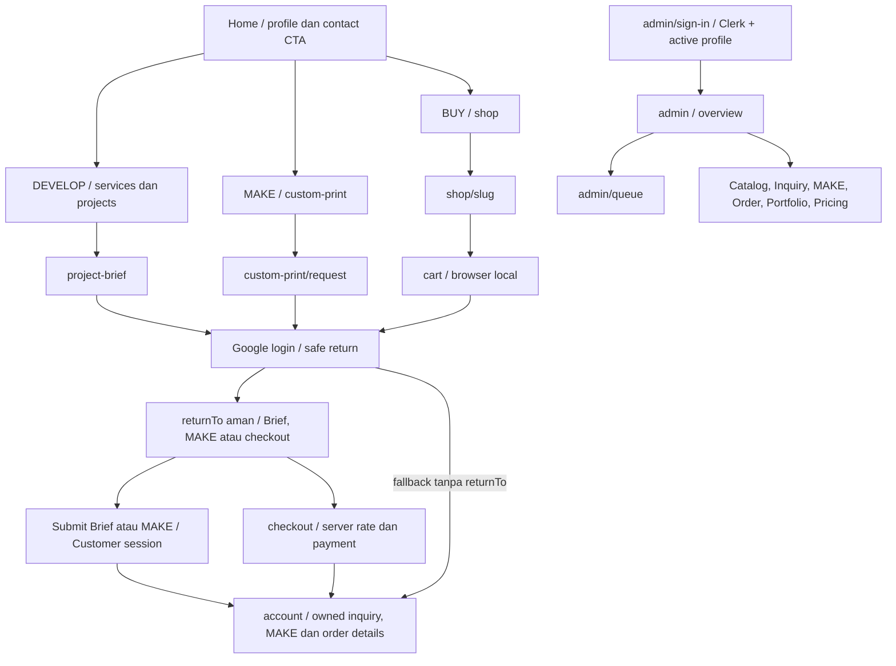
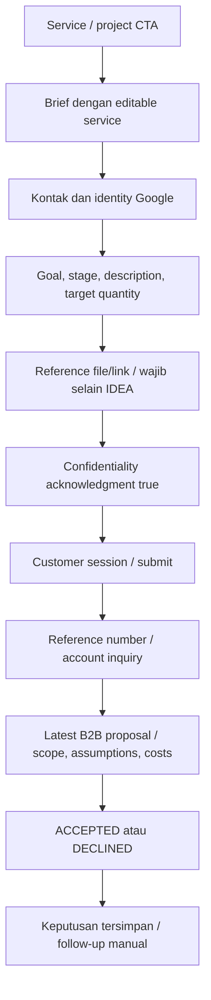
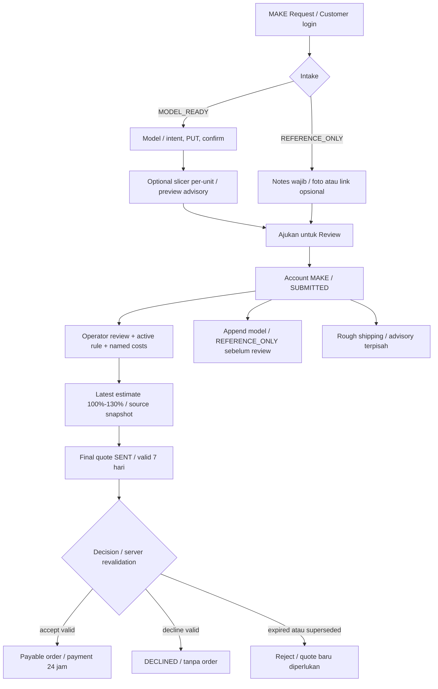
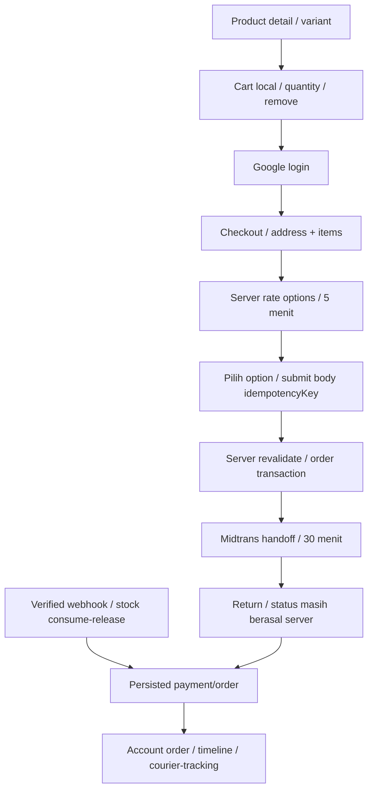
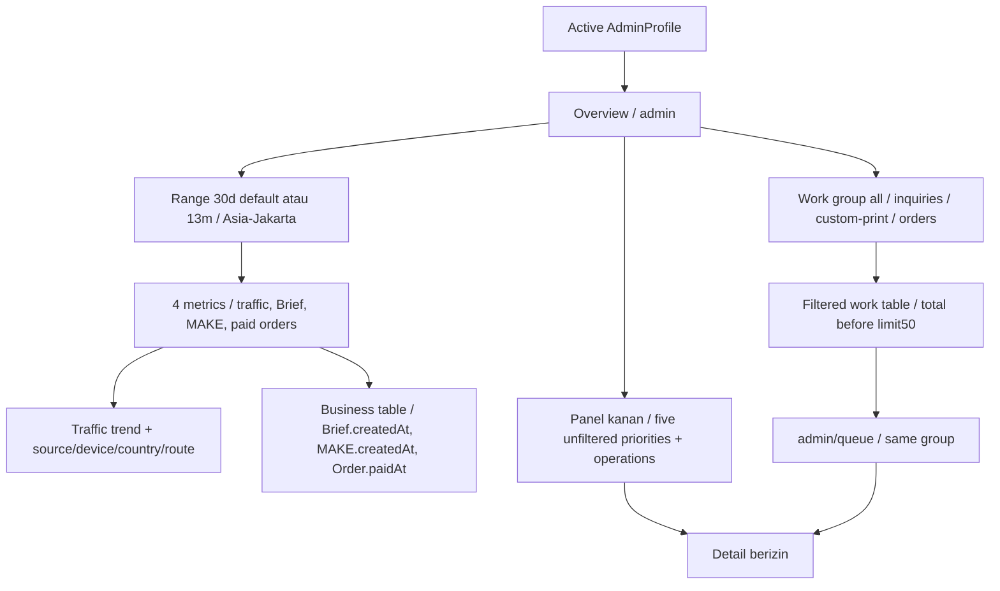
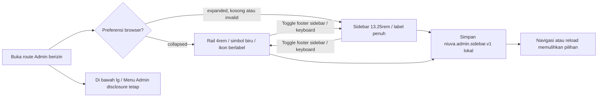

# NIUVA — UI Flow & Structural Wireframes

> **Status:** Draft v0.3 — REFERENCE. Referensi penjelas, bukan sumber keputusan baru.
>
> **Pemeriksaan sumber:** 2026-09-30 (Asia/Jakarta), `main` pada `9605a96`
> (`9605a96e936236b7e54b526f05e6b344747b24ab`). Perilaku yang berlaku
> memakai commit tersebut sebagai baseline API/data. Revisi navigasi Admin pada checkout kerja
> dikirim melalui branch `codex/admin-navigation-docs-v03`. Owner menerima visual shell
> pada Overview Admin lokal pada 2026-10-01; activation/AT/perangkat/produksi tetap mengikuti gate sumber.
>
> **Authority:** [PRD](../PRD-Niuva-MVP.md), [Tech Design](../TechDesign-Niuva-MVP.md),
> [lifecycle](../backend/lifecycle-contract.md), [Phase 2 closure](../backend/phase-2-closure-decisions.md),
> [pricing/shipping](../backend/phase-3-pricing-biteship-contract.md).
> Schema, handler dan service menjadi bukti pemetaan runtime; addenda/closure terbaru dibaca bersama authority.
> [DESIGN](../../DESIGN.md), [Action Queue](../backend/SPEC-action-queue.md), dan
> [keputusan Owner sesi ini](NIUVA_Use_Case_Specification.md#9-keputusan-owner-dan-input-terbuka)
> melengkapi traceability. Keputusan sesi dibedakan dari capability yang sudah diimplementasikan.
>
> **Asal:** draf repo v0.2 direkonsiliasi dengan sumber di atas. Artefak diagram sumber
> asli yang pernah disebut belum ditemukan di repo. Lampiran memuat kandidat/model lama
> dengan label eksplisit; tidak menjadi kontrak implementasi.

## Perilaku yang berlaku

### 1. Batas wireframe dan navigasi

Wireframe menunjukkan urutan informasi, state dan operasi runtime; bukan
approval visual baru atau desain pixel. Visual mengikuti
[DESIGN.md](../../DESIGN.md), tokens runtime dan komponen route aktual.
Fakta bisnis mengikuti [Specification](NIUVA_Use_Case_Specification.md);
DTO/action mengikuti [API](NIUVA_API_Contract.md).



Company profile/kontak pada home; tidak ada /about atau /contact page.
Service detail menggunakan empat slug aktif. Project card-only tidak
menampilkan link detail. Catalog display curation tidak mengubah canonical data.

### 2. Auth, account dan state umum

| Layar/state | Struktur dan perilaku |
| --- | --- |
| /login dan /register | Satu Google CTA, status konfigurasi/session unavailable, safe return route. Tidak ada password/email registration form. |
| /account | Profil Google read-only; lists Brief/MAKE/orders; link owned detail; claim input token legacy; logout. |
| Detail owned record | Reference/status/timeline/snapshots, tindakan yang sesuai state; foreign record tidak membuka PII. |
| Claim | kind + private token; submit -> success owned work atau invalid/stale/already-owned. Company/email bukan bukti ownership. |
| Admin entry | Clerk + active database profile; login berhasil tanpa profile tidak membuka dashboard. |
| Mutation state | idle -> submitting -> success/error. Error field dekat kontrol, summary bila perlu; state provider unavailable berbeda dari validation/ownership. |
| Payment return | Menampilkan persisted status/pending/verifying; tidak menampilkan redirect sebagai bukti PAID. |

Editor profil/alamat tersimpan berada di lampiran. Account read-only tetap
memiliki operasi keputusan/claim/model yang dibatasi pemilik dan status.

### 3. DEVELOP — Brief dan proposal



```text
PROJECT BRIEF
Kontak: nama* / Google email / WhatsApp*
Perusahaan                         [opsional]
Layanan                            [empat pilihan, editable]
Tujuan proyek*                     [teks]
Tahap*                             [IDEA / SKETCH / CAD / PROTOTYPE / EXISTING_PRODUCT]
Deskripsi* / target quantity*       [teks]
Budget / deadline                  [opsional]
File privat atau HTTP/HTTPS link   [wajib selain IDEA]
[ ] Pernyataan kerahasiaan*
[Kirim Project Brief]

ACCOUNT INQUIRY
Reference / status / submitted details
Proposal vN / scope / assumptions / named costs / total / validUntil
[Terima proposal] [Tolak proposal]  [hanya latest valid SENT]
Keputusan tersimpan; tim menindaklanjuti secara manual
```

Submit email/owner dari session; confirmed upload UPLOADED menjadi VERIFIED
ketika inquiry dan attachment link disimpan atomik. Tidak ada pembayaran,
invoice atau kontrak otomatis setelah proposal accepted.

### 4. MAKE — intake, tiga informasi biaya dan keputusan



```text
MAKE REQUEST
Mode: [Model siap] [Referensi / butuh bantuan operator]
Material* / quantity* / kontak Google + phone*
Warna / faculty / productInterest / requestedSize / deadline [opsional]
Model: file privat* / unit confirmation sesuai form
Referensi: notes* / satu foto atau HTTPS link [opsional]

SIMULASI CUSTOMER (mode model eligible)
Berat dan durasi slicer per unit [opsional]
Material / machine subtotal / total advisory, atau "Perlu review"
"Estimasi awal, bukan harga final"
[Ajukan untuk Review]

ACCOUNT MAKE
Reference / status / files / timeline / [Tambahkan model bila diizinkan]
1. Simulasi Customer historis [unverified]
2. Estimasi produksi operator vN [lower–upper / 100%–130%]
   Material, mesin, pos tambahan / rule version / source / publishedAt
   Belum terkalibrasi oleh riwayat pekerjaan
3. Quote final vN [frozen total / expiry / latest status]
   [Terima quote] [Tolak quote] hanya saat valid
Rough ongkir [postal code / area opsional / cek]
   AVAILABLE range atau "Ongkir menyusul"; tidak menambah quote
Order/payment continuation sesudah acceptance server
```

Mesh STL/OBJ/3MF, confirmed owned file, declared slicer per unit dan active
eligible PER_UNIT rule dibutuhkan untuk preview. STEP/STP/photos/references
tetap review. Append model hanya REFERENCE_ONLY pada SUBMITTED/UNDER_REVIEW sebelum review; STL memerlukan unitConfirmation.
Request owned wajib latest estimate sebelum quote; source berubah
operator harus menerbitkan estimasi baru. Quote final runtime memakai lowerRp
dan memeriksa range/snapshot. Account decision body accept/decline tanpa required
idempotency header. Accept atomik menciptakan order; provider setelah commit.

### 5. BUY — cart, checkout dan tracking



```text
CART
Published product + selected variant / quantity [1–99] / remove
Ringkasan advisory / stock tidak direservasi / [Lanjut checkout]

CHECKOUT (Customer session)
Identity Google; kontak dan alamat pengiriman satu order
recipientName* / phone* / addressLine* / city* / province* / postalCode*
district / biteshipAreaId [opsional], countryCode default ID
Server rate options + expiry / [Pilih kurir dan layanan]
Items + ringkasan server / [Bayar]
Submitting / field error / out-of-stock / rate-changed / provider unavailable

ORDER
Reference / status / payment deadline / persisted total-item-address-rate
Payment pending -> lanjut handoff yang tersimpan
Paid -> fulfillment timeline / courier / tracking
Cancelled / expired -> tidak menjanjikan fulfillment
```

Cart browser tidak menyimpan harga authoritative atau memegang stock.
Checkout items unik 1–50; body key sama digunakan untuk retry submit yang sama,
bukan key baru setiap render. Stock reservation/attempt 30 menit; replay TTL
24 jam tidak memperpanjang payment. Late cancelled settlement menjadi refund
exception; redirect tidak mengubah paid.

### 6. Admin Overview dan Action Queue

UC-ADMIN-OPS-01 mencakup analytics tanpa menambah UC ID.



Struktur berikut mengikuti komposisi runtime, tanpa angka metrik buatan:

```text
ADMIN SHELL
Desktop lg: header [Admin / konteks] ... [Situs publik] [role] [Keluar]
Terbuka 13.25rem: logo Horizontal light pada putih, Operasional / Kelola
Terlipat 4rem: simbol Niuva biru pada putih, ikon + label aksesibel + tooltip
Logo: tinggi visual simbol sekitar 24px dan posisi selaras pada full/rail
Sidebar: logo tetap / daftar menu menggulir sendiri / footer tetap paling bawah
Footer terbuka/rail: [tombol ikon 44px], terpusat; tooltip Lipat/Perluas navigasi Admin
Urutan: Overview / Action Queue / Orders / Custom Print / B2B Inquiries
        Products & Stock / Portfolio / Pricing Rules (akses service sesuai role)
Default terbuka; niuva.admin.sidebar.v1 lokal, dipulihkan lintas route/reload
Mobile di bawah lg: logo lengkap terang, Menu Admin disclosure termasuk Situs publik

OVERVIEW
Laporan [30 hari] [13 bulan]          group tetap saat range berubah
[Tayangan halaman] [Brief B2B masuk] [Custom print masuk] [Order dibayar]

Area laporan utama                      Panel kanan
Traffic trend per hari/bulan WIB         Lima prioritas queue tanpa filter
Business activity table                  Aktivitas operasional terbaru
Sources masuk (landing-only)
Devices / countries / page groups

Work table [all / inquiries / custom-print / orders]
Total matching sebelum display 50 / [Buka Action Queue]

ACTION QUEUE /admin/queue
Group -> filter server sebelum limit50 -> total matching -> detail links
Shipping exceptions lebih dahulu, lalu pekerjaan tertua
Payment-event exceptions: di luar queue sampai lifecycle penyelesaian server
Alert stok: di luar queue sampai ambang dan tindakan operator ditetapkan
```

| State/detail | Makna layar |
| --- | --- |
| Business report | Brief.createdAt, MAKE.createdAt, Order.paidAt; order tetap dihitung setelah status maju. |
| Operational panel | Status counts NEW/SUBMITTED/PAID dan activity createdAt 30 hari terpisah dari paidAt report. |
| Traffic collection off | Label off/default; data aggregate historis bila ada tetap read, tidak mengarang traffic. |
| Business unavailable | Nilai “—”/message untuk bisnis; traffic/operasional yang tersedia tetap tampil. |
| Traffic unavailable | Nilai “—”/message untuk traffic; bisnis yang tersedia tetap tampil. |
| Zero/empty successful query | Benar-benar nol/no data, berbeda dari unavailable. |
| Overview/queue query failure | Admin data unavailable state; auth failure mempunyai access unavailable state sendiri. |
| Privacy | Tidak menampilkan contact/address/file/provider payload pada overview; data detail hanya setelah authorization. |
| Sidebar collapsed | Simbol biru resmi pada putih dengan skala/posisi selaras terhadap logo lengkap; ikon terpusat dan toggle di footer. Tooltip hover/fokus dapat ditutup dengan Escape; route aktif tetap aria-current. |
| Sidebar viewport pendek | Logo dan footer tetap terlihat; hanya daftar navigasi menggulir. Toggle mempertahankan fokus saat lebar berubah. |
| Situs publik | Link header kanan desktop sebelum role/Keluar menuju `/` pada tab yang sama; pada mobile tetap di Menu Admin. |
| Sidebar storage ditolak | Toggle tetap dapat dipakai pada sesi halaman; persistence setelah reload bergantung storage. |
| Mobile | Toggle desktop tersembunyi; disclosure Menu Admin tetap dapat dibuka dengan keyboard dan pilihan desktop tidak mengubah menu mobile. |

Range server invalid -> 30d, group invalid -> all. Calendar 13m = current month
+ 12 sebelumnya. Sumber traffic perkiraan, no unique visitors/conversion/order
attribution. Owner/legal notice dan edge/WAF gates sebelum produksi.

### 7. Workspace Admin aktual

Navigasi desktop pada seluruh workspace menggunakan kontrak revisi lokal
2026-10-01 berikut. Toggle berada di footer sidebar dan logo lengkap/simbol
berlatar putih konsisten. Perubahan lebar langsung, tanpa animasi layout,
sehingga reduced motion tidak memerlukan jalur toggle terpisah. Visual shell revisi
ACCEPTED_OWNER_LOCAL pada 2026-10-01 setelah tinjauan Overview Admin aktual.



Storage ditolak menggunakan fallback memori; persistence lintas reload tidak
dijanjikan. Rail hanya tampilan; server tetap memeriksa akses setiap route.

| Layar | Struktur operasi |
| --- | --- |
| Inquiry detail | Brief/contact/private attachment berizin, status transition, proposal scope/assumptions/lines/validUntil, decision history, follow-up manual. |
| MAKE detail | Private file download, reviewed slicer fields, active rule/filament, named additional costs atau no-cost, publish latest estimate, source match/draft/send, estimated package rough-shipping. |
| Product detail | Product canonical fields, variants price/physical package/active, media/publication; stock detail terpisah dengan ledger/reason. |
| Order detail | Snapshot/status/history; state-dependent fulfillment, custom address/final measurement/ongkir payment, courier/tracking. |
| Portfolio detail | Content/media/publication; rights/evidence gate, detail/card-only. |
| Pricing | Owner explicit quantity semantics/confirmation, development activation guard; bukan generic editable pricing CRUD. |

```text
ADMIN MAKE WORKSPACE
Intake/file -> review weight/duration/material/qty/config
Pricing v1 + filament + additional costs / explicit no-cost
[Terbitkan estimasi] -> vN / lower-upper / source snapshot
[Buat draft quote] -> source must match latest estimate -> [Kirim]
Quote immutable SENT / valid seven days / account decision

ADMIN ORDER WORKSPACE
Retail paid -> PROCESSING -> READY_TO_SHIP
Custom paid -> IN_PRODUCTION -> FINISHING_QC
Final package weight/dimensions + address -> rate/payment 24h
Verified shipping payment -> READY_TO_SHIP -> courier/tracking -> SHIPPED
Paid cancellation generic tidak memberi shortcut; refund penuh Owner workflow
```

### 8. Matriks layar dan operasi

Paths literal mengikuti [page inventory](../../src/app) dan handlers pada
[API inventory](NIUVA_API_Contract.md#2-inventory-route-handler-lengkap).
“SSR” berarti server read, bukan JSON endpoint implisit.

| Page route | Read / mutation yang ada |
| --- | --- |
| `/` | Public content/CTA; About/contact dalam home. |
| `/services`, `/services/[slug]` | Empat service detail, editable Brief prefill. |
| `/projects`, `/projects/[slug]` | Published/detail-approved project read; card-only tanpa detail link. |
| `/shop`, `/shop/[slug]` | Published catalog SSR; add variant local cart. |
| `/cart` | Browser localStorage; tanpa cart handler. |
| `/project-brief` | POST project-brief; upload intent/confirm. |
| `/custom-print` | Process/review info dan MAKE CTA. |
| `/custom-print/request` | Preview-estimate, uploads, POST requests. |
| `/login`, `/register` | Google start/callback. |
| `/checkout` | Customer; shipping/rates dan checkout body key. |
| `/account` | Owned work SSR, readonly profile, POST claim/logout. |
| `/account/inquiries/[id]` | Owned SSR + account B2B decision. |
| `/account/make/[id]` | Owned SSR + account model/rough-shipping/quote decision. |
| `/account/orders/[id]` | Owned order SSR, persisted payment/tracking. |
| `/orders/[token]` | Route-bound order status access according to record policy. |
| `/quote/[token]` | Legacy unclaimed quote review, token accept/decline. |
| `/custom-print/requests/[token]` | Legacy unclaimed request status, token files. |
| `/admin/sign-in` | Clerk entry, active profile still required. |
| `/admin` | SSR DashboardService/AnalyticsService/ActionQueueService. |
| `/admin/queue` | SSR group filter/count/limit and links. |
| `/admin/inquiries`, `/admin/inquiries/[id]` | SSR; transitionInquiryAction/sendB2BQuoteAction. |
| `/admin/custom-print`, `/admin/custom-print/[id]` | SSR; review/estimate/package/quote/reissue actions. |
| `/admin/products`, `/admin/products/[id]` | SSR; update product/variant/media actions. |
| `/admin/products/[id]/stock/[variantId]` | Ledger SSR; adjustStockAction. |
| `/admin/orders`, `/admin/orders/[id]` | SSR; transition/token/address/final shipping payment/metadata actions. |
| `/admin/portfolio`, `/admin/portfolio/[id]` | SSR; updatePortfolioAction/replacePortfolioMediaAction. |
| `/admin/pricing` | Owner guard; activatePricingRuleAction. |

Private download uses downloadPrivateFileAction from eligible Admin detail.
Analytics page-view mounted only enabled public allowlist, bukan account/Admin/
checkout/quote token. Cron retention bukan layar Customer.

### 9. Pemeriksaan dokumentasi vs product acceptance

Diagram runtime dapat dirender untuk memeriksa alur/label/edge. Itu tidak
membuktikan tampilan product pada physical device/AT, Owner visual acceptance,
provider/staging atau produksi. No fake metrics, prices, customer data atau
realistic invented media dipakai dalam wireframe struktural ini.

## Lampiran — Usulan dan model konseptual lama

### A.1 Kandidat layar di luar MVP

| Konsep lama | Status |
| --- | --- |
| `/account/profile` edit | Kandidat; profil sekarang read-only pada account. |
| `/account/addresses` CRUD | Kandidat; alamat checkout tersimpan sebagai order snapshot. |
| `/account/orders` / `/account/make` / `/account/project-briefs` list pages | Tidak ada separate page; lists berada pada /account. |
| Wishlist | Kandidat; UC-PUB-SHOP-02 runtime add-to-cart. |
| Separate /about /contact | Konsep IA lama; konten/CTA saat ini pada home. |
| REST screen APIs dengan `/api/v1` | Model lama; page SSR/handler/actions nyata pada bagian 8. |
| Generic unsaved/profile/address workflow | Kandidat, tidak memberi operasi backend tambahan. |

### A.2 Penutupan gap lama

Metrics placeholder, “routes proposed”, “Admin queue belum ada”, “profile PATCH
runtime” dan “address CRUD runtime” dari v0.2 telah diganti. Gate privacy/edge/
provider/production/calibration/publication tetap mengikuti authority. Wireframe
tidak membuat keputusan visual/business baru.
