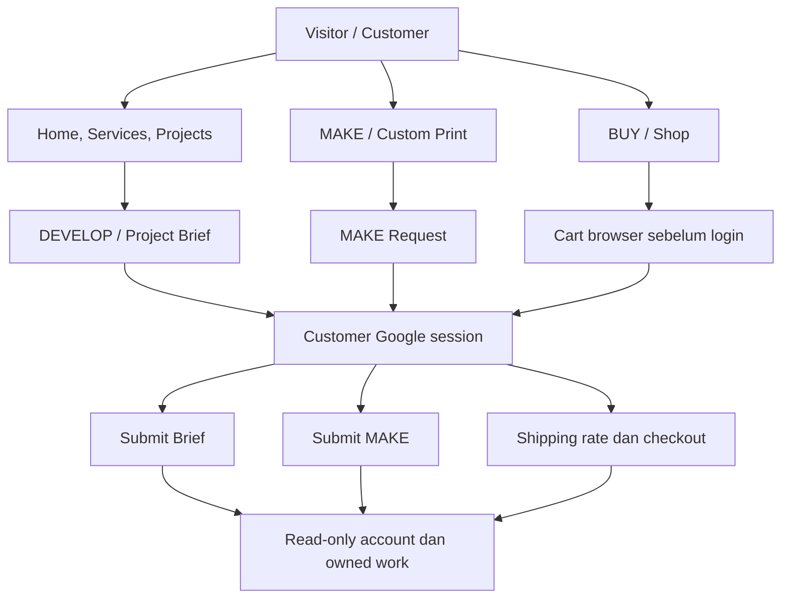
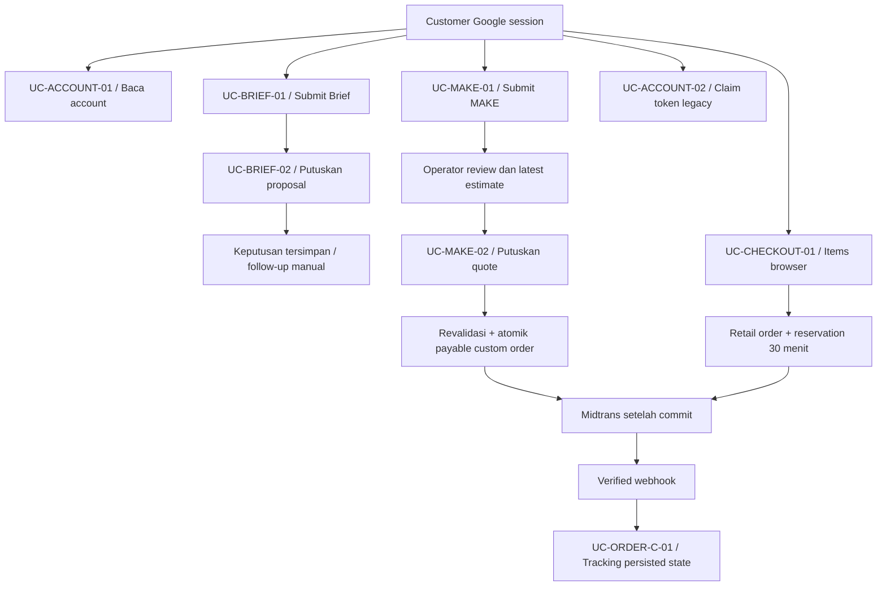
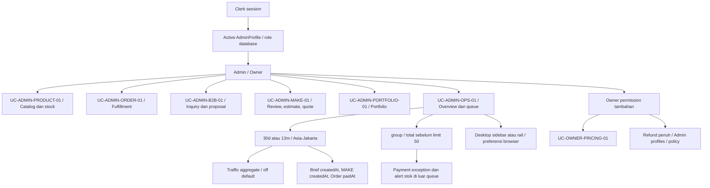

# NIUVA — Use Case Diagrams

> **Status:** Draft v0.3 — REFERENCE. Referensi penjelas, bukan sumber keputusan baru.
>
> **Pemeriksaan sumber:** 2026-09-30 (Asia/Jakarta), `main` pada `9605a96`
> (`9605a96e936236b7e54b526f05e6b344747b24ab`). Perilaku yang berlaku
> memakai commit tersebut sebagai baseline API/data. Revisi navigasi Admin pada checkout kerja
> dikirim melalui branch `codex/admin-navigation-docs-v03`. Owner menerima visual shell
> pada Overview Admin lokal pada 2026-10-01; activation/AT/perangkat/produksi tetap mengikuti gate sumber.
>
> **Authority:** [PRD](../PRD-Niuva-MVP.md), [Tech Design](../TechDesign-Niuva-MVP.md),
> [lifecycle](../backend/lifecycle-contract.md), [Phase 2 closure](../backend/phase-2-closure-decisions.md),
> [pricing/shipping](../backend/phase-3-pricing-biteship-contract.md).
> Schema, handler dan service menjadi bukti pemetaan runtime; addenda/closure terbaru dibaca bersama authority.
> [DESIGN](../../DESIGN.md), [Action Queue](../backend/SPEC-action-queue.md), dan
> [keputusan Owner sesi ini](NIUVA_Use_Case_Specification.md#9-keputusan-owner-dan-input-terbuka)
> melengkapi traceability. Keputusan sesi dibedakan dari capability yang sudah diimplementasikan.
>
> **Asal:** draf repo v0.2 direkonsiliasi dengan sumber di atas. Artefak diagram sumber
> asli yang pernah disebut belum ditemukan di repo. Lampiran memuat kandidat/model lama
> dengan label eksplisit; tidak menjadi kontrak implementasi.

## Perilaku yang berlaku

### 1. Peta aktor dan perjalanan

Mermaid flowchart memetakan tujuan/dependency, bukan sintaks UML use-case
native. Panah prasyarat bukan mutasi status. Definisi 28 tujuan ada pada
[Specification](NIUVA_Use_Case_Specification.md).

About/kontak berada dalam konten/CTA home. Empat service slug:
`research-development`, `consultant-workshop`, `design-prototyping`,
`apparel-merchandise`. Service CTA mengisi prefill Brief yang editable.

### 2. Customer dan authority bisnis

Simulasi Customer, estimasi operator 100%–130% dan quote final berbeda.
Proposal B2B ACCEPTED tidak mempunyai edge ke payable order.

### 3. Admin, Owner dan analytics

Permission selalu diperiksa service. Analytics/queue adalah read model dalam
UC-ADMIN-OPS-01, bukan state owner baru atau bukti aktivasi produksi.
Navigasi desktop dapat dilipat dari header; mobile tetap disclosure. Kebijakan
pengecualian queue mengikuti [spec](../backend/SPEC-action-queue.md#batas-payment-dan-stock).

### 4. Register 28 ID dan route aktual

| ID | Actor | Tujuan / route |
| --- | --- | --- |
| UC-PUB-HOME-01 | Visitor | Home `/`. |
| UC-PUB-ABOUT-01 | Visitor | Company content `/`. |
| UC-PUB-SERVICE-01 | Visitor | `/services`, `/services/[slug]`. |
| UC-PUB-SERVICE-02 | Visitor | Service CTA -> `/project-brief`. |
| UC-PUB-PROJECT-01 | Visitor | `/projects`, published detail. |
| UC-PUB-CUSTOM-01 | Visitor | `/custom-print`. |
| UC-PUB-CUSTOM-02 | Visitor | `/custom-print/request`. |
| UC-PUB-SHOP-01 | Visitor | `/shop`, `/shop/[slug]`. |
| UC-PUB-SHOP-02 | Visitor | Add variant ke cart browser. |
| UC-AUTH-C-01 | Visitor | `/login`, `/register`, Google start/callback. |
| UC-AUTH-C-02 | Customer | Logout. |
| UC-ACCOUNT-01 | Customer | `/account`, owned detail. |
| UC-ACCOUNT-02 | Customer | Claim private legacy token. |
| UC-BRIEF-01 | Customer | Submit Brief. |
| UC-BRIEF-02 | Customer | `/account/inquiries/[id]`, proposal decision. |
| UC-MAKE-01 | Customer | Submit MAKE. |
| UC-MAKE-02 | Customer | `/account/make/[id]`, quote/model/rough shipping. |
| UC-CART-01 | Visitor | `/cart`. |
| UC-CHECKOUT-01 | Customer | `/checkout`, server rate/checkout. |
| UC-ORDER-C-01 | Customer / token capability | `/account/orders/[id]`, `/orders/[token]` menurut policy. |
| UC-AUTH-A-01 | Admin/Owner | `/admin/sign-in`, active profile. |
| UC-ADMIN-PRODUCT-01 | Admin/Owner | `/admin/products`, detail dan stock varian. |
| UC-ADMIN-ORDER-01 | Admin/Owner | `/admin/orders`, detail order. |
| UC-ADMIN-B2B-01 | Admin/Owner | `/admin/inquiries`, detail inquiry. |
| UC-ADMIN-MAKE-01 | Admin/Owner | `/admin/custom-print`, detail request. |
| UC-ADMIN-PORTFOLIO-01 | Admin/Owner | `/admin/portfolio`, detail project. |
| UC-ADMIN-OPS-01 | Admin/Owner | `/admin`, `/admin/queue`, analytics. |
| UC-OWNER-PRICING-01 | Owner | `/admin/pricing`. |

### 5. Rujukan antardokumen

| Pembacaan | Rujukan |
| --- | --- |
| Skenario/exception per ID | [Specification](NIUVA_Use_Case_Specification.md). |
| Langkah perjalanan | [Activity](NIUVA_Activity_Diagram_User_Flow.md). |
| Aktor/service/provider | [Sequence](NIUVA_Sequence_Diagrams.md), [Technical Sequence](NIUVA_Technical_Sequence_Diagrams.md). |
| Data/snapshot/state | [Domain Model](NIUVA_Domain_Data_Model.md). |
| DTO/operasi nyata | [API](NIUVA_API_Contract.md). |
| Layar dan route | [Wireframes](NIUVA_UI_Flow_Wireframes.md). |
| Layers dan analytics | [Architecture](NIUVA_System_Architecture.md). |

## Lampiran — Usulan dan model konseptual lama

### A.1 Diagram awal

Draf awal mempunyai label HOME/ACCOUNT/OPS dan relasi include/extend.
Artefak diagram sumber asli tidak tersedia di repo; relasi tersebut bukan
bukti kontrak. v0.3 memakai 28 ID spesifikasi dan route runtime pada tabel utama.

### A.2 Kandidat

Wishlist, editor profil, address book, shared-company ownership, automated
proposal-to-order dan REST Admin tidak memberi capability runtime tambahan.
Endpoint konseptual lama tersedia hanya di lampiran
[API](NIUVA_API_Contract.md#lampiran--usulan-dan-model-konseptual-lama).
