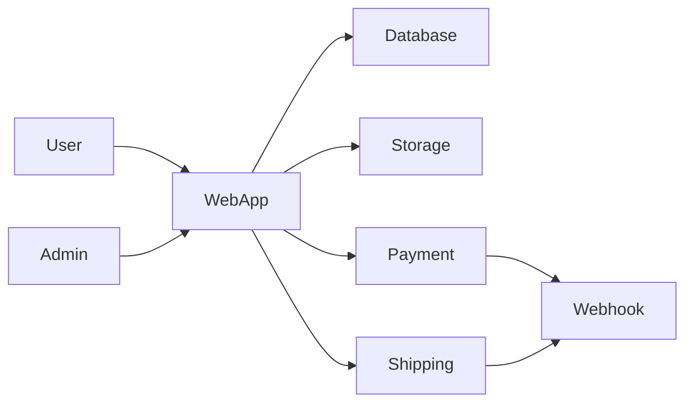

# Deep Research Request — Website Niuva Inovasi Utama

## Tujuan Utama

Saya ingin melakukan **deep research untuk menentukan strategi, arsitektur, teknologi, UX, integrasi, dan scope MVP terbaik** untuk website **Niuva Inovasi Utama (niuva.id)**.

Saya adalah **vibe-coder / developer pemula** yang sedang mengerjakan project ini dalam konteks magang. Karena itu, hasil penelitian harus:

- mudah dipahami;
- actionable;
- tidak overengineering;
- realistis dikerjakan dalam ±1 bulan;
- sesuai budget startup kecil;
- memberikan rekomendasi yang tegas, bukan hanya daftar opsi;
- menjelaskan alasan teknis dalam bahasa sederhana.

Gunakan **informasi terbaru yang tersedia saat penelitian dilakukan** dan jangan mengandalkan ranking tools, pricing, API, atau fitur lama.

---

# 1. Project Context

## Tentang Niuva

**Niuva Inovasi Utama** adalah perusahaan yang bergerak di bidang inovasi, product development, engineering, prototyping, 3D printing, konsultasi, workshop, apparel, dan merchandise.

Empat layanan utama perusahaan:

1. **Research & Development**
2. **Consultant & Workshop**
3. **Design & Prototyping**
4. **Apparel & Merchandise**

Niuva tidak ingin diposisikan hanya sebagai “tempat print 3D”.

Value proposition yang ingin ditonjolkan:

> **Idea → Design → Prototype → Finished Product**

Customer dapat datang hanya dengan ide dan Niuva dapat membantu sampai menjadi prototype atau produk jadi.

Niuva juga mempunyai model layanan fleksibel:

- custom produk satuan;
- kebutuhan perusahaan/borongan;
- jasa desain;
- jasa operator;
- jasa 3D printing;
- sewa device;
- sewa workstation;
- customer membawa filament sendiri;
- customer menggunakan filament Niuva;
- full-service;
- self-service;
- ready-made products.

---

# 2. Target Users

## B2B

Target utama:

- startup/perusahaan yang membutuhkan R&D produk;
- perusahaan yang membutuhkan prototype;
- product team;
- design team;
- brand yang membutuhkan merchandise;
- perusahaan yang membutuhkan product development partner.

## Retail / B2C

Target utama:

- mahasiswa;
- orang yang mencari custom gift;
- customer yang ingin membuat figur;
- hobbyist;
- customer yang membutuhkan custom product;
- customer yang ingin mencetak model 3D.

## Internal

Saat ini tim Niuva masih sangat kecil.

Internal user utama:

- Owner;
- Admin.

Dashboard/internal tools nantinya harus bisa digunakan orang **non-IT**.

---

# 3. Masalah yang Ingin Diselesaikan

Saat ini Niuva belum memiliki website terpadu.

Website harus membantu calon customer memahami:

- Niuva itu perusahaan apa;
- apa yang mereka kerjakan;
- services yang tersedia;
- bagaimana proses kerja mereka;
- portfolio/project yang pernah dikerjakan;
- bagaimana meminta quotation;
- bagaimana memesan custom product;
- bagaimana melakukan custom 3D printing;
- bagaimana membeli produk ready-made;
- bagaimana harga dihitung;
- bagaimana pembayaran dilakukan;
- bagaimana shipping dilakukan;
- bagaimana order diproses;
- bagaimana customer memonitor pesanannya.

Website ini harus menyatukan **tiga karakter bisnis sekaligus**:

1. **Service Business**
2. **Custom Manufacturing**
3. **Retail Commerce**

Jangan memperlakukannya sebagai company profile biasa ataupun marketplace biasa.

---

# 4. Platform & Constraints

## Platform

Target:

**Responsive website**

Harus nyaman digunakan pada:

- desktop;
- laptop;
- tablet;
- mobile browser.

Native iOS / Android app **tidak diperlukan pada MVP**.

---

## Timeline

Target MVP:

**1–4 minggu / sekitar 1 bulan**

Karena timeline sangat terbatas, semua rekomendasi harus dibagi menjadi:

- **Must Have for Launch**
- **Can Ship Shortly After Launch**
- **Phase 2**
- **Future / Optional**

Jangan merekomendasikan architecture enterprise jika manfaatnya tidak sebanding dengan complexity.

---

## Budget

### Bulan pertama

Maksimum sekitar:

**Rp1.000.000**

### Bulan berikutnya

Target recurring operational cost:

**≤ Rp500.000/bulan**

Idealnya lebih rendah.

Domain sudah tersedia:

**niuva.id**

Domain tidak perlu dimasukkan sebagai biaya baru.

Hitung biaya untuk:

- hosting;
- database;
- storage;
- CDN bila diperlukan;
- file storage STL / OBJ / 3MF;
- transactional email;
- authentication;
- payment;
- shipping;
- monitoring;
- backups;
- layanan eksternal lainnya.

Gunakan IDR untuk estimasi utama.

Jika provider menggunakan USD, tampilkan juga estimasi IDR dan jelaskan asumsi kurs.

---

# 5. MVP Priority

## Phase 1 — Customer-Facing MVP

Prioritas utama:

### A. Company Profile + Services + Portfolio

Customer harus bisa:

- memahami Niuva;
- memahami value proposition;
- melihat services;
- memahami proses kerja;
- melihat project / case study;
- melihat portfolio;
- menghubungi Niuva;
- mengajukan kebutuhan B2B;
- meminta quotation.

---

### B. Ready-Made Product Catalog

Customer dapat:

- melihat kategori produk;
- browsing produk;
- melihat product detail;
- melihat foto;
- melihat harga;
- memilih variant;
- mengetahui stock;
- memasukkan produk ke cart.

Pertimbangkan kebutuhan:

- SKU;
- variant;
- category;
- inventory;
- product images;
- promo;
- discount;
- status availability.

---

### C. Custom 3D Print Ordering / Configurator

Customer dapat memasukkan kebutuhan custom 3D print.

Research harus menentukan UX dan architecture terbaik untuk:

- upload file;
- STL;
- OBJ;
- 3MF;
- quantity;
- material;
- color;
- berat;
- print duration;
- notes;
- finishing;
- support;
- multicolor;
- kebutuhan khusus.

Namun jangan berasumsi bahwa semua informasi tersebut bisa diperoleh otomatis dari browser.

Research harus secara teknis memverifikasi:

- apa yang dapat dibaca langsung dari STL/OBJ/3MF;
- apakah volume dapat dihitung;
- apakah berat bisa diestimasi;
- bagaimana density material memengaruhi berat;
- apakah support dapat dihitung tanpa slicing;
- apakah brim/raft bisa dihitung;
- apakah purge/waste multicolor dapat dihitung;
- apakah print duration dapat dihitung secara reliable;
- apakah browser-side slicing realistis;
- apakah server-side slicing diperlukan;
- apakah CuraEngine/PrusaSlicer/Bambu Studio CLI atau engine lain relevan;
- risiko keamanan menjalankan slicer terhadap file customer;
- biaya compute;
- deployment complexity.

Bandingkan setidaknya tiga pendekatan:

1. **Instant calculated pricing**
2. **Estimated pricing + operator verification**
3. **Quotation/manual verification**

Berikan rekomendasi **yang paling realistis untuk MVP 1 bulan**.

---

### D. Checkout + Online Payment + Shipping

Customer dapat:

- membuat cart;
- checkout;
- memasukkan data penerima;
- memilih pengiriman;
- membayar secara online;
- mendapatkan order confirmation;
- mendapatkan status order.

Research harus mempertimbangkan:

- ready-made product;
- custom product;
- custom 3D printing;
- produk yang belum bisa diketahui berat final-nya ketika quotation dibuat.

---

# 6. Phase 2

Setelah MVP customer-facing selesai:

## E. CMS Admin

Owner/Admin dapat mengelola:

- portfolio;
- project;
- services;
- homepage content;
- promo;
- announcement;
- FAQ;
- products;
- categories;
- product images.

---

## F. Sales & Order Dashboard

Owner/Admin dapat:

- melihat order;
- melihat customer;
- melihat payment status;
- melihat production status;
- update order;
- melihat order history;
- melihat revenue sederhana.

---

## G. Inventory Management

Kelola:

- ready-made product stock;
- product variants;
- filament;
- material;
- stock adjustment;
- penggunaan material.

---

## H. Financial Dashboard

Kelola atau monitoring sederhana:

- pemasukan;
- pengeluaran;
- revenue;
- gross sales;
- laporan sederhana.

Jangan mengubah sistem ini menjadi ERP/accounting enterprise pada tahap awal.

---

# 7. Important MVP Question — Minimum Admin

Walaupun CMS/dashboard penuh masuk Phase 2, website tidak mungkin berjalan tanpa operational tools minimum.

Research harus menjawab:

> **Apa minimum admin capability yang wajib tersedia sejak MVP agar A–D benar-benar bisa dioperasikan?**

Evaluasi apakah MVP minimal membutuhkan:

- order list;
- order detail;
- update order status;
- verify custom print order;
- update payment status;
- product CRUD;
- stock update;
- basic portfolio CRUD;
- price configuration;
- shipping status;
- customer notes.

Berikan rekomendasi **thin admin dashboard** yang realistis.

---

# 8. Pricing v1 — Custom 3D Printing

Gunakan aturan berikut sebagai **business requirement awal / Pricing v1**.

Jika tersedia file:

**Pricelist 3D Print Niuva.xlsx**

gunakan file tersebut sebagai sumber tambahan.

Jika spreadsheet dan aturan di bawah berbeda:

- jangan diam-diam memilih salah satunya;
- tampilkan konfliknya;
- jelaskan field yang berbeda;
- berikan rekomendasi bagaimana membuat satu source of truth.

---

## 8.1 Custom 3D Print Standard

Formula:

```text
Total =
biaya material progresif
+ biaya waktu cetak
```

Sudah termasuk:

- pajak;
- listrik;
- finishing;
- support removal;
- QC;
- setup;
- risiko gagal cetak.

Tidak ada tambahan Full Service Rp35.000 pada standard custom print.

---

## 8.2 Berat yang Ditagihkan

Gunakan total hasil slicer:

- model;
- support;
- brim/raft;
- purge/waste multicolor.

Tidak ada minimum 50 gram.

---

## 8.3 PLA Progressive Pricing

```text
PLA =
(min(g, 200) × Rp1.000)
+ (min(max(g − 200, 0), 300) × Rp900)
+ (max(g − 500, 0) × Rp800)
```

---

## 8.4 ABS Progressive Pricing

```text
ABS =
(min(g, 200) × Rp1.200)
+ (min(max(g − 200, 0), 300) × Rp1.100)
+ (max(g − 500, 0) × Rp1.000)
```

---

## 8.5 Print Time

```text
Print Cost =
Print Duration × Rp5.000/hour
```

Pertahankan presisi durasi internal.

---

## 8.6 Multicolor

Tidak ada surcharge khusus.

Additional cost otomatis berasal dari:

- purge/waste;
- tambahan print duration;
- support;
- proses yang dihasilkan slicer.

---

# 9. Customer-Owned Filament

Jika customer membawa filament sendiri dan Niuva menjadi operator:

```text
PLA = printed weight × Rp500/gram
ABS = printed weight × Rp700/gram
```

Pada skema ini tidak ada tambahan Rp5.000/jam berdasarkan aturan Pricing v1 saat ini.

Research harus memeriksa apakah struktur pricing seperti ini berpotensi membingungkan customer dan bagaimana UX terbaik menjelaskannya.

---

# 10. Rental / Self-Service

Jika customer membawa filament sendiri:

```text
Total =
printer rental
+ Rp5.000/project
+ selected workstation/service
```

Contoh:

```text
Printer rental 1 hour   Rp12.000
Own filament             Rp5.000
Niuva PC 30 minutes     Rp15.000
────────────────────────────────
Total                   Rp32.000
```

---

# 11. Communal Filament

Tarif:

```text
PLA = used grams × Rp500
ABS = used grams × Rp700
```

Usage:

```text
spool weight before
− spool weight after
```

---

# 12. Self Service vs Full Service

Pilihan saling menggantikan:

### Self Service / PC Niuva

```text
Rp15.000 / 30 minutes
```

### Full Service

```text
Rp35.000 / file
```

Mencakup:

- satu file;
- satu parameter correction dalam sesi yang sama.

Model revision atau file baru = layanan baru.

### Customer PC

Gratis.

---

# 13. Membership

```text
Price        Rp500.000
Quota        50 hours
Validity     1 month
Unused quota expires
Filament     charged separately
```

Membership dan rental boleh tetap manual pada MVP jika automation akan memperbesar scope secara signifikan.

---

# 14. Pricing Precision

Simpan:

- slicer weight dengan presisi asli;
- print duration dengan presisi asli.

Hitung tanpa intermediate rounding.

Total akhir dibulatkan menggunakan:

```text
ROUND_HALF_UP
```

Contoh:

```text
Rp21.472,36 → Rp21.472
Rp21.472,50 → Rp21.473
Rp21.472,78 → Rp21.473
```

Order idealnya menyimpan:

- original weight;
- original duration;
- material cost breakdown;
- machine cost breakdown;
- subtotal before rounding;
- total after rounding;
- pricing rule version;
- material snapshot;
- configuration snapshot.

Research harus menilai apakah ini cocok diterapkan langsung atau perlu disederhanakan untuk MVP.

---

# 15. Business & UX Research

Belum ada competitor/reference website yang dipilih.

Cari benchmark dari kategori berikut:

- 3D printing service;
- rapid prototyping;
- additive manufacturing;
- product development;
- engineering consultancy;
- makerspace;
- custom manufacturing;
- custom gift;
- custom merchandise;
- product configurator;
- headless commerce/custom commerce.

Cari contoh:

### Indonesia

dan

### International

Jangan hanya menilai visual.

Analisis:

- homepage;
- positioning;
- navigation;
- service pages;
- CTA;
- quotation;
- custom order;
- configurator;
- file upload;
- portfolio;
- case study;
- product catalog;
- checkout;
- pricing transparency;
- shipping;
- trust signals;
- testimonials;
- FAQ;
- account;
- order tracking.

---

# 16. Information Architecture

Usulkan sitemap terbaik.

Contoh hipotesis awal:

```text
Home
Services
 ├── Research & Development
 ├── Consultant & Workshop
 ├── Design & Prototyping
 └── Apparel & Merchandise

Projects / Portfolio

Shop
 ├── Ready Products
 └── Product Detail

Custom 3D Print
 ├── Upload / Configurator
 ├── Pricing Guide
 └── Custom Order

How It Works
About
FAQ
Contact / Request Quote
Cart
Checkout
Account / Order Status
```

Tetapi jangan menerima struktur ini begitu saja.

Bandingkan dengan benchmark dan berikan rekomendasi final.

---

# 17. B2B User Journey

Rancang journey untuk calon client seperti:

```text
Landing
→ Understand capabilities
→ Explore service
→ View relevant case studies
→ Understand process
→ Trust Niuva
→ Submit project brief
→ Request quotation
→ Consultation
```

Research harus menjawab:

- informasi apa yang meningkatkan conversion;
- CTA terbaik;
- bagaimana menangani project yang harganya tidak bisa fixed;
- apakah B2B inquiry sebaiknya form, WhatsApp, email, atau combination;
- bagaimana portfolio sebaiknya disusun;
- apakah projects perlu case-study format.

---

# 18. Retail User Journey

Contoh:

```text
Shop
→ Product
→ Variant
→ Add to cart
→ Checkout
→ Payment
→ Shipping
→ Order confirmation
→ Tracking
```

Research harus memberikan recommended UX.

---

# 19. Custom 3D Print Journey

Analisis flow seperti:

```text
Custom Print
→ Upload model
→ Select material
→ Select quantity
→ Configuration
→ Automated/estimated calculation
→ Review
→ Operator confirmation if required
→ Payment
→ Production
→ QC
→ Shipping
```

Research harus menentukan **di titik mana human verification paling aman**.

---

# 20. Tech Stack Research

Saya membutuhkan **satu primary recommendation**, maksimal dua alternatif.

Jangan memberikan 10–20 stack tanpa keputusan.

Bandingkan berdasarkan:

- beginner friendliness;
- AI-assisted development friendliness;
- speed to MVP;
- documentation;
- ecosystem;
- deployment complexity;
- Indonesian payment compatibility;
- shipping integration;
- image/file upload;
- long-term maintainability;
- cost;
- security.

Evaluasi kategori:

## Application framework

Misalnya:

- Next.js;
- Nuxt;
- SvelteKit;
- Laravel;
- alternatives jika memang lebih cocok.

## Hosting

Bandingkan layanan yang relevan dengan budget Indonesia.

## Database

Pertimbangkan:

- PostgreSQL;
- managed database;
- serverless options.

## ORM / data access

Jika relevan.

## Authentication

Tentukan apakah account wajib pada checkout.

Bandingkan:

- guest checkout;
- account optional;
- mandatory account.

## Object Storage

Untuk:

- product images;
- portfolio images;
- customer 3D files.

## Email

Untuk:

- order confirmation;
- payment status;
- internal notification.

## Monitoring

Minimal monitoring/error reporting.

---

# 21. Build vs Buy

Untuk setiap bagian, tentukan apakah lebih baik:

- custom build;
- managed service;
- SaaS;
- headless solution;
- hybrid.

Analisis terutama:

- commerce;
- cart;
- checkout;
- CMS;
- auth;
- payment;
- shipping;
- storage.

Prioritaskan solusi yang memungkinkan MVP selesai cepat tanpa lock-in berlebihan.

---

# 22. Commerce Architecture

Bandingkan:

### Option 1
Custom commerce built into main app

### Option 2
Headless commerce

### Option 3
Existing commerce platform + custom frontend

### Option 4
Hybrid

Nilai berdasarkan:

- biaya;
- implementation time;
- custom print configurator;
- payment Indonesia;
- shipping Indonesia;
- inventory;
- custom order;
- future admin/dashboard.

Berikan rekomendasi akhir.

---

# 23. Payment Gateway Indonesia

Research **provider saat ini**, jangan mengandalkan informasi lama.

Bandingkan provider yang relevan, misalnya jika masih tersedia:

- Midtrans;
- Xendit;
- DOKU;
- Tripay;
- Duitku;
- provider relevan lainnya.

Gunakan official docs terbaru.

Bandingkan:

| Factor | Requirement |
|---|---|
| Setup | Startup-friendly |
| QRIS | Preferred |
| VA | Preferred |
| E-wallet | Preferred |
| Cards | Optional |
| Webhooks | Required |
| Sandbox | Required |
| Documentation | Important |
| Refund | Evaluate |
| Fees | Compare |
| Settlement | Compare |
| Registration | Explain |

Cari tahu:

- biaya transaksi;
- biaya setup jika ada;
- settlement;
- requirements badan usaha;
- sandbox;
- webhook;
- payment status;
- API quality.

Berikan **recommended provider untuk Niuva**.

---

# 24. Shipping Indonesia

Research solusi shipping terbaru.

Pertimbangkan:

- courier aggregator;
- direct courier integration;
- shipping API.

Bandingkan provider/API yang relevan.

Evaluate:

- supported couriers;
- rate calculation;
- address;
- weight;
- dimensions;
- tracking;
- AWB/resi;
- pickup;
- webhook;
- cost;
- developer experience.

Jelaskan bagaimana shipping harus berbeda antara:

## Ready Product

vs

## Custom Manufacturing

karena final package weight/dimension mungkin belum pasti ketika customer melakukan initial order.

---

# 25. Custom Product Shipping Problem

Research harus menjawab:

> Bagaimana sistem checkout sebaiknya menangani produk custom jika berat dan dimensi final baru diketahui setelah produksi?

Bandingkan:

1. estimasi ongkir di awal;
2. charge ongkir setelah produksi;
3. shipping deposit;
4. manual quotation;
5. flat-rate;
6. hybrid.

Berikan rekomendasi MVP.

---

# 26. File Upload & Storage Architecture

Custom 3D models dapat mengandung intellectual property customer.

Research harus membahas:

- private buckets;
- signed URLs;
- access authorization;
- storage lifecycle;
- retention;
- file deletion;
- encryption;
- backups;
- maximum upload size;
- upload progress;
- resumable upload bila diperlukan;
- antivirus / malware scanning;
- file extension verification;
- MIME validation;
- safe processing.

Customer B2B mungkin mengupload desain produk confidential.

Karena itu hindari public URLs untuk model customer.

---

# 27. File Formats

Bandingkan support MVP untuk:

- STL;
- OBJ;
- 3MF;
- STEP/STP;
- other formats.

Jelaskan mana yang:

- bisa dianalisis otomatis;
- hanya disimpan;
- perlu conversion;
- tidak perlu didukung di MVP.

---

# 28. Database / Domain Model

Buat schema konseptual minimal untuk:

- User
- Customer
- Address
- Product
- ProductVariant
- ProductCategory
- Inventory
- Material
- PricingRule
- CustomPrintRequest
- UploadedModel
- Configuration
- Quotation
- Cart
- CartItem
- Order
- OrderItem
- Payment
- Shipment
- OrderStatus
- ProductionStatus
- Portfolio
- Service
- Promo

Tunjukkan relationship secara sederhana.

Gunakan Mermaid ER Diagram jika berguna.

Hindari schema berlebihan.

---

# 29. Order State Machine

Custom manufacturing membutuhkan status lebih detail daripada e-commerce biasa.

Usulkan status misalnya:

```text
REQUESTED
WAITING_REVIEW
QUOTED
WAITING_PAYMENT
PAID
QUEUED
PRINTING
FINISHING
QC
READY_TO_SHIP
SHIPPED
COMPLETED
CANCELLED
```

Research harus menentukan state machine yang ideal dan tidak terlalu kompleks.

Pisahkan jika perlu:

- payment status;
- production status;
- shipping status.

---

# 30. Portfolio / Case Study Strategy

Niuva sudah mempunyai proyek seperti:

- redesain kendaraan;
- EV development;
- interactive arcade;
- simulator;
- engineering/product development.

Research harus menjelaskan apakah project sebaiknya ditampilkan sebagai:

- gallery;
- portfolio card;
- detailed case study;
- combination.

Untuk B2B, tentukan struktur terbaik, misalnya:

```text
Problem
→ Challenge
→ Niuva Approach
→ Process
→ Result
→ Capabilities Used
```

---

# 31. CMS Strategy

Untuk startup kecil, tentukan apakah CMS sebaiknya:

- built into dashboard;
- headless CMS;
- database-based custom CMS;
- external platform.

Bandingkan berdasarkan:

- owner non-IT;
- cost;
- complexity;
- image management;
- product integration;
- portfolio;
- deployment.

Berikan rekomendasi.

---

# 32. Security

Buat minimum security checklist untuk MVP:

- authentication;
- authorization;
- admin roles;
- password security;
- secret management;
- webhook verification;
- CSRF;
- XSS;
- SQL injection;
- rate limiting;
- file upload security;
- private files;
- payment security;
- HTTPS;
- backups;
- logging.

Jelaskan dengan bahasa yang mudah dipahami.

---

# 33. Privacy

Identifikasi data customer yang akan disimpan:

- name;
- email;
- phone;
- shipping address;
- order history;
- uploaded 3D model;
- company/project information.

Berikan rekomendasi:

- privacy policy;
- terms;
- retention;
- file deletion;
- customer consent.

Pertimbangkan konteks Indonesia dan identifikasi regulasi yang relevan menggunakan sumber resmi.

Jangan memberikan legal advice; jelaskan sebagai compliance research.

---

# 34. SEO

Research strategi SEO untuk dua intent:

## B2B

Contoh:

- jasa prototyping;
- product development;
- 3D printing Bandung;
- design & prototyping;
- R&D produk;
- jasa custom merchandise.

## Retail

Contoh:

- custom 3D printing;
- custom figur;
- custom gift;
- produk 3D print.

Jangan keyword-stuff.

Berikan rekomendasi:

- page structure;
- metadata;
- schema markup;
- local SEO jika relevan;
- project/case study SEO;
- product SEO.

---

# 35. Performance

Research kebutuhan:

- image optimization;
- lazy loading;
- caching;
- CDN;
- database indexes;
- upload strategy;
- Core Web Vitals;
- mobile performance.

Prioritaskan hal yang nyata berdampak ke MVP.

---

# 36. Design / UX Direction

Belum ada benchmark visual.

Research harus mengidentifikasi 3–5 design directions dari website berkualitas.

Niuva perlu terasa:

- professional;
- innovative;
- engineering-oriented;
- creative;
- trustworthy;
- modern.

Jangan membuat hasil terlalu “tech startup generic”.

Pertimbangkan bagaimana memperlihatkan:

- material;
- 3D printing;
- engineering;
- product prototype;
- physical output;
- portfolio.

---

# 37. AI Scope

**AI bukan fitur customer-facing pada website MVP.**

Jangan merekomendasikan:

- AI chatbot;
- AI product recommendation;
- AI pricing;
- AI agent;
- generative AI customer feature;

kecuali hanya disebut sebagai **future optional idea**, bukan requirement.

AI hanya boleh digunakan untuk membantu development:

- research;
- coding;
- debugging;
- architecture;
- code review;
- test generation;
- documentation;
- UI implementation.

Berikan workflow AI-assisted development yang cocok untuk vibe-coder tetapi tetap mengharuskan:

- testing;
- verification;
- source review;
- no blind copy-paste.

---

# 38. Development Strategy

Berikan cara membangun project dengan urutan yang mengurangi risiko.

Misalnya:

```text
Foundation
→ Public website
→ Product catalog
→ Cart
→ Payment
→ Custom print request
→ Shipping
→ Minimal admin
→ Testing
→ Production deployment
```

Tetapi tentukan urutan final berdasarkan dependency.

---

# 39. Four-Week Roadmap

Buat roadmap realistis.

## Week 1

Foundation + architecture + public site

## Week 2

Commerce + catalog

## Week 3

Custom print + payment/shipping

## Week 4

Admin minimum + QA + deployment

Jangan menerima pembagian ini mentah-mentah.

Sesuaikan berdasarkan hasil research.

Untuk setiap minggu tampilkan:

- goals;
- deliverables;
- dependencies;
- acceptance criteria;
- risks.

---

# 40. Scope Cut Strategy

Jika project tidak mungkin selesai dalam 4 minggu, tentukan fitur mana yang harus dipotong terlebih dahulu.

Gunakan ranking:

- Critical
- High
- Medium
- Low

Contoh evaluasi:

- customer accounts;
- automatic slicing;
- instant pricing;
- live tracking;
- full CMS;
- inventory automation;
- financial dashboard;
- membership automation;
- rental reservation;
- advanced analytics.

Tujuannya adalah **launch**, bukan perfect system.

---

# 41. Cost Analysis

Buat setidaknya tiga skenario:

## Ultra-Lean

Target recurring:

**< Rp250.000/bulan**

## Recommended

Target recurring:

**< Rp500.000/bulan**

## Growth

Untuk ketika traffic/orders meningkat.

Hitung:

- application hosting;
- DB;
- storage;
- bandwidth;
- email;
- payment cost;
- shipping/API;
- monitoring;
- backup.

Pisahkan:

- fixed monthly cost;
- per-transaction cost;
- usage-based cost.

---

# 42. Scaling

Jangan overengineer.

Tetapi jelaskan:

- apa yang akan menjadi bottleneck pertama;
- kapan perlu upgrade hosting;
- kapan database perlu upgrade;
- kapan object storage meningkat;
- kapan background worker diperlukan;
- kapan slicing architecture perlu dipisahkan.

Gunakan trigger berbasis usage jika memungkinkan.

---

# 43. Competitor Matrix Deliverable

Buat tabel:

| Company | Country | Positioning | B2B | Retail | Custom Print | Instant Quote | File Upload | Checkout | Shipping | Portfolio | Key Lesson |
|---|---|---:|---:|---:|---:|---:|---:|---:|---:|---:|---|

Gunakan competitor nyata dan link sumber.

---

# 44. Stack Comparison Deliverable

Buat tabel:

| Area | Recommended | Alternative | Why | Cost | Complexity | MVP Fit |
|---|---|---|---|---:|---|---|

Area minimal:

- framework;
- hosting;
- DB;
- storage;
- auth;
- CMS;
- payment;
- shipping;
- email;
- monitoring.

---

# 45. Feature Priority Matrix

Buat tabel:

| Feature | Launch | Shortly After | Phase 2 | Future | Complexity | Business Value |
|---|---:|---:|---:|---:|---|---|

---

# 46. Risk Register

Identifikasi risiko seperti:

- configurator terlalu kompleks;
- slicing tidak reliable;
- payment onboarding terlambat;
- shipping API tidak cocok;
- admin scope membengkak;
- upload file besar;
- data privacy;
- custom product disputes;
- pricing calculation bug;
- scope creep;
- budget overrun.

Untuk setiap risiko:

- likelihood;
- impact;
- mitigation.

---

# 47. Required Final Recommendation

Jangan mengakhiri laporan dengan:

> “It depends.”

Berikan keputusan.

Output harus menyebut secara eksplisit:

### Build This

Stack dan architecture yang direkomendasikan.

### Do This Manually at MVP

Proses yang sebaiknya belum diotomatisasi.

### Do Not Build Yet

Feature yang sebaiknya ditunda.

### Upgrade Later

Bagaimana sistem berkembang setelah traction.

---

# 48. Required Deliverables

Laporan akhir harus memiliki urutan berikut:

1. **Executive Summary**
2. **Final Recommendation**
3. **Business Model Analysis**
4. **Target User Analysis**
5. **Competitor & Benchmark Matrix**
6. **Recommended Information Architecture**
7. **B2B Journey**
8. **Retail Journey**
9. **Custom 3D Print Journey**
10. **MVP Feature Matrix**
11. **Custom Print Configurator Feasibility**
12. **Pricing Engine Architecture**
13. **Recommended Tech Stack**
14. **Stack Alternatives**
15. **Build vs Buy Analysis**
16. **Payment Gateway Comparison**
17. **Shipping API Comparison**
18. **Custom Shipping Strategy**
19. **File Upload & Storage Architecture**
20. **Database / Domain Model**
21. **Order State Machine**
22. **Minimum Admin Dashboard**
23. **CMS Strategy**
24. **Security**
25. **Privacy / Compliance**
26. **SEO**
27. **Performance**
28. **UX/UI Benchmark**
29. **Cost Analysis**
30. **Four-Week Roadmap**
31. **Testing Strategy**
32. **Launch Checklist**
33. **Risk Register**
34. **Scope Cuts**
35. **Future Phase**
36. **Sources**
37. **Handoff Context**

---

# 49. Research Source Rules

Prioritize sources in this order:

1. **Official documentation**
2. **Official pricing pages**
3. **Official API docs**
4. **Official competitor websites**
5. **GitHub / open-source repositories**
6. **Technical case studies**
7. **Developer discussions**
8. **Reddit/community signal**
9. **Industry articles**

Do not use random SEO blogs as primary evidence for major technical decisions when official documentation exists.

---

# 50. Freshness Rules

For all fast-changing information such as:

- pricing;
- API;
- hosting limits;
- payment fees;
- shipping services;
- framework versions;
- SDKs;
- quotas;
- free tiers;

verify current documentation.

For each major factual recommendation include:

**Source URL + access date**

Use format:

```text
Source: https://...
Accessed: YYYY-MM-DD
```

If source information is outdated or uncertain, flag it.

---

# 51. Evidence Quality

Explicitly distinguish:

### Official Fact

Supported by official documentation.

### Community Signal

Based on developer/user experience.

### Research Inference

Conclusion derived from multiple sources.

Do not present inference as a confirmed fact.

If sources disagree, show the disagreement.

---

# 52. Output Style

Write in **Bahasa Indonesia**.

Technical terms may remain in English where clearer.

Assume the reader has basic familiarity with websites but limited software engineering experience.

For every technical concept:

1. explain what it is;
2. why Niuva needs or does not need it;
3. give practical recommendation.

Use:

- tables;
- diagrams;
- Mermaid.js;
- flow charts;
- examples.

Avoid unnecessary jargon.

---

# 53. Recommendation Format

For important decisions use:

```text
Recommendation:
Why:
Cost:
Complexity:
Risk:
Alternative:
When to Upgrade:
```

---

# 54. Architecture Diagram

Berikan diagram arsitektur MVP.

Contoh format Mermaid:



Buat diagram final berdasarkan stack yang direkomendasikan.

---

# 55. No Overengineering Rule

Hindari rekomendasi seperti:

- Kubernetes;
- microservices;
- complex event architecture;
- dedicated search cluster;
- multi-region;
- enterprise CMS;
- excessive queues;
- distributed architecture;

kecuali benar-benar ada alasan kuat.

Default ke:

> **simple modular monolith + managed services**

jika research mendukungnya.

---

# 56. Acceptance Criteria for Research

Research dianggap berhasil jika setelah membaca laporan saya bisa menjawab:

1. Apa yang harus dibangun?
2. Apa yang tidak perlu dibangun?
3. Stack apa yang dipakai?
4. Kenapa stack itu dipilih?
5. Berapa biaya bulan pertama?
6. Berapa biaya bulanan?
7. Bagaimana custom 3D printing bekerja?
8. Apakah instant quotation feasible?
9. Bagaimana payment?
10. Bagaimana shipping?
11. Bagaimana file customer diamankan?
12. Apa minimum admin yang harus ada?
13. Apa yang harus selesai minggu 1–4?
14. Apa risiko terbesar?
15. Apa yang sebaiknya dilakukan manual dulu?
16. Bagaimana system berkembang setelah MVP?

---

# 57. Final Decision Summary

Pada bagian akhir buat tabel:

| Decision | Choice | Reason |
|---|---|---|
| Frontend / Full-stack | | |
| Database | | |
| Hosting | | |
| Storage | | |
| Auth | | |
| Commerce | | |
| CMS | | |
| Payment | | |
| Shipping | | |
| 3D Pricing | | |
| Admin | | |
| Email | | |
| Monitoring | | |

Setelah tabel tersebut, tulis:

## Build First

Daftar fitur launch.

## Keep Manual

Daftar proses manual untuk MVP.

## Build Later

Daftar Phase 2.

## Avoid for Now

Daftar fitur yang menambah complexity tetapi belum memberikan business value yang cukup.

---

# 58. Project Files / Existing Inputs

Jika file berikut tersedia, gunakan sebagai sumber project:

- **Company profile PT Niuva**
- **Pricelist 3D Print Niuva.xlsx**

Company profile digunakan untuk memahami:

- positioning;
- services;
- company narrative;
- portfolio;
- visi/misi.

Pricelist digunakan untuk:

- material pricing;
- rental;
- service fees;
- membership;
- business rules.

Jika terdapat informasi yang belum ada dalam file atau konteks project:

**jangan mengarang fakta Niuva.**

Label sebagai:

```text
Needs confirmation from Niuva
```

---

# 59. Final Handoff Requirement

End the research document with this exact block:

```markdown
## Handoff Context
<!-- Machine-readable summary for the next workflow step. Do not delete; the next prompt in the workflow reads this block. -->
- Stage: research
- App name: Niuva
- User level: A
- Target platform: web
- Budget: Rp1.000.000 first month; target <= Rp500.000/month recurring
- Timeline: 1-4 weeks
- AI in product scope: no
- Source files: research-Niuva.md
```

Do not put anything after the Handoff Context block.